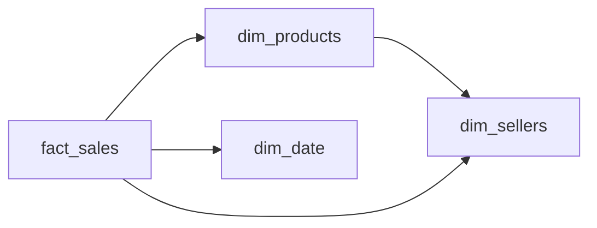

# A Number for the Seller
_They want a total. Give them the right schema first._

- **Domain:** data_modeling
- **Difficulty:** Easy
- **Est. time:** 25 min
- **URL:** https://datadriven.io/problems/a_number_for_the_seller

## Problem

We run an online marketplace where sellers list products, and each product records the date its listing went live and whether that listing is still active, since a seller may delist or relist over time. Every sale is logged line by line with the units sold and the revenue earned. Build the analytics schema behind a daily seller dashboard that shows, for each seller, how many of their listings are currently active and, for each date, the revenue and units their sales earned.

**Concepts tested:** `dmAttributes`, `dmDimensionTables`, `dmFactTables`, `dmForeignKeys`, `dmGrainDefinition`, `dmMetricAdditivity`, `dmOneToMany`, `dmPreAggregation`, `dmPrimaryKeys`, `dmStarSchema`, `dmSurrogateKeys`

## Solution walkthrough


### Two numbers, two grains

This is a two-grain problem wearing a seller-dashboard costume. The active-listing count is a snapshot count over products; revenue and units are additive sums over sale lines. Anyone can draw four tables. What separates candidates is refusing to let the sales rows answer the listings question. Collapse the two into one fact and every product that never sold drops out of the count, and the moment listings and sales meet before aggregation, revenue fans out by the number of listings. **Both numbers come back wrong, and neither looks obviously broken.**

### Building it

**Step 1: Name the two grains out loud**

Say it before you draw: one number counts things that exist (listings), the other sums things that happened (sale lines). A thing that exists does not need to have happened to be counted, so they cannot share a table.

**Step 2: Declare `fact_sales` at one row per sale line**

One row per product sold within an order, keyed by its own `sale_key`, carrying `quantity` and `gross_revenue`. That is the most atomic grain the log offers, so daily totals per seller are a plain sum and nothing is lost if someone later wants per-product numbers.

**Step 3: Put listing status on `dim_products`**

`listed_at` and `is_active` describe the listing, not any sale, so they live on `dim_products`. Counting active listings becomes a filter on `is_active` over the product table, and an unsold product still counts because its row exists whether or not it ever appears in `fact_sales`.

**Step 4: Hang both off one `dim_sellers`**

Both `dim_products.seller_key` and `fact_sales.seller_key` point at the same `dim_sellers` row. The shared dimension is the only place the two metrics meet, and they meet there after each has been rolled up to one row per seller.

**Step 5: Give the calendar its own `dim_date`**

The dashboard reads by date, so the fact stores only `date_key` and `dim_date` holds `full_date`. Adding `day_of_week` and `month` there costs nothing and means a weekday or month comparison is written once instead of in every dashboard query.

### The reference design


**dim_date**

| column | type | key |
|---|---|---|
| date_key | INT | PK |
| full_date | DATE |  |
| day_of_week | INT |  |
| month | INT |  |

**dim_sellers**

| column | type | key |
|---|---|---|
| seller_key | INT | PK |
| seller_name | TEXT |  |
| joined_at | TIMESTAMP |  |
| region | TEXT |  |

**dim_products**

| column | type | key |
|---|---|---|
| product_key | INT | PK |
| seller_key | INT | FK |
| product_name | TEXT |  |
| listed_at | TIMESTAMP |  |
| is_active | BOOLEAN |  |

**fact_sales**

| column | type | key |
|---|---|---|
| sale_key | BIGINT | PK |
| product_key | INT | FK |
| seller_key | INT | FK |
| date_key | INT | FK |
| quantity | INT |  |
| gross_revenue | DECIMAL |  |


> **The listing count never touches sales**
>
> Active listings are a filter over `dim_products`; revenue and units are sums over `fact_sales`. If your design needs a sale row to know a listing exists, you have already lost every product with zero sales.

> **Joining raw rows multiplies both metrics**
>
> A seller with 50 active listings and 200 sale lines, joined on `seller_key` before anything is summed, produces 10,000 rows. Every revenue line is repeated 50 times and every listing 200 times. Roll each side up to one row per seller first, then join.

**The dashboard query the design makes easy**

```sql
WITH active_listings AS (
    SELECT seller_key, COUNT(*) AS active_listings
    FROM dim_products
    WHERE is_active = TRUE
    GROUP BY seller_key
),
daily_sales AS (
    SELECT sale.seller_key,
           cal.full_date,
           SUM(sale.gross_revenue) AS revenue,
           SUM(sale.quantity) AS units
    FROM fact_sales AS sale
    JOIN dim_date AS cal ON cal.date_key = sale.date_key
    GROUP BY sale.seller_key, cal.full_date
)
SELECT seller.seller_name,
       COALESCE(listing.active_listings, 0) AS active_listings,
       sales.full_date,
       sales.revenue,
       sales.units
FROM dim_sellers AS seller
LEFT JOIN active_listings AS listing ON listing.seller_key = seller.seller_key
LEFT JOIN daily_sales AS sales ON sales.seller_key = seller.seller_key
```

> **Aggregate first, meet second**
>
> The shape of the schema dictates the shape of the query: two independent rollups keyed by `seller_key`, joined at the end. A design that puts the two grains in one table forces the query to undo that mistake every time it runs.

> **The fanout gets named before the first table**
>
> The senior move is naming the fanout before any table is drawn and asking whether a sale row is an order or an order line. Candidates who start with one wide table usually discover the count is wrong halfway through writing the query.

| Two grains, star schema | One flat sales table |
|---|---|
| `dim_products` holds listing status, `fact_sales` holds sale lines. Unsold products still count, revenue sums once per line, and BI tools slice by `dim_date` attributes for free. | Listing status copied onto each sale row. Products with no sales vanish from the count, a relisted product carries stale `is_active` values on old rows, and any join back to products multiplies revenue. |

- **Sellers now want how many listings were active on each past date. What changes?**
  - _Tests whether the candidate adds a daily listing snapshot fact instead of overloading `is_active`._
- **How would you handle refunds so revenue reconciles to finance?**
  - _Tests signed measures versus a separate refund fact._
- **What if a product could be transferred to a different seller?**
  - _Tests whether `seller_key` on `fact_sales` should record the seller at the time of sale, and SCD thinking on `dim_products`._
- **At 3 million sale lines a day, how would you keep the overnight dashboard refresh cheap?**
  - _Tests pre-aggregating a daily seller summary from `fact_sales`._
