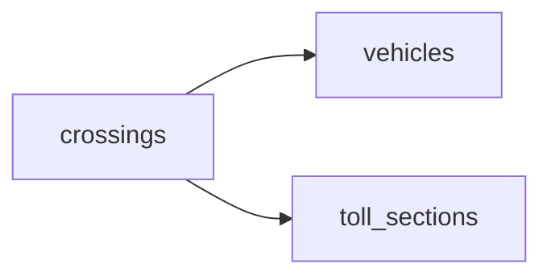

# Between the Cameras
_Every plate that goes in should come out. Watch the ones that don't._

- **Domain:** data_modeling
- **Difficulty:** Easy
- **Est. time:** 15 min
- **URL:** https://datadriven.io/problems/between_the_cameras

## Problem

A plate read at a tolled section's entry camera is only half a crossing until the same plate is read leaving that section, and commuter plates come through several times a day. Live traffic volume, the average time to cross each section, and an alert for any plate that entered with no exit yet all have to come from the model, so an unfinished crossing is still on record. Design the data model.

**Concepts tested:** `dmAttributes`, `dmConstraints`, `dmDataTypes`, `dmEntities`, `dmForeignKeys`, `dmGrainDefinition`, `dmOneToMany`, `dmPreAggregation`, `dmPrimaryKeys`

## Solution walkthrough


### Why this problem exists in real interviews

This is a grain question dressed up as traffic monitoring. The cameras hand you two loose events per trip, and the business only cares about the pair. Anyone can draw a vehicle table; what separates candidates is declaring one row per crossing that opens on the entry read and closes on the exit read. Mirror the raw events instead and every duration becomes a pairing exercise; model only finished crossings and the missing-exit alert has nothing to look at.

> **The row opens on entry and closes on exit**
>
> Ask whether the business fact is a camera read or a crossing. It is the crossing. The entry read creates the row, the exit read completes it, and an empty exit time is exactly the alert condition.

---

### Break down the requirements

**Step 1: Declare the grain as the crossing**

One row per crossing, not per sensor read. With `entry_time` and `exit_time` on the same row, duration is `exit_time - entry_time`, no pairing at query time.

**Step 2: Keep unfinished crossings on record**

The alert needs plates that went in and never came out. Write the row at entry with `exit_time` left `NULL`; the alert is a filter on that, and averages simply skip open rows.

**Step 3: Hang the crossing off its section and its vehicle**

Volume and crossing time are read per section, so each crossing carries a `section_id` pointing at `toll_sections`. Repeat commuter reads resolve to one row in `vehicles` through `vehicle_id`.

**Step 4: Capture direction and lane on the crossing**

Direction and lane come from the reads themselves and drive pricing, so they live on the crossing row rather than being recomputed.

---

### The solution

One defensible model: a crossing row per trip through a section, keyed to the section and the vehicle, with both timestamps stored and the exit allowed to be empty until it arrives.


**toll_sections**

| column | type | key |
|---|---|---|
| section_id | INT | PK |
| section_name | TEXT |  |

**vehicles**

| column | type | key |
|---|---|---|
| vehicle_id | BIGINT | PK |
| license_plate | VARCHAR |  |
| vehicle_class | TEXT |  |
| first_seen_ts | TIMESTAMP |  |

**crossings**

| column | type | key |
|---|---|---|
| crossing_id | BIGINT | PK |
| vehicle_id | BIGINT | FK |
| section_id | INT | FK |
| entry_time | TIMESTAMP |  |
| exit_time | TIMESTAMP |  |
| direction | TEXT |  |
| lane | TEXT |  |


> **Three dashboard tiles, one row shape**
>
> Volume, average crossing time and the missing-exit alert all read one table filtered by section and time. The vehicle table answers the repeat-crosser questions with a single join.

> **Naming the open crossing is the senior tell**
>
> They separate raw reads from the business fact, they say out loud that an open crossing is a row with no exit yet, and they name the matching rule: same plate, same section, exit after entry within a time window.

> **Completed-only rows erase the evaders**
>
> Modeling only completed crossings silently drops every evader, so the alert can never fire. Using the plate as the primary key couples the model to OCR quality, and forgetting to exclude open rows drags the average crossing time.

---

### The analysis pattern

**Per-section volume, crossing time and missing exits**

```sql
SELECT
    section_id,
    COUNT(*) AS crossings,
    AVG(EXTRACT(EPOCH FROM (exit_time - entry_time))) AS avg_transit_sec,
    COUNT(*) FILTER (WHERE exit_time IS NULL
                     AND entry_time < NOW() - INTERVAL '30 minutes') AS missing_exits
FROM crossings
WHERE entry_time >= NOW() - INTERVAL '1 hour'
GROUP BY section_id
```

---

### Trade-offs and alternatives

| Crossing row, open until exit | Raw sensor event log |
|---|---|
| Duration is a subtraction and open crossings are a filter on `exit_time`. The cost is a matching step that updates the row when the exit read lands. | Every read is a row and ingestion stays dumb. Every duration, volume and missing-exit query has to rebuild the pairs first. |

---

- **What if an exit read arrives seconds after the daily partition boundary?**
  - _Tests late-arriving exits and updating open rows across partitions._
- **How would you flag a crossing faster than the physical minimum for that section?**
  - _Tests whether anomaly detection is a filter on stored timestamps._
- **What rule pairs an exit read with the right open entry?**
  - _Tests stating the pairing rule explicitly._
- **How would you handle an exit read whose plate is a partial match for two open entries?**
  - _Tests data-quality handling when OCR misreads a plate._
