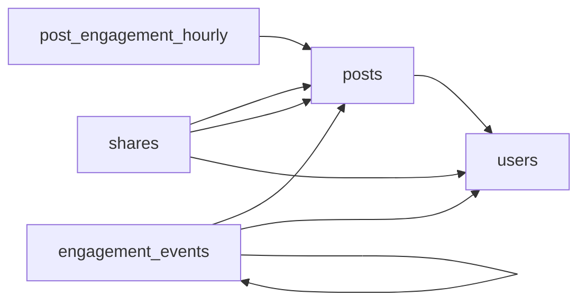

# Content Engagement Data Model
_Post published. Now measure everything that happens next._

- **Domain:** data_modeling
- **Difficulty:** Hard
- **Est. time:** 40 min
- **URL:** https://datadriven.io/problems/content_engagement_data_model

## Problem

We run a large social content platform where creators publish posts (text, image, video) and people engage through views, reactions, comments, and shares. Each view carries how long the person watched and each reaction carries its kind (like, love, angry), while a comment can reply to another comment so reply threads nest. A share turns an existing post into a brand-new post of its own, so the model has to trace every reshare back to both the post it came from and the person who reshared it. Design a schema that powers virality, creator-performance, and feed-ranking dashboards, knowing that raw engagement runs to billions of events a day, far too much to scan on every dashboard load.

**Concepts tested:** `dmDenormalization`, `dmDimensionTables`, `dmFactTables`, `dmForeignKeys`, `dmGrainDefinition`, `dmMetricAdditivity`, `dmOneToMany`, `dmPreAggregation`, `dmPrimaryKeys`, `dmStarSchema`

## Solution walkthrough


### What this really is

This is a two-grain star schema dressed up as social analytics. Anyone can draw `users`, `posts` and an events table. What separates candidates is whether they notice that billions of events a day **cannot be the table a dashboard reads**, and that a share is not an engagement at all: it mints a new post. If you model only the atomic fact, every dashboard load scans terabytes. If you fold shares into `engagement_events` as one more `event_type`, you lose the second post, and virality can no longer walk from a reshare back to its source.

> **Declare two grains before drawing a single column**
>
> One row per action in `engagement_events` for drilldown, and one row per post per hour in `post_engagement_hourly` for dashboards. Once both grains are stated out loud, every other table falls into place around `users` and `posts`.

### Building it

**Step 1: Keep `users` and `posts` as conformed dimensions**

`posts.creator_id` points to `users`. Both facts join through these same two tables, so creator performance and feed ranking read the same definition of a post.

**Step 2: Put every action in `engagement_events`**

An `event_type` discriminator ('view', 'reaction', 'comment') plus `event_ts` on every row. Variant attributes ride along as nullable columns: `watch_ms` for views, `reaction_type` for reactions. Splitting into three tables triples the joins for any cross-type metric.

**Step 3: Thread replies with `parent_comment_id`**

A self-referencing FK to `event_id` on the same table. A reply is just a comment whose parent is another comment, so no bridge table is needed and a recursive CTE walks the thread.

**Step 4: Give `shares` two edges into `posts`**

`source_post_id` is what was reshared, `reshare_post_id` is the new post it created, `sharer_user_id` is who did it. Those two post edges are the whole point: they turn reshares into a graph you can traverse.

**Step 5: Roll up to `post_engagement_hourly`**

The grain is one post per `hour_bucket`, keyed by `post_hour_id` (a deterministic hash of `post_id` and `hour_bucket`, so hourly reloads upsert cleanly). It stores only additive counts: `views`, `reactions`, `comments`, `shares`, `watch_ms_total`.


**users**

| column | type | key |
|---|---|---|
| user_id | BIGINT | PK |
| handle | VARCHAR |  |
| signup_date | DATE |  |
| follower_count | INT |  |

**posts**

| column | type | key |
|---|---|---|
| post_id | BIGINT | PK |
| creator_id | BIGINT | FK |
| post_type | VARCHAR |  |
| created_at | TIMESTAMP |  |
| content_uri | TEXT |  |

**engagement_events**

| column | type | key |
|---|---|---|
| event_id | BIGINT | PK |
| post_id | BIGINT | FK |
| user_id | BIGINT | FK |
| event_type | VARCHAR |  |
| reaction_type | VARCHAR |  |
| watch_ms | INT |  |
| parent_comment_id | BIGINT | FK |
| event_ts | TIMESTAMP |  |

**post_engagement_hourly**

| column | type | key |
|---|---|---|
| post_hour_id | BIGINT | PK |
| post_id | BIGINT | FK |
| hour_bucket | TIMESTAMP |  |
| views | BIGINT |  |
| reactions | BIGINT |  |
| comments | BIGINT |  |
| shares | BIGINT |  |
| watch_ms_total | BIGINT |  |

**shares**

| column | type | key |
|---|---|---|
| share_id | BIGINT | PK |
| source_post_id | BIGINT | FK |
| reshare_post_id | BIGINT | FK |
| sharer_user_id | BIGINT | FK |
| shared_at | TIMESTAMP |  |


> **A share as an `event_type` loses the new post**
>
> Candidates add 'share' to `event_type` and move on. That row has one `post_id`, so the reshare post it created is gone, and 'how far did this spread' becomes unanswerable.

> **Rollups store counts, never rates**
>
> Put a `share_rate` column in the hourly table and someone will average it across hours, which is wrong. Store additive counts and divide at query time, exactly as the query below does with `SUM(h.shares) / NULLIF(SUM(h.views), 0)`.

**Top creators by 24-hour virality**

```sql
SELECT
    u.handle,
    SUM(h.views) AS views_24h,
    SUM(h.reactions) AS reactions_24h,
    SUM(h.shares) AS shares_24h,
    SUM(h.shares)::NUMERIC / NULLIF(SUM(h.views), 0) AS share_rate
FROM post_engagement_hourly h
JOIN posts p ON p.post_id = h.post_id
JOIN users u ON u.user_id = p.creator_id
WHERE h.hour_bucket >= NOW() - INTERVAL '24 hours'
GROUP BY u.handle
ORDER BY shares_24h DESC
LIMIT 50
```

| Counter columns on posts | Hourly rollup fact |
|---|---|
| A `reaction_count` on `posts` incremented by the app. Cheap to read, but it has no time axis, drifts from the event log, and a correction means guessing. | `post_engagement_hourly` is rebuilt from `engagement_events`, so any hour can be recomputed after a bad load, and 'last 24 hours' is a range filter on `hour_bucket`. |

> **Billions of events shrink to millions of rows**
>
> At 5B events a day and roughly 20M posts active per hour at most, the rollup gains well under 500M rows a day, and a 24-hour dashboard scans only the recent partitions of `hour_bucket`.

- **How do you backfill `post_engagement_hourly` after a bad upstream load?**
  - _Tests that the rollup is reproducible from the atomic fact and that `post_hour_id` makes reloads idempotent._
- **A reaction is toggled on and off inside one hour. What does `reactions` show?**
  - _Tests event-log versus net-state semantics._
- **How would you compute the full reshare cascade depth for one post?**
  - _Tests a recursive walk over `source_post_id` and `reshare_post_id`._
- **How do you partition `engagement_events` at 50B rows a day?**
  - _Tests date partitioning on `event_ts` plus clustering by `post_id`._
