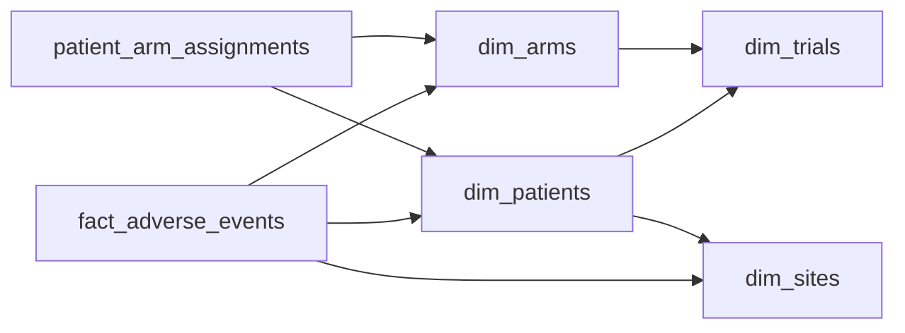

# Crossing Over

- **Domain:** data_modeling
- **Difficulty:** Medium
- **Est. time:** 25 min
- **URL:** https://datadriven.io/problems/crossing_over

## Problem

A pharmaceutical company runs multi-site clinical trials where a patient can move between treatment arms during the study, through crossover or a dose reduction. Design a schema for the safety team that stores adverse event reports and attributes every event to the arm the patient was actually on when the event was reported, so per-arm safety rates stay correct even after patients switch. The team also needs to reconstruct, for any date, which arm and dose a patient was on for audit.

**Concepts tested:** `dmConstraints`, `dmDimensionTables`, `dmFactTables`, `dmForeignKeys`, `dmGrainDefinition`, `dmJunctionTables`, `dmManyToMany`, `dmOneToMany`, `dmPrimaryKeys`, `dmScdStrategy`, `dmScdType2`, `dmStarSchema`, `dmSurrogateKeys`

## Solution walkthrough


### Why this problem exists in real interviews

This is a time-varying attribution problem wearing a clinical-safety costume. The real question: when an adverse event is reported, which treatment arm was the patient on at that moment? Anyone can draw patients, arms and events. The trick is refusing to hang the arm off the patient as a single current-arm foreign key. The instant a patient crosses over or takes a dose reduction, that key rewrites every past event onto the new arm, and a dangerous arm's safety signal quietly bleeds into the arm the patient moved to.

> **The arm belongs to the moment, not the patient**
>
> The patient-to-arm relationship changes over time, so an event cannot look its arm up live. Model arm membership as a versioned assignment record with `valid_from` and `valid_to`, resolve the arm whose window contains the report time, and pin that `arm_key` onto the event when it loads.

---

### Break down the requirements

**Step 1: Name the grain of the event fact**

One row in `fact_adverse_events` is one reported adverse event for one patient. Severity grade and the serious flag live at that grain; fold several events into a patient-level summary and you lose the ability to attribute each one.

**Step 2: Make arm membership temporal**

`patient_arm_assignments` holds one row per stint a patient spends on an arm, bounded by `valid_from` and `valid_to`. A crossover closes one window and opens another. Rows are only ever added, never edited, which is exactly the history an auditor replays to answer 'which arm and dose on this date'.

**Step 3: Pin the arm onto the event**

At load, find the assignment whose window contains `reported_at` and write its `arm_key` onto the event row. The fact now remembers the truth even if the patient switches tomorrow, and per-arm rates become a plain aggregation that never moves.

**Step 4: Keep dimensions conformed**

`dim_arms` belongs to its trial and carries the drug and dose, `dim_sites` and `dim_patients` are shared, and `dim_trials` ties them together. A later dosing or lab fact reuses the same dimensions and the same pinning pattern.

---

### The reference model

One defensible design. `patient_arm_assignments` is the system of record for arm membership over time, and `fact_adverse_events` carries an `arm_key` resolved from it at report time. That gives fast per-arm reads and strict, auditable attribution at once.


**dim_trials**

| column | type | key |
|---|---|---|
| trial_key | INT | PK |
| protocol_id | TEXT |  |
| phase | TEXT |  |
| indication | TEXT |  |

**dim_sites**

| column | type | key |
|---|---|---|
| site_key | INT | PK |
| site_name | TEXT |  |
| country | TEXT |  |
| region | TEXT |  |

**dim_arms**

| column | type | key |
|---|---|---|
| arm_key | INT | PK |
| trial_key | INT | FK |
| arm_name | TEXT |  |
| drug | TEXT |  |
| dose_mg | DECIMAL |  |

**dim_patients**

| column | type | key |
|---|---|---|
| patient_key | BIGINT | PK |
| subject_id | TEXT |  |
| trial_key | INT | FK |
| site_key | INT | FK |
| enrolled_at | DATE |  |
| sex | TEXT |  |
| birth_year | INT |  |

**patient_arm_assignments**

| column | type | key |
|---|---|---|
| assignment_key | BIGINT | PK |
| patient_key | BIGINT | FK |
| arm_key | INT | FK |
| valid_from | TIMESTAMP |  |
| valid_to | TIMESTAMP |  |
| switch_reason | TEXT |  |

**fact_adverse_events**

| column | type | key |
|---|---|---|
| ae_key | BIGINT | PK |
| patient_key | BIGINT | FK |
| arm_key | INT | FK |
| site_key | INT | FK |
| reported_at | TIMESTAMP |  |
| onset_at | TIMESTAMP |  |
| severity_grade | INT |  |
| is_serious | BOOLEAN |  |
| outcome | TEXT |  |


> **Two structures, two questions answered**
>
> Validity windows turn point-in-time reconstruction into a single range lookup, and pinning the arm on the event turns per-arm rates into an aggregation that never shifts under later switches. The cost is one denormalized key on the fact.

> **Saying 'time-varying' before drawing a box**
>
> A strong candidate says 'the arm is time-varying' out loud before drawing anything, asks whether assignment history may ever be overwritten, and states which timestamp drives attribution. They reject any design that resolves the arm through a mutable current-arm column.

> **A current-arm column rewrites history**
>
> Putting `current_arm_id` on `dim_patients` and joining events to it. The first crossover re-attributes every prior adverse event to the new arm, so the arm a patient left looks safer than it was. In a safety review that is a data-integrity failure, not a rounding error.

---

### The analysis pattern

**Serious adverse event rate per arm**

```sql
SELECT
    a.arm_name,
    a.drug,
    COUNT(*) FILTER (WHERE e.is_serious) AS serious_events,
    COUNT(*) AS total_events,
    ROUND(
        100.0 * COUNT(*) FILTER (WHERE e.is_serious) / NULLIF(COUNT(*), 0),
        1
    ) AS serious_pct
FROM fact_adverse_events e
JOIN dim_arms a ON a.arm_key = e.arm_key
GROUP BY a.arm_name, a.drug
ORDER BY serious_pct DESC
```

---

### Trade-offs and alternatives

| Pin the arm on the event | Resolve the arm at query time |
|---|---|
| `arm_key` resolved once at load and frozen on `fact_adverse_events`. Per-arm reads are a plain aggregation, historical rates never move, at the cost of one extra key and a load-time lookup. | Join each event to `patient_arm_assignments` where `reported_at` falls between `valid_from` and `valid_to`. Also correct, but every safety query repeats the range join and every analyst must pick the right timestamp. |

---

- **How would you add a dose-administration fact so that dose-response analysis reuses the same arm attribution?**
  - _Tests whether the candidate reapplies the pin-at-event-time pattern to a second fact sharing the dimensions._
- **An event is reported five days late, and the patient crossed over in between. Which arm does it attribute to, and how does your load decide?**
  - _Tests onset time versus report time and which timestamp drives the window lookup._
- **Regulators ask for the exact arm and dose every patient was on as of a specific past date. What does that query look like?**
  - _Tests point-in-time reconstruction over the `valid_from` and `valid_to` windows._
