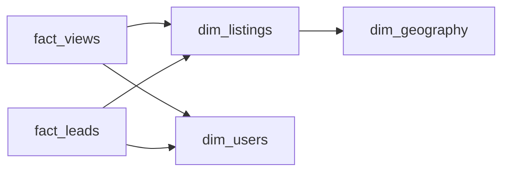

# Deal Flow
_Sellers want buyers. Buyers want deals._

- **Domain:** data_modeling
- **Difficulty:** Medium
- **Est. time:** 25 min
- **URL:** https://datadriven.io/problems/deal_flow

## Problem

A housing marketplace records every view of a property listing and every lead a buyer submits on one, each with the buyer and the time. Each listing has a property type and sits in a neighborhood that rolls up to a city and a state, and the model has to yield the view-to-lead conversion rate broken down by location at any of those levels and by property type.

**Concepts tested:** `dmAttributes`, `dmConstraints`, `dmDenormalization`, `dmDimensionTables`, `dmEntities`, `dmFactTables`, `dmForeignKeys`, `dmGrainDefinition`, `dmManyToMany`, `dmMetricAdditivity`, `dmOlapCubes`, `dmOneToMany`, `dmPrimaryKeys`, `dmStarSchema`, `dmSurrogateKeys`

## Solution walkthrough

### A ratio that has to roll up

This is a non-additive metric dressed up as a funnel. Conversion is leads over views, and the report wants it at neighborhood, city and state, crossed with property type. Anyone can draw a views table and a leads table. What separates candidates is where the rate gets computed: the weak design stores it, or stores counts already summed by neighborhood, and the strong one keeps every view and lead as its own row hanging off a listing that knows its type and its place. Get it wrong and a city's rate becomes an average of neighborhood rates, so a sleepy block with 50 views outvotes a busy one with 50,000.

> **Divide last, never store the ratio**
>
> Sum views and sum leads at whatever level is asked, then divide once. Two counts always add up from neighborhood to state; a rate never does. So the model keeps **the events, not the answer**.

### Building it

**Step 1: Record each event at its own grain**

`fact_views` is one row per view, every repeat open included; `fact_leads` is one row per lead submitted. Each carries the buyer (`user_id`) and the time (`viewed_at`, `submitted_at`), and each has columns the other lacks (`device` on a view, `message` on a lead).

**Step 2: Anchor both events on the listing**

Both facts point at `dim_listings` through `listing_id`, and the listing carries `property_type` plus a `geography_id`. Type and location are facts about the listing, so they live there once and both sides of the ratio reach them by the same hop.

**Step 3: Let geography roll up in place**

`dim_geography` is one row per neighborhood with `city` and `state` denormalized onto it. Rolling up from neighborhood to state is a coarser grouping on the same row, not another table to reach.

**Step 4: Share the buyer across both facts**

`dim_users` is referenced by both facts, so a cut by signup cohort or user type lands on the numerator and the denominator identically.

### The reference design

**dim_listings**

| column | type | key |
|---|---|---|
| listing_id | BIGINT | PK |
| geography_id | INT | FK |
| property_type | TEXT |  |
| price | DECIMAL |  |
| bedrooms | INT |  |
| sqft | INT |  |
| listed_at | DATE |  |

**dim_geography**

| column | type | key |
|---|---|---|
| geography_id | INT | PK |
| neighborhood | TEXT |  |
| city | TEXT |  |
| state | TEXT |  |

**dim_users**

| column | type | key |
|---|---|---|
| user_id | BIGINT | PK |
| signup_date | DATE |  |
| user_type | TEXT |  |

**fact_views**

| column | type | key |
|---|---|---|
| view_id | BIGINT | PK |
| listing_id | BIGINT | FK |
| user_id | BIGINT | FK |
| viewed_at | TIMESTAMP |  |
| device | TEXT |  |

**fact_leads**

| column | type | key |
|---|---|---|
| lead_id | BIGINT | PK |
| listing_id | BIGINT | FK |
| user_id | BIGINT | FK |
| submitted_at | TIMESTAMP |  |
| message | TEXT |  |

> **Both facts on one join fan out**
>
> Hanging `fact_views` and `fact_leads` off the same listing in one join multiplies rows: a listing with 300 views and 3 leads becomes 900 joined rows. `COUNT(DISTINCT ...)` hides it at the price of a huge sort. Total each fact per listing first, then join the two totals.

WITH view_totals AS (
    SELECT listing_id, COUNT(*) AS views
    FROM fact_views
    GROUP BY listing_id
),
lead_totals AS (
    SELECT listing_id, COUNT(*) AS leads
    FROM fact_leads
    GROUP BY listing_id
),
listing_activity AS (
    SELECT
        d.listing_id,
        d.property_type,
        d.geography_id,
        COALESCE(vt.views, 0) AS views,
        COALESCE(lt.leads, 0) AS leads
    FROM dim_listings d
    LEFT JOIN view_totals vt ON vt.listing_id = d.listing_id
    LEFT JOIN lead_totals lt ON lt.listing_id = d.listing_id
)
SELECT
    g.neighborhood,
    la.property_type,
    SUM(la.views) AS views,
    SUM(la.leads) AS leads,
    SUM(la.leads) * 1.0 / NULLIF(SUM(la.views), 0) AS conversion_rate
FROM listing_activity la
JOIN dim_geography g ON g.geography_id = la.geography_id
GROUP BY g.neighborhood, la.property_type

Conversion by neighborhood and property type

Each fact is totaled per listing before the join, so no row multiplies; swap `neighborhood` for `city` or `state` to roll up, and the division still happens last.

sql

> **Leads without a view are real**
>
> Leads arrive from search results and saved-search emails with no view logged. A design that makes a lead a child of a view loses them; anchoring both facts on the listing keeps them. The strong candidate asks about this out loud, and notes a quiet listing can show a rate above one.

| Separate facts | One typed event log |
|---|---|
| `fact_views` and `fact_leads` stand apart. Each carries only the columns its event has, each partitions by its own date, and conversion is two per-listing totals joined on `listing_id`. | One event log with an `event_type` column also works: conditional counts give the same rate, as long as each row still points at the listing. The cost is width, not correctness: `device` and `message` sit empty on most rows. |

> **Counts add up, ratios do not**
>
> Views and leads sum cleanly from listing to neighborhood to state. A stored rate does not, and counts pre-summed by neighborhood can never be re-cut by property type. Keep the rows; build daily rollups on top of them if the dashboard needs speed.

- **How would you report conversion by the price a buyer saw, when sellers cut prices mid-listing?**
  - _Tests whether the candidate versions the listing or stamps the price seen onto each event._
- **How do you attribute a lead to the view that drove it when a buyer visited five times?**
  - _Tests attribution choices and whether a session key spans both facts._
- **What changes when `fact_views` grows to a billion rows a day?**
  - _Tests partitioning and whether a daily per-listing rollup is introduced._
- **How do you honor a deletion request from a buyer who submitted leads a year ago?**
  - _Tests how deletion propagates across both facts that reference `dim_users`._
