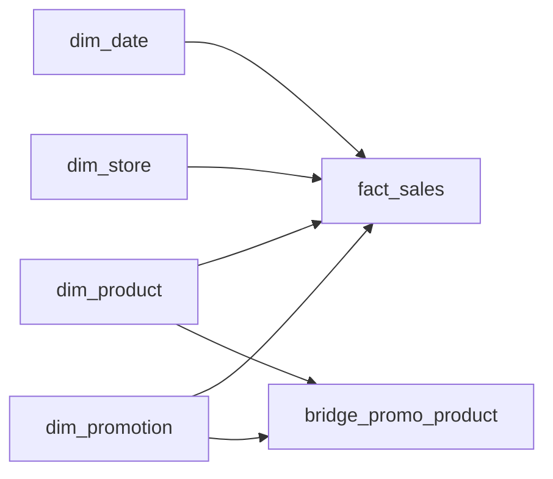

# Every Line Counts
_Every beep at the register. Coupons, returns, all of it._

- **Domain:** data_modeling
- **Difficulty:** Medium
- **Est. time:** 25 min
- **URL:** https://datadriven.io/problems/every_line_counts

## Problem

Design the star schema that holds every item scanned at the registers of our 500 stores, one row per receipt line, so the merchandising analytics team can slice sales by store, product, date and the promotion applied, rolling up to region, department and fiscal period. A promotion covers many products and a product can sit in several running promotions at once, each pairing with its own discount, but the register applies at most one promotion to any given line.

**Concepts tested:** `dmDimensionTables`, `dmFactTables`, `dmForeignKeys`, `dmJunctionTables`, `dmManyToMany`, `dmOneToMany`, `dmPrimaryKeys`, `dmStarSchema`, `dmSurrogateKeys`

## Solution walkthrough


### Why this problem exists in real interviews

Retail is the original Kimball use case, and interviewers use POS problems to probe grain declaration under a many-to-many wrinkle: a promotion can apply to many products and a product can participate in many promotions. The signal is whether the candidate reaches for a bridge table instead of flattening the relationship onto the fact.

> **Trick to Solving**
>
> The tell is "promotions apply to multiple products". Before drawing any tables, a strong candidate asks: is a sales line allowed to have zero or one promotion, and is there exclusivity? If multiple promos can stack, the fact alone cannot resolve it, and a bridge is required.
>
> 1. Declare grain as one row per sales line
> 2. Join dimensions conformed across all retail facts
> 3. Add `bridge_promo_product` for the many-to-many
> 4. Store the applied promotion FK on the fact for the single-promo common case

---

### Break down the requirements

**Step 1: Fix the grain at the sales line**

`fact_sales` is one row per item scanned per transaction. This is the atomic unit of retail analytics and supports every roll-up from basket to department to region.

**Step 2: Conform dimensions across the warehouse**

`dim_store`, `dim_product`, `dim_date`, and `dim_promotion` are reusable across inventory, returns, and sales facts. Conformity is what keeps "weekly revenue by department" returning the same answer in every dashboard.

**Step 3: Model the promo-product relationship as a bridge**

`bridge_promo_product` carries the eligibility and discount percentage per pair. The fact stores only the applied `promotion_sk` so you know which promo actually fired.

**Step 4: Keep measures atomic and additive**

`quantity` and `extended_amount` are both fully additive. Non-additive measures like unit price are derived at query time from extended amount divided by quantity.

---

### The solution

Below is one defensible model. The bridge table is the anchor for the promo-product many-to-many; everything else is the canonical Kimball star.


**dim_store**

| column | type | key |
|---|---|---|
| store_sk | BIGINT | PK |
| store_code | TEXT |  |
| region | TEXT |  |
| district | TEXT |  |
| store_format | TEXT |  |
| open_date | DATE |  |

**dim_product**

| column | type | key |
|---|---|---|
| product_sk | BIGINT | PK |
| sku | TEXT |  |
| department | TEXT |  |
| category | TEXT |  |
| subcategory | TEXT |  |
| brand | TEXT |  |

**dim_date**

| column | type | key |
|---|---|---|
| date_sk | INT | PK |
| calendar_date | DATE |  |
| fiscal_period | TEXT |  |

**dim_promotion**

| column | type | key |
|---|---|---|
| promotion_sk | BIGINT | PK |
| promo_code | TEXT |  |
| promo_type | TEXT |  |
| start_date | DATE |  |
| end_date | DATE |  |

**bridge_promo_product**

| column | type | key |
|---|---|---|
| promotion_sk | BIGINT | FK |
| product_sk | BIGINT | FK |
| discount_pct | DECIMAL |  |

**fact_sales**

| column | type | key |
|---|---|---|
| sales_line_id | BIGINT | PK |
| date_sk | INT | FK |
| store_sk | BIGINT | FK |
| product_sk | BIGINT | FK |
| promotion_sk | BIGINT | FK |
| quantity | INT |  |
| extended_amount | DECIMAL |  |


> **Why This Design Works**
>
> The bridge lets you answer eligibility questions ("which products were discounted under this promo") without touching the fact, while the fact answers incidence questions ("which sales used this promo"). Separating the two concerns keeps both queries fast and avoids duplicate rows in `fact_sales` when multiple promos are eligible.

> **Interviewers Watch For**
>
> Strong candidates distinguish eligibility from application. They also ask about stacking: can two promos hit one line, and if so, does the fact need a junction on the line itself? Weaker candidates put a `promo_list` array on the fact and lose the ability to attribute revenue to a single promotion.

> **Common Pitfall**
>
> Duplicating sales lines across every applicable promotion. This double-counts revenue in every aggregate and is nearly impossible to debug once dashboards ship.

---

### The analysis pattern

**Promotion lift by department**

```sql
SELECT
    p.department,
    pr.promo_code,
    SUM(f.extended_amount) AS promo_revenue,
    SUM(f.quantity) AS units_sold,
    COUNT(DISTINCT f.store_sk) AS stores_participating
FROM fact_sales f
JOIN dim_product p ON p.product_sk = f.product_sk
JOIN dim_promotion pr ON pr.promotion_sk = f.promotion_sk
JOIN dim_date d ON d.date_sk = f.date_sk
WHERE d.calendar_date BETWEEN pr.start_date AND pr.end_date
GROUP BY p.department, pr.promo_code
ORDER BY promo_revenue DESC
```

---

### Trade-offs and alternatives

| Star with promo bridge | Denormalized sales with promo arrays |
|---|---|
| Clean many-to-many for eligibility, single-promo attribution on the fact, conformed dimensions across retail. Cost: analysts need to understand when to use the bridge versus the fact FK. | Single-table reads, no bridge joins. Cost: array columns kill most BI tools, stacked promos double-count revenue, and eligibility queries become full scans. |

---

- **A single sales line gets hit by two stacked promos. How does the model attribute revenue?**
  - _Tests whether the candidate introduces a fact-level junction or picks a single dominant promo per line._
- **Returns happen days later at a different store. How does `fact_sales` handle that?**
  - _Tests whether the candidate proposes a separate `fact_returns` or negative sales lines._
- **A department reorganization remaps 2000 SKUs to new departments. What changes and where?**
  - _Tests SCD awareness on `dim_product` and whether historical reports stay reproducible._
- **The chain opens 500 stores in a new region with a different fiscal calendar. How do `dim_store` and `dim_date` accommodate it?**
  - _Tests conformed dimension evolution across multiple fiscal calendars._
