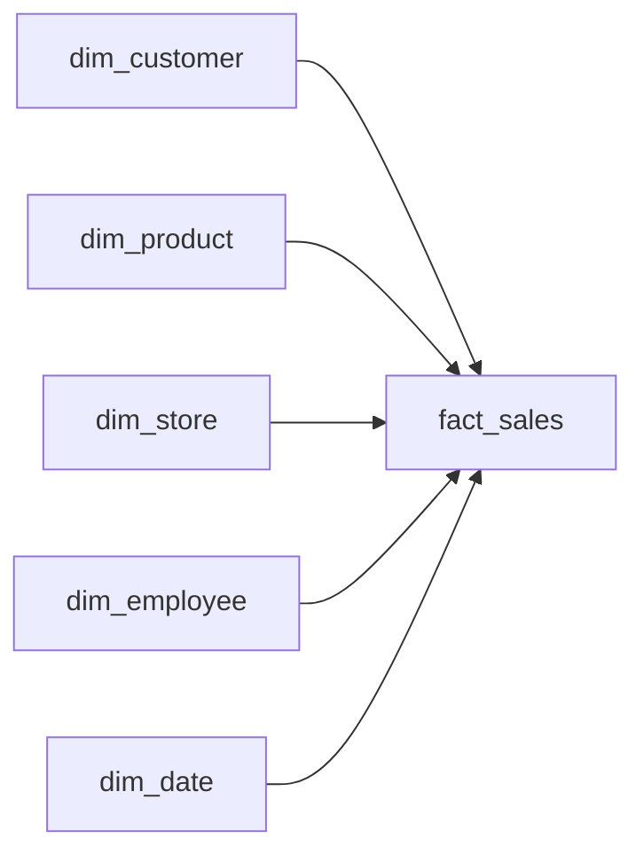

# Every Line Remembered
_Customers move, products relaunch, and some stores have no address. Reshape the tables so nothing gets forgotten._

- **Domain:** data_modeling
- **Difficulty:** Medium
- **Est. time:** ? min
- **URL:** https://datadriven.io/problems/every_line_remembered

## Problem

Our sales reports cannot be trusted: when a customer moves, last year's sales by city follow them to the new address, and when a retired product relaunches under its old identifier it inherits the retired item's sales. Redesign the retail chain's transactional orders, customers, products, stores and employees as a dimensional warehouse where every line item of an order is its own sales record, still traceable to its order and tied to the customer, product, store, employee and date of the sale. Each sale must keep the address its customer had on the order date while we can still see where every customer lives now, and digital storefronts with no physical location must report as stores alongside the physical ones.

**Concepts tested:** `dmAttributes`, `dmDenormalization`, `dmDimensionTables`, `dmEntities`, `dmFactTables`, `dmForeignKeys`, `dmGrainDefinition`, `dmMetricAdditivity`, `dmOneToMany`, `dmPrimaryKeys`, `dmStarSchema`, `dmSurrogateKeys`

## Solution walkthrough


### What this problem really is

Underneath the retail costume this is a grain-and-history problem. Anyone can list five dimension tables and a fact; what separates candidates is declaring the fact at the order line rather than the order, and deciding which dimensions have to carry history. Model the fact at order grain and every product-mix question needs a fan-out back to line detail. Model `dim_customer` as Type 1 and the first time a customer moves you silently rewrite every past geo report. The reused product identifiers are the tell that forces surrogate keys, and the digital storefronts are the tell that the store dimension cannot assume a physical address.

> **Trick to Solving**
>
> Before drawing any tables, a strong candidate asks: "what is the smallest additive unit the business reports on, and which dimensions are shared across facts?" The answer is the grain. Everything after that is conformed dimensions and surrogate key discipline.
>
> 1. Declare `fact_sales` grain = one row per order line
> 2. Pick conformed dimensions (customer, product, store, employee, date)
> 3. Decide SCD strategy per dimension
> 4. Introduce surrogate keys on every dimension

---

### Break down the requirements

**Step 1: Declare the fact grain as the order line**

One row per order line lets analysts compute units, gross sales, and product mix by simple aggregation. Order-grain would force fan-out joins back to line detail for any product question.

**Step 2: Introduce surrogate keys on every dimension**

Natural keys stay as `*_nk` columns but are not the PK. This lets a `product_id` renumber in the source (a retired item relaunched under the same id) without cascading to fact rows.

**Step 3: Apply SCD Type 2 on `dim_customer` address**

Customer city and state move. Tracking the as-of address via `effective_from`, `effective_to`, and `is_current` lets a past sale attribute to the address it shipped to.

**Step 4: Conform `dim_date` across any time-based lookup**

One calendar dimension is shared by every fact and by date-typed columns on dimensions via role-playing keys.

**Step 5: Keep `dim_store` flexible enough for digital**

Digital storefronts have no physical address. A nullable address is one defensible choice; a `store_type` flag lets reporting partition physical vs digital cleanly, all within one `dim_store`.

---

### The solution

Below is one defensible model. The grain anchors the rest of the design, and Type 2 on `dim_customer` is the one SCD lever worth defending out loud.


**dim_customer**

| column | type | key |
|---|---|---|
| customer_sk | BIGINT | PK |
| customer_nk | TEXT |  |
| city | TEXT |  |
| state | TEXT |  |
| effective_from | TIMESTAMP |  |
| effective_to | TIMESTAMP |  |
| is_current | BOOLEAN |  |

**dim_product**

| column | type | key |
|---|---|---|
| product_sk | BIGINT | PK |
| product_nk | TEXT |  |
| sku | TEXT |  |
| category | TEXT |  |
| brand | TEXT |  |

**dim_store**

| column | type | key |
|---|---|---|
| store_sk | BIGINT | PK |
| store_nk | TEXT |  |
| store_type | TEXT |  |
| region | TEXT |  |

**dim_employee**

| column | type | key |
|---|---|---|
| employee_sk | BIGINT | PK |
| employee_nk | TEXT |  |
| role | TEXT |  |
| hire_date | DATE |  |

**dim_date**

| column | type | key |
|---|---|---|
| date_key | INT | PK |
| calendar_date | DATE |  |
| fiscal_week | TEXT |  |

**fact_sales**

| column | type | key |
|---|---|---|
| sales_line_sk | BIGINT | PK |
| order_nk | TEXT |  |
| customer_sk | BIGINT | FK |
| product_sk | BIGINT | FK |
| store_sk | BIGINT | FK |
| employee_sk | BIGINT | FK |
| date_key | INT | FK |
| quantity | INT |  |
| extended_price | FLOAT |  |


> **Why this design holds up**
>
> The line-grain fact makes every product and category question additive. Surrogate keys decouple the warehouse from OLTP churn. Type 2 on `dim_customer` preserves historical attribution when a customer moves, which matters for any geo report.

> **What strong candidates do**
>
> They name the grain before drawing a single box. They call out which dimensions are Type 1 vs Type 2 and justify each. They acknowledge digital storefronts as a dimension nuance, not a schema exception.

> **Red flags to avoid**
>
> Using OLTP primary keys as warehouse PKs couples reporting to source churn. Keeping order-grain only forces fan-out joins on product mix questions. Modeling customer address as Type 1 silently rewrites historical geo reports when a customer moves.

---

### The analysis pattern

**Weekly gross sales by region and category**

```sql
SELECT
    d.fiscal_week,
    s.region,
    p.category,
    SUM(f.quantity) AS units,
    SUM(f.extended_price) AS gross_sales
FROM fact_sales f
JOIN dim_date d ON d.date_key = f.date_key
JOIN dim_store s ON s.store_sk = f.store_sk
JOIN dim_product p ON p.product_sk = f.product_sk
GROUP BY d.fiscal_week, s.region, p.category
```

---

### Trade-offs and alternatives

| Kimball star with line-grain fact | One Big Table on columnar storage |
|---|---|
| Predictable joins, conformed dimensions, good BI tool support. Writes are heavier because dimensions require SCD processing. Storage grows with dimension history. | Single wide fact with dimension attributes flattened onto every row. No joins at query time. Schema evolution is trickier and reprocessing history on a dimension change rewrites millions of rows. |

---

- **How would you extend the model to track promotion attribution per order line?**
  - _Tests adding a `dim_promotion` and whether it lives as a factless bridge._
- **Which SCD type would you use on `dim_employee` role and why?**
  - _Tests role tracking trade-offs; promotions usually need Type 2 for commission history._
- **A customer address corrects a typo. Does that trigger a new `dim_customer` row?**
  - _Tests the difference between a real change and a data quality fix._
- **How would you handle returns without breaking the additive grain?**
  - _Tests whether returns become negative-quantity rows or a separate `fact_returns`._
- **How would you partition `fact_sales` to keep yearly comparisons bounded?**
  - _Tests partitioning by `date_key` and its impact on fiscal reporting._
