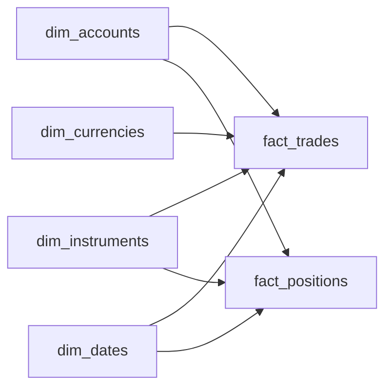

# Financial Trading Warehouse
_Every trade, every tick, every fraction of a share. The regulators want receipts._

- **Domain:** data_modeling
- **Difficulty:** Hard
- **Est. time:** 30 min
- **URL:** https://datadriven.io/problems/financial_trading_warehouse

## Problem

We're building the data warehouse for a trading platform that handles stocks, ETFs, and crypto with fractional-share quantities. Every trade executes in the instrument's native currency and is converted to the account's home currency, and regulators can ask us to reproduce any past trade confirmation and any account's holdings exactly as they stood on a historical date, even after account and instrument details have since been updated. Design the dimensional model with a per-trade fact, a daily position snapshot, and dimensions that keep their full history.

**Concepts tested:** `dmAttributes`, `dmDenormalization`, `dmDimensionTables`, `dmFactTables`, `dmForeignKeys`, `dmGrainDefinition`, `dmMetricAdditivity`, `dmOneToMany`, `dmPrimaryKeys`, `dmScdStrategy`, `dmScdType2`, `dmStarSchema`, `dmSurrogateKeys`

## Solution walkthrough


### Why this problem exists in real interviews

This probes whether a candidate can combine **multi-currency fact design** with SCD Type 2 on regulated dimensions and an immutable, append-only trade log. Trading warehouses are the domain where every one of these choices is a regulatory requirement, and interviewers look for candidates who call them out explicitly.

> **Trick to Solving**
>
> Before drawing tables, a strong candidate asks: what SEC audit window applies, and how are multi-currency trades reported? The signal is 'reproduce a confirmation exactly as it stood on a historical date,' which means every regulated dimension is Type 2 and every fact row freezes both native and home currency plus the FX rate.
>
> 1. Store native amount, home amount, and the FX rate together on each trade so reports reproduce after rates move
> 2. Make the account and instrument dimensions Type 2 with surrogate keys and effective dates
> 3. Keep the trade fact append-only; corrections are offsetting rows, never in-place edits
> 4. Add a daily position snapshot so as-of queries do not sum full history

---

### Break down the requirements

**Step 1: Precision is a production concern**

In production every monetary column would use a fixed-scale decimal so rounding never compounds across reconciliation. That is a physical-type concern; the dimensional model itself just has to carry the right measures on the right grain. What the model must get right is that those measures are stored at write time, not recomputed later.

**Step 2: Carry native and home currency**

A euro trade at 1.08 USD/EUR stores `native_amount`, `home_amount`, and `fx_rate`. Storing only one of the three forces a lossy recomputation at query time when FX rates shift, which silently rewrites past P&L.

**Step 3: Type 2 dimensions everywhere**

Account attributes, instrument metadata, and FX rates all evolve over time. Point-in-time audits require that a trade from 2023 joins back to the 2023 state of each dimension, not the current state. Type 2 with effective dates is the only model that holds up.

**Step 4: Append-only trade fact**

A correction is never an in-place update. It is a new trade row that offsets the original. The fact table is immutable, and the net position is computed from the sum of all fact rows per account per instrument.

**Step 5: Snapshot positions periodically**

`fact_positions` is a daily periodic snapshot per account per instrument. It makes as-of position queries cheap and gives the SEC a stable artifact rather than a sum-over-history at audit time.

---

### The solution

Below is one defensible design: SCD Type 2 on the account and instrument dimensions, append-only trade fact with dual-currency measures, and a daily position snapshot for audit stability.


**dim_accounts**

| column | type | key |
|---|---|---|
| account_key | BIGINT | PK |
| account_id | TEXT |  |
| account_type | TEXT |  |
| home_currency | TEXT |  |
| effective_from | DATE |  |
| effective_to | DATE |  |

**dim_instruments**

| column | type | key |
|---|---|---|
| instrument_key | BIGINT | PK |
| symbol | TEXT |  |
| asset_class | TEXT |  |
| tick_size | DECIMAL |  |
| effective_from | DATE |  |
| effective_to | DATE |  |

**dim_currencies**

| column | type | key |
|---|---|---|
| currency_key | INT | PK |
| iso_code | TEXT |  |
| decimal_places | INT |  |
| fx_rate_to_usd | DECIMAL |  |
| effective_from | DATE |  |
| effective_to | DATE |  |

**dim_dates**

| column | type | key |
|---|---|---|
| date_key | INT | PK |
| full_date | DATE |  |
| is_trading_day | BOOLEAN |  |
| market_session | TEXT |  |

**fact_trades**

| column | type | key |
|---|---|---|
| trade_id | BIGINT | PK |
| account_key | BIGINT | FK |
| instrument_key | BIGINT | FK |
| currency_key | INT | FK |
| trade_date_key | INT | FK |
| quantity | DECIMAL |  |
| native_amount | DECIMAL |  |
| home_amount | DECIMAL |  |
| fx_rate | DECIMAL |  |
| side | TEXT |  |

**fact_positions**

| column | type | key |
|---|---|---|
| snapshot_date_key | INT | PK |
| account_key | BIGINT | FK |
| instrument_key | BIGINT | FK |
| quantity | DECIMAL |  |
| cost_basis_home | DECIMAL |  |
| market_value_home | DECIMAL |  |


> **Why this works**
>
> Immutable facts plus Type 2 dimensions produce a warehouse that can reproduce any past statement exactly. The daily position snapshot sidesteps sum-over-full-history at audit time. The trade-off is storage (several surrogate keys and duplicate measures per trade) for complete reproducibility.

> **Interviewers watch for**
>
> A strong candidate freezes the FX amounts on each trade and makes the account and instrument dimensions Type 2, then explains how a 2023 audit joins each trade back to its 2023 dimension version. They propose offsetting rows for corrections rather than in-place updates. Weak candidates recompute home amounts at query time and overwrite dimension rows, then cannot reproduce the original trade confirmations.

> **Common pitfall**
>
> Storing only `native_amount` and recomputing home amount at query time using the current FX rate. Yesterday's P&L silently drifts every time an FX rate updates, and reconciliation against the ledger fails.

---

### The analysis pattern

**Account P&L in home currency for a historical period**

```sql
SELECT
    a.account_id,
    i.symbol,
    SUM(CASE WHEN t.side = 'buy' THEN -t.home_amount ELSE t.home_amount END) AS realized_pnl_home
FROM fact_trades t
JOIN dim_accounts a
    ON a.account_key = t.account_key
    AND a.effective_from <= '2024-06-30'
    AND (a.effective_to IS NULL OR a.effective_to > '2024-06-30')
JOIN dim_instruments i
    ON i.instrument_key = t.instrument_key
    AND i.effective_from <= '2024-06-30'
    AND (i.effective_to IS NULL OR i.effective_to > '2024-06-30')
JOIN dim_dates d ON d.date_key = t.trade_date_key
WHERE d.full_date BETWEEN '2024-01-01' AND '2024-06-30'
GROUP BY a.account_id, i.symbol
```

---

### Trade-offs and alternatives

| Type 2 dimensions plus append-only fact | Bitemporal fact with valid-time columns |
|---|---|
| Familiar Kimball pattern, fits most BI tools, audit friendly. Cost: joins carry an effective-date predicate and corrections are offset rows. | Bitemporal fact tracks both effective and knowledge time on each row. Cost: more complex query semantics and most SQL engines need explicit temporal joins, but it supports 'what did we think was true as of this date' questions directly. |

---

- **How do you reconstruct a trade confirmation from 2021 exactly, including account name at that time?**
  - _Tests point-in-time joins against SCD Type 2 dimensions._
- **How do you handle a stock split that changes `quantity` on all historical positions?**
  - _Tests corporate action modeling and whether splits are adjustment rows or recomputed snapshots._
- **What if an FX rate is revised after end-of-day and trades need to be restated?**
  - _Tests whether FX revisions produce offsetting trades or a new snapshot at a later knowledge time._
- **How and where do you enforce that `home_amount` equals `native_amount` times `fx_rate` at write time?**
  - _Tests where value integrity lives when the modeling canvas cannot express column constraints._
- **At 100M trades per day, how do you partition `fact_trades` for point-in-time audit queries?**
  - _Tests partitioning by `trade_date_key` and clustering by `account_key`._
- **How do you handle GDPR deletion requests for a retail account with a seven-year SEC retention?**
  - _Tests the conflict between deletion obligations and regulatory retention._
