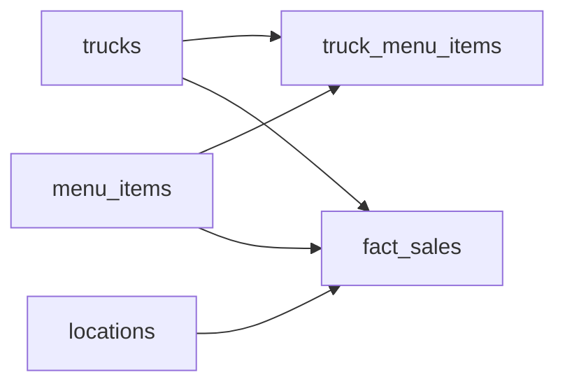

# Food Truck Operations Data Model
_Mobile vendor, fixed menu, unpredictable locations._

- **Domain:** data_modeling
- **Difficulty:** Medium
- **Est. time:** 30 min
- **URL:** https://datadriven.io/problems/food_truck_operations_data_model

## Problem

We operate a fleet of food trucks. Each truck has a menu and moves between locations throughout the day. Customers order at a truck and pay. Operations wants to know: which items sell best at which locations? Which trucks are most profitable by day? Design the data model to answer these questions.

**Concepts tested:** `dmDimensionTables`, `dmFactTables`, `dmForeignKeys`, `dmGrainDefinition`, `dmJunctionTables`, `dmManyToMany`, `dmMetricAdditivity`, `dmOneToMany`, `dmPrimaryKeys`, `dmStarSchema`, `dmSurrogateKeys`

## Solution walkthrough


### Why this problem exists in real interviews

This probes whether a candidate understands **when to snapshot a measure onto a fact row** instead of joining through a dimension. Price and location both drift constantly in this domain, and the design that looks normalized on day one quietly rewrites history on day ninety.

> **Trick to Solving**
>
> When a prompt says “trucks move between locations throughout the day” and “menu prices change,” the trick is to recognize that joining to find “the price” or “the location” of a sale is a trap. Before designing, ask: does the fact row need to remember the moment it happened?
>
> 1. Snapshot `price_charged` onto `fact_sales`
> 2. Snapshot `location_id` onto `fact_sales`
> 3. Keep `truck_menu_items` as a junction with effective dates for the menu
> 4. Do not join to reconstruct historical price

---

### Break down the requirements

**Step 1: Declare the grain**

One row in `fact_sales` equals one line item on one order at one truck at one point in time. This is atomic and additive.

**Step 2: Model the catalog vs the menu**

`menu_items` is the global catalog. `truck_menu_items` is the junction expressing which truck sells which item at which price, valid between effective dates.

**Step 3: Snapshot `price_charged` on the fact**

Prices change. If a customer paid five dollars and the menu later says six, the sales total must still show five. The snapshot lives on `fact_sales.price_charged`.

**Step 4: Snapshot `location_id` on the fact**

Because trucks physically move, the location at sale time is a fact attribute, not a truck attribute. Joining through a schedule dimension is possible but adds latency and edge cases.

---

### The solution

Below is one conceptually sound approach. The key decision is denormalizing `price_charged` and `location_id` onto the fact row, which trades a little storage for correctness under change.


**trucks**

| column | type | key |
|---|---|---|
| truck_id | INT | PK |
| name | TEXT |  |
| license_plate | TEXT |  |
| capacity | INT |  |

**locations**

| column | type | key |
|---|---|---|
| location_id | INT | PK |
| name | TEXT |  |
| latitude | DECIMAL |  |
| longitude | DECIMAL |  |
| city | TEXT |  |

**menu_items**

| column | type | key |
|---|---|---|
| menu_item_id | INT | PK |
| name | TEXT |  |
| category | TEXT |  |

**truck_menu_items**

| column | type | key |
|---|---|---|
| truck_id | INT | FK |
| menu_item_id | INT | FK |
| list_price | DECIMAL |  |
| effective_from | DATE |  |
| effective_to | DATE |  |

**fact_sales**

| column | type | key |
|---|---|---|
| sale_id | BIGINT | PK |
| truck_id | INT | FK |
| location_id | INT | FK |
| menu_item_id | INT | FK |
| sold_at | TIMESTAMP |  |
| price_charged | DECIMAL |  |
| quantity | INT |  |


> **Why this works**
>
> Snapshotting on the fact is a well-known Kimball move for drifting measures. It trades a little denormalization for the guarantee that yesterday’s total cannot silently change when today’s menu updates. The junction table `truck_menu_items` still answers “what is on the menu right now” through effective dates.

> **Interviewers watch for**
>
> A strong candidate surfaces the “historical price” question before being asked and reaches for snapshot columns without hesitation. They also notice that truck location is time-varying and refuse to model it as a static truck attribute.

> **Common pitfall**
>
> Looking up price by joining `menu_items` at read time. The first time an operations manager updates a price, every historical sales total silently changes. Interviewers view this as a silent-data-corruption bug.

---

### The analysis pattern

**Top items per location last week**

```sql
SELECT
    l.name AS location,
    m.name AS item,
    SUM(s.price_charged * s.quantity) AS revenue,
    SUM(s.quantity) AS units
FROM fact_sales s
JOIN locations l ON l.location_id = s.location_id
JOIN menu_items m ON m.menu_item_id = s.menu_item_id
WHERE s.sold_at >= NOW() - INTERVAL '7 days'
GROUP BY l.name, m.name
ORDER BY l.name, revenue DESC
```

---

### Trade-offs and alternatives

| Snapshot on fact | Type 2 SCD on menu |
|---|---|
| `price_charged` and `location_id` live on `fact_sales`.

* Reads are a simple SELECT SUM
* History is immutable by construction
* Slightly more fact storage | `truck_menu_items` versioned with `effective_from`/`effective_to` and surrogate keys.

* Single source of truth for price
* Every revenue query becomes a temporal range join
* Backfills and corrections are delicate |

---

- **How do you compute truck utilization by hour when a truck moves three times in a day?**
  - _Tests whether the candidate reaches for an explicit `truck_location_schedule` or a window function over sales._
- **A promo discounts 20 percent after 3pm. Where does the discount live?**
  - _Tests decomposition of price into `list_price`, discount, and `paid_price` on the fact row._
- **How would you support a commissary model where multiple trucks share prep?**
  - _Tests whether the candidate introduces a commissary dimension or a bridge table._
- **If sales volume 10x-ed, how would you partition `fact_sales`?**
  - _Tests scale thinking: date partitioning, clustering by location or truck._
