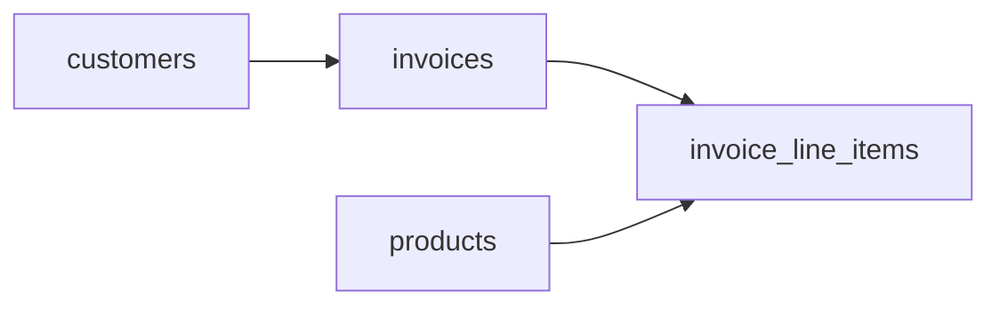

# Ghosts in the Ledger
_Invoices go out, partial payments trickle in, and some customers are three months overdue._

- **Domain:** data_modeling
- **Difficulty:** Easy
- **Est. time:** 15 min
- **URL:** https://datadriven.io/problems/ghosts_in_the_ledger

## Problem

We run a B2B SaaS platform that bills customers monthly. Each invoice pairs a header carrying the billing period and running status with a variable set of charges for subscription tiers, usage overages, and one-time fees, where every charge locks in the price that was in effect when the bill was issued. Finance needs to see what each customer still owes as invoices age past their due date.

**Concepts tested:** `dmAttributes`, `dmConstraints`, `dmDataTypes`, `dmDimensionTables`, `dmEntities`, `dmFactTables`, `dmForeignKeys`, `dmGrainDefinition`, `dmMetricAdditivity`, `dmOneToMany`, `dmPrimaryKeys`

## Solution walkthrough


### Why this problem exists in real interviews

This probes whether a candidate understands **header versus line grain** and the independence of price snapshots from the product catalog. Invoicing is the canonical one-to-many header-detail pattern, and getting the unit price semantics wrong produces audit failures that interviewers see every quarter.

> **Trick to Solving**
>
> Before drawing tables, a strong candidate asks: is the invoice immutable once issued? The signal in this prompt is AR tracking and prices locked at billing time, which means price on the line item is a point-in-time fact, not a lookup into a mutable product table.
>
> 1. Split header (one per invoice) from detail (one per line)
> 2. Snapshot `unit_price` on `invoice_line_items` at issue time
> 3. Keep `customers` and `products` as dimensions
> 4. Store `amount` explicitly so reconciliation does not depend on a recomputation

---

### Break down the requirements

**Step 1: Declare the two grains**

`invoices` has one row per invoice number. `invoice_line_items` has one row per charge on that invoice. The relationship is strictly 1:M and every line belongs to exactly one header.

**Step 2: Snapshot the price on the line**

Unit price must live on `invoice_line_items` at write time. Looking it up from `products` later breaks the moment pricing changes, and every historical invoice would restate itself, which is a direct audit failure.

**Step 3: Dimension customers**

Customer name, billing address, and payment terms live once on `customers`. Embedding them on each invoice is a Type 1 SCD in disguise and erases the ability to rerun an old invoice.

**Step 4: Reconcile at the header**

AR aging rolls up at the invoice level (issued, due, status, outstanding). Line items feed gross margin analysis. Both rollups share one set of conformed dimensions.

---

### The solution

Below is one conceptually sound approach. The grain anchors the design: one row per invoice on the header, one row per charge on the detail.


**customers**

| column | type | key |
|---|---|---|
| customer_id | INT | PK |
| legal_name | TEXT |  |
| billing_email | TEXT |  |
| payment_terms_days | INT |  |
| created_at | TIMESTAMP |  |

**products**

| column | type | key |
|---|---|---|
| product_id | INT | PK |
| sku | TEXT |  |
| product_name | TEXT |  |
| list_price | DECIMAL |  |
| is_subscription | BOOLEAN |  |

**invoices**

| column | type | key |
|---|---|---|
| invoice_id | BIGINT | PK |
| customer_id | INT | FK |
| issue_date | DATE |  |
| due_date | DATE |  |
| status | TEXT |  |
| total_amount | DECIMAL |  |

**invoice_line_items**

| column | type | key |
|---|---|---|
| line_id | BIGINT | PK |
| invoice_id | BIGINT | FK |
| product_id | INT | FK |
| quantity | DECIMAL |  |
| unit_price | DECIMAL |  |
| line_total | DECIMAL |  |


> **Why this works**
>
> The design separates the immutable record (invoice and its lines) from the mutable catalog (products, customers). Reprinting a 2023 invoice in 2026 yields the same totals because all monetary facts live on the line. The trade-off is storage redundancy: `unit_price` is duplicated for every line even when the price has not changed.

> **Interviewers watch for**
>
> Strong candidates volunteer the snapshot argument without being asked and frame it as an audit requirement. They also call out that `total_amount` on `invoices` should be derived from the line items but stored for reconciliation speed. Weak candidates lookup `products.list_price` at query time and then spend the rest of the interview explaining why last quarter's AR aging no longer matches the general ledger.

> **Common pitfall**
>
> Embedding customer billing address directly on `invoices` as columns. It looks convenient, but it silently becomes the de facto Type 1 customer dimension, and any customer update rewrites the history of every past invoice.

---

### The analysis pattern

**AR aging by customer**

```sql
SELECT
    c.legal_name,
    SUM(CASE WHEN i.due_date >= CURRENT_DATE THEN i.total_amount ELSE 0 END) AS current_ar,
    SUM(CASE WHEN i.due_date < CURRENT_DATE AND CURRENT_DATE - i.due_date <= 30 THEN i.total_amount ELSE 0 END) AS past_due_30,
    SUM(CASE WHEN CURRENT_DATE - i.due_date > 30 THEN i.total_amount ELSE 0 END) AS past_due_60_plus
FROM invoices i
JOIN customers c ON c.customer_id = i.customer_id
WHERE i.status = 'outstanding'
GROUP BY c.legal_name
ORDER BY past_due_60_plus DESC
```

---

### Trade-offs and alternatives

| Header-detail snapshot | Event-sourced invoices |
|---|---|
| Two tables, immutable lines, fast reporting. Cost: reprice changes cannot be retroactively applied, which is the point for AR but awkward for promotions. | Append every state transition (created, revised, paid) as events; project invoices as a read model. Cost: more infrastructure, but every change is auditable and replayable. |

---

- **How would you handle a partial payment that covers some line items but not others?**
  - _Tests whether the candidate introduces a separate payment allocations table._
- **What if finance issues a credit memo against a prior invoice?**
  - _Tests whether corrections are modeled as new signed rows versus mutating the original invoice._
- **How do you keep `invoices.total_amount` consistent with the sum of line items?**
  - _Tests whether the candidate uses a trigger, a check constraint, or an ETL contract._
