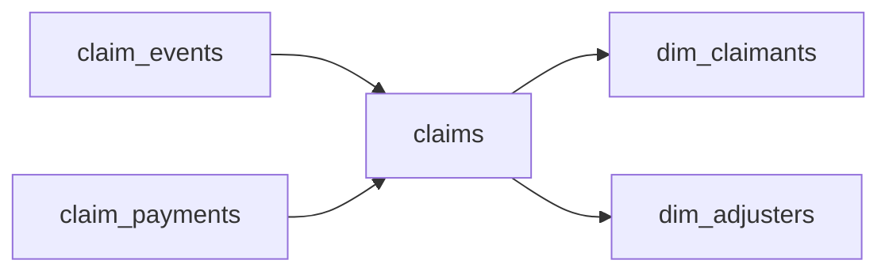

# Insurance Claims Lifecycle
_A claim gets filed. Then it gets complicated. Then it gets reassigned. Then it loops back._

- **Domain:** data_modeling
- **Difficulty:** Hard
- **Est. time:** 25 min
- **URL:** https://datadriven.io/problems/insurance_claims_lifecycle

## Problem

We need a data model for our insurance claims system. A claim goes through many stages: filed, assigned, investigated, approved or denied, then paid out. We need to track the full lifecycle with version history for audit. Design it.

**Concepts tested:** `dmAttributes`, `dmDataTypes`, `dmDimensionTables`, `dmEntities`, `dmFactTables`, `dmForeignKeys`, `dmGrainDefinition`, `dmOneToMany`, `dmPrimaryKeys`, `dmScdType2`, `dmStarSchema`, `dmSurrogateKeys`

## Solution walkthrough


This is a slowly changing dimension with an insurance badge on it. Every reassignment, status flip and amount revision is a new version of the same claim. So the real skill is keeping two things apart: **who the claim is** (`claim_id`, stable forever) and which version you are looking at (`claim_sk`, one per change). Anyone can draw claimants, adjusters and payments. The trap comes in two forms. One is making `claim_id` the primary key of `claims` and updating it in place. The other is still joining on it once versions exist. With the first, the audit trail is gone the moment an adjuster changes. With the second, a claim with four versions quadruples every payment total that joins through it.

### Building it

**Step 1: Declare the grain before the columns**

One `claims` row is one claim during one stretch of time in which nothing about it changed. Say that sentence out loud. It forces `valid_from` and `valid_to` onto the table. It also rules out `claim_id` as the key, because a claim that loops back from 'investigated' to 'assigned' has many rows.

**Step 2: Give each version its own surrogate key**

`claim_sk` identifies the version row and is the PK. `claim_id` stays as a plain durable key that repeats across versions. It is the number an adjuster types into a search box. `claimant_id` and `current_adjuster_id` are ordinary FKs into the two dimensions.

**Step 3: Point the facts at the version they happened under**

`claim_events` holds one row per state transition. `claim_payments` holds one row per disbursement, so installments never collapse into a `paid_amount` column. Each fact carries `claim_sk`, the version in effect when it occurred, plus `claim_id` for grouping across versions. A fact joined to `claims` on `claim_sk` returns exactly one row, every time.

**Step 4: Close the old row, open the new one**

A reassignment sets `valid_to` on the current row to the event time. It then inserts a new row whose `valid_from` is that same instant, with `valid_to` left `NULL`. That one closing timestamp is the only value ever overwritten.


**dim_claimants**

| column | type | key |
|---|---|---|
| claimant_id | BIGINT | PK |
| full_name | TEXT |  |
| policy_number | TEXT |  |
| dob | DATE |  |

**dim_adjusters**

| column | type | key |
|---|---|---|
| adjuster_id | INT | PK |
| full_name | TEXT |  |
| region | TEXT |  |
| hired_at | DATE |  |

**claims**

| column | type | key |
|---|---|---|
| claim_sk | BIGINT | PK |
| claim_id | BIGINT |  |
| claimant_id | BIGINT | FK |
| current_adjuster_id | INT | FK |
| status | TEXT |  |
| claim_amount | DECIMAL |  |
| valid_from | TIMESTAMP |  |
| valid_to | TIMESTAMP |  |

**claim_events**

| column | type | key |
|---|---|---|
| event_id | BIGINT | PK |
| claim_sk | BIGINT | FK |
| claim_id | BIGINT |  |
| event_type | TEXT |  |
| event_payload | JSON |  |
| actor_id | INT |  |
| occurred_at | TIMESTAMP |  |

**claim_payments**

| column | type | key |
|---|---|---|
| payment_id | BIGINT | PK |
| claim_sk | BIGINT | FK |
| claim_id | BIGINT |  |
| amount | DECIMAL |  |
| paid_at | TIMESTAMP |  |
| method | TEXT |  |


> **A repeated key fans out every join**
>
> Candidates who notice the versioning still wire `claim_payments.claim_id` to `claims.claim_id`. That key is no longer unique. A claim reassigned three times has four rows, so `SUM(amount)` grouped by adjuster reports four times the money actually paid. The FK has to land on the PK, which is `claim_sk`.

### Reading history back

**Claim state as of a date**

```sql
SELECT
    c.claim_id,
    c.status,
    c.claim_amount,
    a.full_name AS adjuster
FROM claims c
JOIN dim_adjusters a ON a.adjuster_id = c.current_adjuster_id
WHERE c.claim_id = 90125
  AND TIMESTAMP '2026-01-15 00:00:00+00' >= c.valid_from
  AND (c.valid_to IS NULL OR TIMESTAMP '2026-01-15 00:00:00+00' < c.valid_to)
```

> **Half-open intervals never overlap**
>
> The predicate is `as_of >= valid_from AND as_of < valid_to`, where `valid_to IS NULL` means the row is still current. Use `BETWEEN` instead and the instant of a reassignment matches both the closing row and the opening row. The same claim then comes back twice, with two adjusters.

| Update in place | Type 2 versions |
|---|---|
| `UPDATE claims SET status = 'approved'` keeps one row per claim and destroys the prior state. 'What did this claim look like on 15 January?' becomes unanswerable, and no payment records which adjuster authorized it. | Each change appends a row keyed by `claim_sk`. The as-of question becomes one indexed range filter. Every payment row still points at the exact version it was paid under, adjuster included. |

> **Name the grain in the first minute**
>
> The senior tell is saying 'one row per claim per version' before drawing a single column, then defending why facts reference `claim_sk` rather than `claim_id`. Candidates who start from the stage list tend to draw one table per stage. That design shatters the lifecycle the moment a claim loops back.

- **An adjuster's `region` changes. Should `dim_adjusters` become Type 2 as well?**
  - _Tests whether versioning is applied where an audit question needs it, not everywhere by reflex._
- **How do you list the current adjuster for every open claim without a date literal?**
  - _Tests the `valid_to IS NULL` convention and a partial index on current rows._
- **A payment is corrected after it posts. Where does the correction live?**
  - _Tests reversal rows in `claim_payments` instead of an `UPDATE` to `amount`._
- **How would you report average time from 'filed' to 'paid' per region?**
  - _Tests reading milestones from `claim_events` and reaching the adjuster through `claim_sk`._
