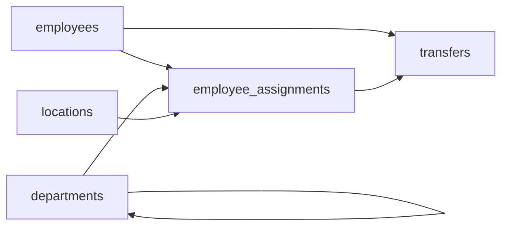

# Lateral Paths
_People switch teams. HR loses track._

- **Domain:** data_modeling
- **Difficulty:** Medium
- **Est. time:** 25 min
- **URL:** https://datadriven.io/problems/lateral_paths

## Problem

We run a large tech company where a single transfer can move someone to a new team, a new manager, and a different office all at once, and departments themselves nest into larger divisions and orgs. Today HR keeps only each employee's current department, manager, and office in one table, so every move erases where they sat before. Design a schema that preserves the full movement history and can answer where any employee was on a given past date.

**Concepts tested:** `dmAttributes`, `dmCompositeKeys`, `dmConstraints`, `dmDataTypes`, `dmEntities`, `dmForeignKeys`, `dmGrainDefinition`, `dmJunctionTables`, `dmManyToMany`, `dmOneToMany`, `dmPrimaryKeys`, `dmScdType2`, `dmSurrogateKeys`

## Solution walkthrough


### Why this problem exists in real interviews

This probes whether a candidate recognizes the classic **SCD Type 2 on the employee dimension** pattern and can model atomic transfers that change multiple attributes at once. HR data is the textbook use case, and a single-row-per-employee design fails the moment anyone asks 'who managed this team last quarter?'

> **Trick to Solving**
>
> Before drawing tables, a strong candidate asks: do we need to answer questions as-of a historical date, and is a transfer a single event or multiple separate attribute changes? The signal is 'losing history on every move,' which maps straight to Type 2 employee assignments.
>
> 1. Keep `employees` as the identity table
> 2. Put mutable attributes (department, manager, office) on `employee_assignments` with effective dates
> 3. Record each transfer as one atomic row in `transfers`
> 4. Self-reference departments for the org hierarchy

---

### Break down the requirements

**Step 1: Separate identity from assignment**

`employees` holds stable attributes (`employee_id`, name, `hire_date`). Everything that changes (department, manager, location) lives on `employee_assignments` with effective dates.

**Step 2: Make assignments Type 2**

Each row carries `effective_from` and `effective_to`, with NULL on the current row. A partial unique index on `(employee_id) WHERE effective_to IS NULL` guarantees exactly one current assignment per person.

**Step 3: Record transfers atomically**

A transfer can change department, manager, and location together. `transfers` is one row per transfer event with the old and new assignment keys. That guarantees the three attribute changes are correlated rather than appearing as three unrelated history rows.

**Step 4: Self-reference departments**

An org chart is a hierarchy. `departments` carries `parent_department_id` pointing back at itself, which supports rollups like 'all engineering headcount' without a bridge table.

**Step 5: Keep locations as a separate dimension**

Office location changes independently of department (remote reorgs, office closures). A dedicated `locations` dimension lets location Type 2 evolve on its own cadence.

---

### The solution

Below is one conceptually sound approach: identity on `employees`, mutable context on `employee_assignments` (Type 2), and a transfer event log that ties the changes together.


**employees**

| column | type | key |
|---|---|---|
| employee_id | BIGINT | PK |
| full_name | TEXT |  |
| hire_date | DATE |  |
| email | TEXT |  |

**departments**

| column | type | key |
|---|---|---|
| department_id | INT | PK |
| department_name | TEXT |  |
| parent_department_id | INT | FK |

**locations**

| column | type | key |
|---|---|---|
| location_id | INT | PK |
| office_name | TEXT |  |
| city | TEXT |  |
| country | TEXT |  |

**employee_assignments**

| column | type | key |
|---|---|---|
| assignment_id | BIGINT | PK |
| employee_id | BIGINT | FK |
| department_id | INT | FK |
| manager_id | BIGINT | FK |
| location_id | INT | FK |
| effective_from | DATE |  |
| effective_to | DATE |  |

**transfers**

| column | type | key |
|---|---|---|
| transfer_id | BIGINT | PK |
| employee_id | BIGINT | FK |
| from_assignment_id | BIGINT | FK |
| to_assignment_id | BIGINT | FK |
| transfer_date | DATE |  |
| reason | TEXT |  |


> **Why this works**
>
> Identity is stable; context is temporal. The assignment table answers 'what was true as of a date,' and the transfer table answers 'why did it change.' The trade-off is extra joins on every report in exchange for a reproducible response to every historical question.

> **Interviewers watch for**
>
> Strong candidates separate identity from assignment without being told. They also propose the partial unique index on current rows. Weak candidates bolt a `history` JSON column onto `employees` and then cannot explain how to query for the state on a specific date.

> **Common pitfall**
>
> Using Type 2 on every attribute independently, so a department change creates a row, a manager change creates a different row, and the two look uncorrelated. A transfer event ties them together as one correlated change.

---

### The analysis pattern

**Headcount by department as of a historical date**

```sql
SELECT
    d.department_name,
    COUNT(*) AS headcount
FROM employee_assignments ea
JOIN departments d ON d.department_id = ea.department_id
WHERE ea.effective_from <= '2024-01-01'
  AND (ea.effective_to IS NULL OR ea.effective_to > '2024-01-01')
GROUP BY d.department_name
ORDER BY headcount DESC
```

---

### Trade-offs and alternatives

| Type 2 assignments plus transfer log | Append-only HR event stream |
|---|---|
| Familiar Kimball pattern, easy point-in-time queries, BI tools handle it natively. Cost: two writes per transfer (close old, insert new) and join cost on every report. | Raw event log of every HR change, projections built downstream. Cost: more infrastructure and analysts need projection tables to answer simple questions; buys replay and audit. |

---

- **How do you represent a promotion that changes title but nothing else?**
  - _Tests whether title lives on `employee_assignments` or on its own history table._
- **How would you handle a retroactive correction to a transfer date?**
  - _Tests whether corrections rewrite the assignment rows or append a correction event._
- **What if two employees switch positions simultaneously?**
  - _Tests whether the transfer event model handles atomic multi-employee swaps._
- **How do you compute tenure in current role without scanning the full history?**
  - _Tests whether the candidate queries `effective_from` on the current assignment._
- **At 80k employees with monthly reorgs, how do you keep the department hierarchy query cheap?**
  - _Tests materialized path or closure table for the self-referential departments tree._
