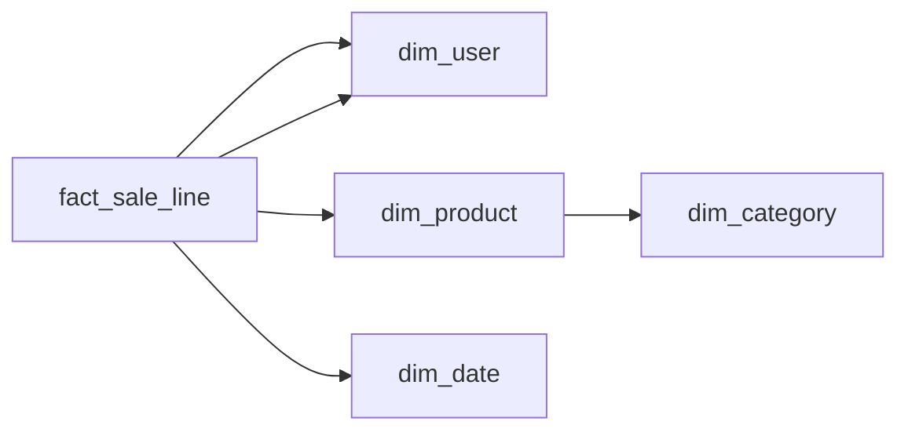

# Marketplace Sales Warehouse
_No schema given. The interviewer is watching._

- **Domain:** data_modeling
- **Difficulty:** Hard
- **Est. time:** 40 min
- **URL:** https://datadriven.io/problems/marketplace_sales_warehouse

## Problem

On our two-sided marketplace any account can buy or sell, and every item line in an order has both a buyer and a seller, so the analyst building our self-service warehouse needs GMV, commission and seller performance sliceable by account region, product category and its parent category, and date. Sellers reprice constantly, yet booked GMV and commission must never change after the sale. No schema exists yet: establish the entities, their relationships and the dimensional model from scratch.

**Concepts tested:** `dmDenormalization`, `dmDimensionTables`, `dmFactTables`, `dmForeignKeys`, `dmGrainDefinition`, `dmMetricAdditivity`, `dmOneToMany`, `dmPrimaryKeys`, `dmSnowflakeSchema`, `dmSurrogateKeys`

## Solution walkthrough


### What this is really asking

This is a star schema with one twist hiding in the word marketplace: every sale has **two parties drawn from the same population**. Anyone can lay out a fact and four dimensions. What separates candidates is noticing that buyer and seller are both accounts, so the fact points at the account dimension twice. Miss it and you have a warehouse that can report GMV by buyer region and has no way to answer the one question the prompt names: how are sellers performing.

> **Two roles, one account dimension**
>
> Fix the grain at one item line, put two foreign keys to the account dimension on that line (one as buyer, one as seller), and freeze the price and commission onto the line itself. Everything else is a standard dimensional spine.

---

### Build it in order

**Step 1: Declare the grain first**

Analysts drill to individual item lines and nothing finer, so `fact_sale_line` holds one row per item in an order, keyed by `sale_line_id` with `order_id` kept as a plain attribute. Quantity, GMV and commission are all additive at this grain.

**Step 2: Give the fact both parties**

An account can buy today and sell tomorrow, so a separate seller table would duplicate every account that does both. `buyer_sk` and `seller_sk` both reference `dim_user.user_sk`: one dimension, two roles, two edges.

**Step 3: Freeze the money on the line**

Sellers reprice constantly. `price_at_sale` and `commission_amount` live on the fact row, written once at the moment of sale, so a later price change on the product never reaches booked GMV.

**Step 4: Snowflake the category rollup**

Products carry brand and SKU plus a `category_sk` into `dim_category`, which holds the category and its broader parent. That one snowflake hop lets analysts report at both levels and absorbs a category reorg without touching fact rows.

---

### The reference design


**dim_user**

| column | type | key |
|---|---|---|
| user_sk | BIGINT | PK |
| user_id | TEXT |  |
| region | TEXT |  |
| signup_date | DATE |  |

**dim_product**

| column | type | key |
|---|---|---|
| product_sk | BIGINT | PK |
| product_id | TEXT |  |
| category_sk | BIGINT | FK |
| brand | TEXT |  |
| sku | TEXT |  |

**dim_category**

| column | type | key |
|---|---|---|
| category_sk | BIGINT | PK |
| category_name | TEXT |  |
| parent_category | TEXT |  |

**dim_date**

| column | type | key |
|---|---|---|
| date_sk | INT | PK |
| full_date | DATE |  |
| year | INT |  |
| quarter | INT |  |
| day_of_week | INT |  |

**fact_sale_line**

| column | type | key |
|---|---|---|
| sale_line_id | BIGINT | PK |
| order_id | BIGINT |  |
| buyer_sk | BIGINT | FK |
| seller_sk | BIGINT | FK |
| product_sk | BIGINT | FK |
| date_sk | INT | FK |
| quantity | INT |  |
| price_at_sale | DECIMAL |  |
| commission_amount | DECIMAL |  |


> **The second key is the seniority tell**
>
> Asked to add seller performance, a candidate who drew a single `user_sk` on the fact has to admit the model cannot tell a purchase from a sale. Asking 'can one account be on both sides?' before drawing is the question that earns the second key.

> **Price on the product rewrites history**
>
> Putting `price` on `dim_product` and multiplying at query time. The first reprice silently rewrites last quarter's GMV, and finance finds out at close.

---

### Reading it back

**Seller GMV and commission by parent category and region**

```sql
SELECT
    c.parent_category,
    s.region AS seller_region,
    SUM(f.price_at_sale * f.quantity) AS gmv,
    SUM(f.commission_amount) AS commission
FROM fact_sale_line f
JOIN dim_user s ON s.user_sk = f.seller_sk
JOIN dim_product p ON p.product_sk = f.product_sk
JOIN dim_category c ON c.category_sk = p.category_sk
JOIN dim_date d ON d.date_sk = f.date_sk
WHERE d.year = 2026
GROUP BY c.parent_category, s.region
ORDER BY gmv DESC
```

| Star with role-played account | One big denormalized table |
|---|---|
| One `dim_user`, joined through `buyer_sk` or `seller_sk` depending on the question. Account changes land in one place; the fact stays narrow and additive. | Buyer and seller attributes copied inline on every line. Scans are fast on a columnar engine, but every region change means rewriting history and the table widens with each attribute. |

---

- **How do you handle multi-currency GMV across 30 marketplaces?**
  - _Tests whether the candidate snapshots an FX rate on the line or joins a currency dimension by date._
- **A seller moves region. Should last year's seller GMV move with them?**
  - _Tests whether Type 2 history on `dim_user` is considered for the seller role._
- **How would you keep fraud-flagged sales without deleting them?**
  - _Tests a soft flag on `fact_sale_line` plus default filters in the semantic layer._
- **At 100M item lines per day, how do you partition `fact_sale_line`?**
  - _Tests date partitioning and clustering by `seller_sk` for seller dashboards._
