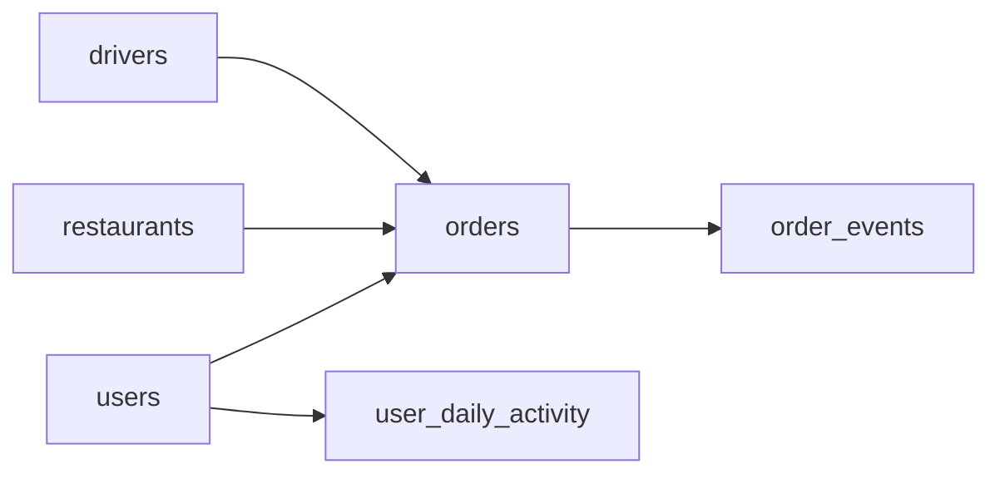

# Metric Definition Reverse Engineering
_Five numbers on a dashboard. Your job: figure out where they come from._

- **Domain:** data_modeling
- **Difficulty:** Hard
- **Est. time:** 35 min
- **URL:** https://datadriven.io/problems/metric_definition_reverse_engineering

## Problem

We're a food delivery company like DoorDash. Our exec dashboard tracks five metrics: DAU, revenue per user, order completion rate, average delivery time, and customer lifetime value. The current SQL is a mess of nested subqueries on raw event tables. Can you design a clean dimensional model that makes these metrics simple to compute?

**Concepts tested:** `dmAttributes`, `dmDenormalization`, `dmDimensionTables`, `dmEventSourcing`, `dmFactTables`, `dmForeignKeys`, `dmGrainDefinition`, `dmMetricAdditivity`, `dmOneToMany`, `dmPreAggregation`, `dmPrimaryKeys`, `dmSurrogateKeys`

## Solution walkthrough


### Why this problem exists in real interviews

This probes whether a candidate can **derive a schema from a set of metric definitions** and recognize when measures need decomposition. Revenue per user, DAU, completion rate, delivery time, and CLV each point at a different grain; the design has to honor all five simultaneously.

> **Trick to Solving**
>
> When a prompt lists metrics, the trick is to reverse-engineer the grain each one needs. DAU is not derivable from orders alone because non-orderers are invisible. Revenue must decompose into additive parts or you cannot isolate tip and promo effects.
>
> 1. Build `user_daily_activity` for DAU
> 2. Decompose revenue into subtotal, fee, tip, promo, refund
> 3. Track `order_events` at state-transition grain
> 4. Keep orders as the spine fact

---

### Break down the requirements

**Step 1: Decompose revenue**

`orders.subtotal`, `delivery_fee`, `tip`, `promo_discount`, `refund` as separate additive columns. Lumping them into `total` kills any ability to explain a delta.

**Step 2: Separate activity from orders**

`user_daily_activity` has one row per active user per day. DAU is a COUNT on this; you cannot derive DAU from orders because non-ordering sessions are missing.

**Step 3: Track order state transitions**

`order_events` captures placed, accepted, `picked_up`, delivered, cancelled with timestamps. Delivery time is `delivered_ts - placed_ts` at query time.

**Step 4: Preserve dimensional spine**

`users`, `restaurants`, `drivers` stay as dimensions so that metric slicing by segment is a single GROUP BY.

---

### The solution

Below is one defensible model. The split between orders (what happened) and `user_daily_activity` (who showed up) is the conceptual anchor for metric derivability.


**users**

| column | type | key |
|---|---|---|
| user_id | BIGINT | PK |
| signup_date | DATE |  |
| region | TEXT |  |

**restaurants**

| column | type | key |
|---|---|---|
| restaurant_id | BIGINT | PK |
| name | TEXT |  |
| cuisine | TEXT |  |
| city | TEXT |  |

**drivers**

| column | type | key |
|---|---|---|
| driver_id | BIGINT | PK |
| region | TEXT |  |
| hired_at | DATE |  |

**orders**

| column | type | key |
|---|---|---|
| order_id | BIGINT | PK |
| user_id | BIGINT | FK |
| restaurant_id | BIGINT | FK |
| driver_id | BIGINT | FK |
| placed_at | TIMESTAMP |  |
| subtotal | DECIMAL |  |
| delivery_fee | DECIMAL |  |
| tip | DECIMAL |  |
| promo_discount | DECIMAL |  |
| refund | DECIMAL |  |

**order_events**

| column | type | key |
|---|---|---|
| event_id | BIGINT | PK |
| order_id | BIGINT | FK |
| event_type | TEXT |  |
| event_ts | TIMESTAMP |  |

**user_daily_activity**

| column | type | key |
|---|---|---|
| user_id | BIGINT | FK |
| activity_date | DATE |  |
| session_count | INT |  |
| last_seen_ts | TIMESTAMP |  |


> **Why this works**
>
> Every metric has a clean path through this schema: DAU from `user_daily_activity`, revenue per user from orders grouped by `user_id`, completion rate from `order_events`, delivery time from event timestamps, CLV from rolled-up orders by user cohort.

> **Interviewers watch for**
>
> A strong candidate walks each of the five metrics through the schema and explicitly shows the SQL pattern. They also flag that CLV is a cohort metric, not a row-level one.

> **Common pitfall**
>
> Computing DAU from `COUNT(DISTINCT user_id) FROM orders`. This silently drops every browsing session that did not buy, and the resulting DAU number is smaller than reality by exactly the non-converting traffic the product team cares about.

---

### The analysis pattern

**Five metrics derived from the schema**

```sql
WITH daily AS (
    SELECT activity_date, COUNT(DISTINCT user_id) AS dau
    FROM user_daily_activity
    GROUP BY activity_date
),
revenue AS (
    SELECT
        DATE(placed_at) AS d,
        SUM(subtotal + delivery_fee + tip - promo_discount - refund)
          / NULLIF(COUNT(DISTINCT user_id), 0) AS rev_per_user
    FROM orders
    GROUP BY DATE(placed_at)
),
completion AS (
    SELECT DATE(e1.event_ts) AS d,
           COUNT(*) FILTER (WHERE e2.event_type = 'delivered') * 1.0
             / COUNT(*) AS completion_rate
    FROM order_events e1
    LEFT JOIN order_events e2 ON e2.order_id = e1.order_id AND e2.event_type = 'delivered'
    WHERE e1.event_type = 'placed'
    GROUP BY DATE(e1.event_ts)
)
SELECT daily.activity_date, dau, rev_per_user, completion_rate
FROM daily
LEFT JOIN revenue ON revenue.d = daily.activity_date
LEFT JOIN completion ON completion.d = daily.activity_date
```

---

### Trade-offs and alternatives

| Decomposed revenue + activity fact | Single orders fact with total column |
|---|---|
| Revenue split into additive parts; DAU from its own fact.

* Every metric is derivable with a GROUP BY
* Deltas can be explained component by component
* Two facts to keep fresh | One orders table with a precomputed total.

* Simpler ingest
* DAU query silently wrong
* Cannot isolate promo or tip contribution |

---

- **How do you backfill `user_daily_activity` if session logs only go back 30 days?**
  - _Tests the candidate’s awareness that DAU is an append-only reality and cannot be reconstructed from orders._
- **A delivery is marked delivered but later disputed and reversed. Which metric is affected?**
  - _Tests whether the candidate can reason about late-arriving corrections to completion rate._
- **How would you compute CLV at a 90-day horizon for last month’s cohort?**
  - _Tests whether the schema supports cohort-by-signup plus rolled-up revenue over a window._
- **A new metric, restaurant acceptance latency, is requested. Does the schema already support it?**
  - _Tests whether `order_events` carries enough lifecycle coverage._
- **Two regions have different definitions of promo discount. How do you reconcile?**
  - _Tests whether the candidate pushes the reconciliation into the semantic layer or into a conformed definition._
