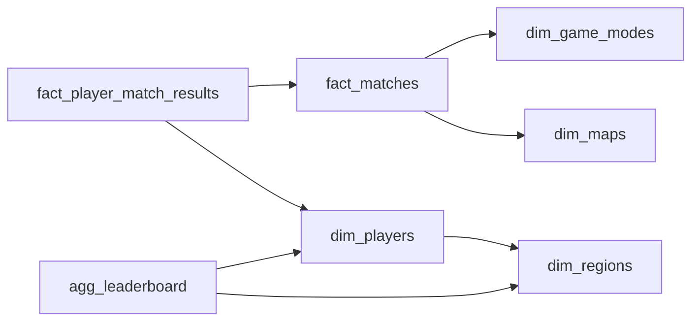

# Multiplayer Game Match History
_Millions of matches. The leaderboard refreshes in fifteen minutes._

- **Domain:** data_modeling
- **Difficulty:** Medium
- **Est. time:** 20 min
- **URL:** https://datadriven.io/problems/multiplayer_game_match_history

## Problem

We run a multiplayer online game. We need to track every match played, which players participated, their scores, and derive a ranked leaderboard. Product wants to query top players by region, average score per player, and match count over the last 30 days. Design the data model.

**Concepts tested:** `dmAttributes`, `dmDimensionTables`, `dmEntities`, `dmFactTables`, `dmForeignKeys`, `dmGrainDefinition`, `dmManyToMany`, `dmMetricAdditivity`, `dmOneToMany`, `dmPreAggregation`, `dmPrimaryKeys`, `dmStarSchema`, `dmSurrogateKeys`

## Solution walkthrough


### The costume and the trap

Strip the leaderboard costume off and this is a many-to-many between players and matches, plus one question that separates seniors: what do you actually store in the leaderboard? Anyone can draw `dim_players` and `fact_matches`. The trap is stashing `win_rate` on `agg_leaderboard` to make top-N reads cheap. The moment product wants a regional or seasonal cut, a stored ratio **cannot be summed**, and every roll-up collapses back into a fact-table rescan. Store the additive parts and compute the rate at read time.

> **Store the parts, not the ratio**
>
> Keep `total_wins`, `total_matches` and `total_score` on `agg_leaderboard`; derive `win_rate` in the SELECT. Additive columns roll up across regions, seasons and time windows for free; a stored rate locks you into exactly one grain.

### Building the model

**Step 1: Bridge players to matches**

`fact_player_match_results` holds one row per player per match with `score`, `kills` and `is_win`. It resolves the many-to-many and is the source of truth for every per-player stat, so its grain is (`match_id`, `player_id`).

**Step 2: Put an `is_ranked` flag on the match**

`fact_matches.is_ranked` is the one switch that controls leaderboard eligibility. Leave it out and casual pub-stomps inflate ranks, and there is no clean way to exclude them after the fact.

**Step 3: Keep the leaderboard columns additive**

`agg_leaderboard` stores `total_wins`, `total_matches` and `total_score`, never `win_rate`. Additive columns let you combine two partial aggregates by adding them; a ratio has to be recomputed from totals you no longer kept.

**Step 4: Declare the refresh cadence**

`agg_leaderboard` is a table, not a view, refreshed on a fixed cadence (every 15 minutes here). That is the deliberate trade: bounded staleness in exchange for cheap top-N reads, plus a reconciliation path for late corrections.

One defensible model. The bridge `fact_player_match_results` and the additive pre-aggregate `agg_leaderboard` are the two load-bearing decisions; everything else is conformed dimensions hanging off the fact.


**dim_players**

| column | type | key |
|---|---|---|
| player_id | BIGINT | PK |
| display_name | TEXT |  |
| region_id | INT | FK |
| signup_date | DATE |  |

**dim_regions**

| column | type | key |
|---|---|---|
| region_id | INT | PK |
| name | TEXT |  |

**dim_game_modes**

| column | type | key |
|---|---|---|
| mode_id | INT | PK |
| name | TEXT |  |
| team_size | INT |  |

**dim_maps**

| column | type | key |
|---|---|---|
| map_id | INT | PK |
| name | TEXT |  |
| biome | TEXT |  |

**fact_matches**

| column | type | key |
|---|---|---|
| match_id | BIGINT | PK |
| mode_id | INT | FK |
| map_id | INT | FK |
| started_at | TIMESTAMP |  |
| duration_sec | INT |  |
| is_ranked | BOOLEAN |  |

**fact_player_match_results**

| column | type | key |
|---|---|---|
| match_id | BIGINT | FK |
| player_id | BIGINT | FK |
| team | TEXT |  |
| score | INT |  |
| kills | INT |  |
| is_win | BOOLEAN |  |

**agg_leaderboard**

| column | type | key |
|---|---|---|
| player_id | BIGINT | FK |
| region_id | INT | FK |
| total_matches | INT |  |
| total_wins | INT |  |
| total_score | BIGINT |  |
| refreshed_at | TIMESTAMP |  |


> **A stored win rate cannot be rolled up**
>
> Putting `win_rate` on `agg_leaderboard` looks tidy until you combine two partial aggregates (say two regions): the merged rate needs the underlying `total_wins` and `total_matches`, which you threw away. Keep the totals and the roll-up is one addition.

> **Naming additivity out loud is the tell**
>
> Strong candidates say "additive versus non-additive measures" unprompted, and they volunteer how often `agg_leaderboard` refreshes and what happens when a `fact_player_match_results` row is corrected. That is the seniority signal, not the number of tables drawn.

### Reading the leaderboard

**Top 10 ranked players by region**

```sql
SELECT
    p.display_name,
    r.name AS region,
    l.total_wins,
    l.total_matches,
    l.total_wins * 1.0 / NULLIF(l.total_matches, 0) AS win_rate
FROM agg_leaderboard l
JOIN dim_players p ON p.player_id = l.player_id
JOIN dim_regions r ON r.region_id = l.region_id
WHERE l.total_matches >= 50
ORDER BY win_rate DESC, l.total_score DESC
LIMIT 10
```

| Pre-aggregated leaderboard table | Live query over fact tables |
|---|---|
| `agg_leaderboard` refreshed on a schedule.

* Cheap top-N reads
* Freshness bounded by cadence
* Needs a reconciliation job for late `is_ranked` corrections | Every read scans `fact_player_match_results`.

* Always fresh
* Expensive on the hot path
* Risk of timeout during peak events |

- **A match is later flagged as cheating and wiped. How does `agg_leaderboard` stay consistent?**
  - _Tests whether corrections trigger a targeted rebuild or a full refresh._
- **How would you model a seasonal reset without losing lifetime stats?**
  - _Tests introducing a `season_id` grain on `agg_leaderboard` versus partitioning._
- **At 2M matches per day, how do you keep `agg_leaderboard` refreshes under 60 seconds?**
  - _Tests incremental aggregation, CDC, or streaming roll-ups over the bridge._
