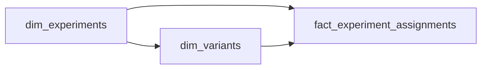

# One Door Each
_Every user picks a lane and stays in it. Model the world so the numbers stay honest._

- **Domain:** data_modeling
- **Difficulty:** Medium
- **Est. time:** ? min
- **URL:** https://datadriven.io/problems/one_door_each

## Problem

We run dozens of product experiments at once on our consumer app, and each user who enters an experiment is locked to a single variant for its duration: either the control or one of the treatment groups. Analysts measure lift by joining each user's variant assignment onto our existing event log, which stays untouched, and counting only the events that occurred after the moment that user was enrolled. Design the data model so a user can never land in two variants of the same experiment, and so an analyst rolling metrics up by variant can tell the control apart from the treatment groups.

**Concepts tested:** `dmAttributes`, `dmCardinalityRequired`, `dmCompositeKeys`, `dmConstraints`, `dmDimensionTables`, `dmEntities`, `dmFactTables`, `dmForeignKeys`, `dmGrainDefinition`, `dmImmutableLogs`, `dmJunctionTables`, `dmManyToMany`, `dmMetricAdditivity`, `dmOneToMany`, `dmPrimaryKeys`, `dmSemanticLayer`, `dmStarSchema`, `dmSurrogateKeys`

## Solution walkthrough


### Why this problem exists in real interviews

This is a set-membership-over-time problem wearing an experimentation costume. Beneath the vocabulary of control and treatment, the question is whether you can record 'this user belongs to exactly this variant, starting at this instant' as its own fact, and leave the event log alone. Anyone can name three tables. The separation that decides pass from fail is refusing to touch `fact_events`: the event log is a shared, immutable stream that a dozen experiments read from, and the moment you bolt `experiment_id` or `variant_id` onto it you have made every future correction a rewrite of billions of rows and made post-enrollment filtering impossible.

> **Trick to Solving**
>
> The prompt says the event log 'stays untouched' and that only events after enrollment count. Those two clauses together force a dedicated assignments fact with a timestamp. The moment you hear 'join user behavior to a variant, but only after the enrollment instant,' the assignment time has to live somewhere queryable, and that somewhere is not the event log.
>
> 1. Spot the temporal join requirement in the prompt
> 2. Create a separate assignments fact table (never embed on events)
> 3. Make `assignment_timestamp` a first-class column
> 4. Set the grain to one row per (`user_id`, `experiment_id`) to prevent variant leakage

---

### Break down the requirements

**Step 1: Identify the entities**

Three distinct entities: **experiments** (the test), variants (control/treatment groups), and assignments (user placed into a variant at a specific time). The event log is a fourth, pre-existing thing you read from but do not change.

**Step 2: Separate assignments from events**

Assignments must live in their own table. Embedding variant info on the event log makes temporal filtering impossible and turns the 0.1% of assignment corrections into billion-row rewrites.

**Step 3: Nail the grain**

Set the grain to one row per (`user_id`, `experiment_id`). The two key columns together carry that grain, which is what stops a user from leaking into multiple variants and invalidating every metric for that experiment.

**Step 4: Include `assignment_timestamp`**

This is the join key for post-assignment analysis. The query pattern is `WHERE event_timestamp >= assignment_timestamp`. Store it on the assignment, never on the event.

---

### The solution


**dim_experiments**

| column | type | key |
|---|---|---|
| experiment_id | INT | PK |
| name | TEXT |  |
| hypothesis | TEXT |  |
| start_date | DATE |  |
| end_date | DATE |  |
| status | TEXT |  |

**dim_variants**

| column | type | key |
|---|---|---|
| variant_id | INT | PK |
| experiment_id | INT | FK |
| variant_name | TEXT |  |
| is_control | BOOLEAN |  |
| traffic_pct | FLOAT |  |

**fact_experiment_assignments**

| column | type | key |
|---|---|---|
| user_id | UUID | PK |
| experiment_id | INT | PK |
| variant_id | INT | FK |
| assignment_timestamp | TIMESTAMP |  |
| is_active | BOOLEAN |  |

**fact_events**

| column | type | key |
|---|---|---|
| event_id | BIGINT | PK |
| user_id | UUID |  |
| event_timestamp | TIMESTAMP |  |
| event_type | TEXT |  |
| revenue | FLOAT |  |


> **Interviewers Watch For**
>
> Four things separate pass from fail:
> 1. Separate assignments table, with the event log left untouched
> 2. Grain of one row per (`user_id`, `experiment_id`)
> 3. `assignment_timestamp` as a first-class field
> 4. Understanding the temporal join pattern

> **Common Pitfall**
>
> Adding `variant_id`, `experiment_id`, or an `assigned_at` column onto `fact_events`. It feels convenient, but it creates two fatal problems: late assignment corrections now require rewriting millions of event rows, and you have coupled one shared log to every experiment that reads it. Keep the experiment context on the assignment and join at query time.

---

### The analysis pattern

**Metric lift query**

```sql
SELECT
    v.variant_name,
    COUNT(DISTINCT e.user_id) AS users,
    AVG(e.revenue)            AS avg_revenue
FROM fact_experiment_assignments a
JOIN dim_variants v ON v.variant_id = a.variant_id
JOIN fact_events e
  ON e.user_id = a.user_id
 AND e.event_timestamp >= a.assignment_timestamp
WHERE a.experiment_id = 42
  AND a.is_active = true
GROUP BY v.variant_name
```

---

### Trade-offs and alternatives

| Dedicated assignments table | Alternative: variant on event log |
|---|---|
| Clean separation of concerns. Temporal joins are clean via `assignment_timestamp`. The composite grain enforces one variant per user per experiment. The cost is one extra join on every metric query. | Variant column denormalized onto each event row. Faster reads since no join. Backfills become catastrophic when assignments are corrected. Cannot reason about pre-assignment behavior. Late-arriving data is hard to attribute correctly. |

- **What if 0.1% of assignments need to be corrected after the fact?**
  - _Tests the `is_active` flag pattern: mark old assignment inactive, insert new one, without deleting history._
- **How would you handle users in 30+ concurrent experiments at 5M DAU?**
  - _Tests partitioning strategy: partition `fact_experiment_assignments` by `experiment_id` for query performance._
- **What if you needed to measure pre-assignment vs post-assignment behavior?**
  - _Tests whether you understand why `assignment_timestamp` is load-bearing for this comparison._
- **How would the schema change to support multi-arm bandits with dynamic traffic allocation?**
  - _Tests extensibility: `traffic_pct` becomes time-varying, assignments need a version or epoch column._
