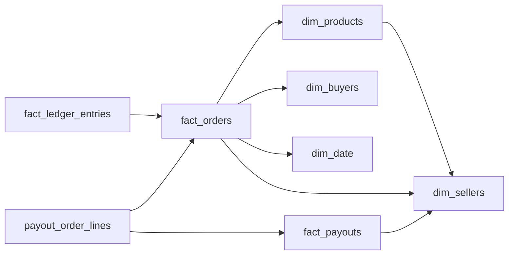

# Online Marketplace  -  Seller Payouts
_The buyer paid one number. The seller got a different one._

- **Domain:** data_modeling
- **Difficulty:** Hard
- **Est. time:** 30 min
- **URL:** https://datadriven.io/problems/online_marketplace_seller_payouts

## Problem

We run an online marketplace where third-party sellers list products and buyers purchase them. The platform collects the full payment from the buyer, deducts a commission, and pays the seller. Refunds are common and complicate the accounting. Finance needs a model that reconciles every dollar from collection to payout. Design the data model.

**Concepts tested:** `dmAttributes`, `dmDimensionTables`, `dmEntities`, `dmFactTables`, `dmForeignKeys`, `dmGrainDefinition`, `dmImmutableLogs`, `dmJunctionTables`, `dmMetricAdditivity`, `dmOneToMany`, `dmPrimaryKeys`, `dmStarSchema`, `dmSurrogateKeys`

## Solution walkthrough


### What this problem really is

This is a double-entry ledger hiding inside a payouts prompt. The buyer paid one number and the seller got a different one because commission, tax, and refunds all move money between those two points. The real skill being probed: can you let **two grains coexist** without conflating them, an order-line fact for what was sold and an append-only ledger for what cash moved? A single wide `fact_orders` with a `refund_amount` column looks fine until the first refund, when you either overwrite history or the numbers stop reconciling. Get the grain wrong and you can never reproduce last quarter's payout on demand.

> **The word "reconciles" is the whole spec**
>
> "Reconciles every dollar" demands immutability: every money movement is a new row in `fact_ledger_entries`, never an UPDATE. Once you commit to an append-only ledger beside `fact_orders`, the rest of the model falls out, refunds are negative rows, tax is its own entry type, and `payout_order_lines` bridges a batch payout back to its source order lines.

---

### Build it up

**Step 1: Declare the grain twice**

`fact_orders` is one row per product per seller per order line, keyed by `order_line_id`. `fact_ledger_entries` is one row per cash movement (charge, commission, tax, refund) keyed by `ledger_entry_id` and linked back with `order_line_id`. Two facts, two grains, one join key.

**Step 2: Model refunds as new negative rows**

A refund is not a mutation of the original charge. It is a fresh ledger row with a negative `amount` and `entry_type = 'REFUND_BUYER'`. The `fact_orders` row it refers to stays untouched, so any historical GMV snapshot stays reproducible.

**Step 3: Keep tax out of revenue**

Tax collected is a pass-through liability, not platform revenue. Give it its own `entry_type = 'TAX'` (or a dedicated column) so `subtotal` and commission math stay clean and remittance audits have a single place to look.

**Step 4: Bridge batch payouts to their orders**

One payout covers many order lines. `fact_payouts` lives at the batch grain; `payout_order_lines` is the junction whose FKs `payout_id` and `order_line_id` answer "which orders funded this payout?" without scanning the whole ledger.

Here is one defensible model. The dual-fact split is the anchor: order economics and cash movements sit in separate tables with different grains, joined through the immutable ledger, and every fact hangs off the same conformed dimensions.


**dim_buyers**

| column | type | key |
|---|---|---|
| buyer_id | BIGINT | PK |
| email | TEXT |  |
| country | TEXT |  |
| created_at | TIMESTAMP |  |

**dim_sellers**

| column | type | key |
|---|---|---|
| seller_id | BIGINT | PK |
| legal_name | TEXT |  |
| commission_tier | TEXT |  |
| onboarded_at | TIMESTAMP |  |

**dim_products**

| column | type | key |
|---|---|---|
| product_id | BIGINT | PK |
| seller_id | BIGINT | FK |
| sku | TEXT |  |
| category | TEXT |  |

**dim_date**

| column | type | key |
|---|---|---|
| date_id | INT | PK |
| calendar_date | DATE |  |
| fiscal_week | INT |  |

**fact_orders**

| column | type | key |
|---|---|---|
| order_line_id | BIGINT | PK |
| order_id | BIGINT |  |
| buyer_id | BIGINT | FK |
| seller_id | BIGINT | FK |
| product_id | BIGINT | FK |
| date_id | INT | FK |
| subtotal | DECIMAL |  |

**fact_ledger_entries**

| column | type | key |
|---|---|---|
| ledger_entry_id | BIGINT | PK |
| order_line_id | BIGINT | FK |
| entry_type | TEXT |  |
| party_id | BIGINT |  |
| amount | DECIMAL |  |
| posted_at | TIMESTAMP |  |

**fact_payouts**

| column | type | key |
|---|---|---|
| payout_id | BIGINT | PK |
| seller_id | BIGINT | FK |
| payout_date | DATE |  |
| gross_amount | DECIMAL |  |
| net_amount | DECIMAL |  |

**payout_order_lines**

| column | type | key |
|---|---|---|
| payout_id | BIGINT | FK |
| order_line_id | BIGINT | FK |
| proceeds_amount | DECIMAL |  |


> **The ledger is the system of record for cash**
>
> Because `fact_ledger_entries` is append-only, any historical finance report reproduces by filtering `posted_at <= as_of_time`. `fact_orders` stays a stable fact for GMV while the ledger carries the accounting identity. The trade-off is deliberate duplication: seller proceeds are derivable from the ledger, but keeping `fact_orders` one hop away is what keeps BI fast.

> **Do they reach for immutability unprompted**
>
> Strong candidates state the identity out loud, charges + commission + refunds + payouts nets to zero per seller, and refuse to UPDATE on refund. Weak candidates build one wide fact and propose overwriting a `refund_amount` column. The tell is whether append-only comes before you ask for it.

> **Folding tax into a revenue column**
>
> Rolling tax into `subtotal` or a `revenue` column makes every GMV and commission figure silently wrong and buries a remittance bug that only surfaces at audit. Tax is a liability you hold and forward, keep it as its own `entry_type`.

---

### Reconciling a payout batch

**Seller reconciliation by payout batch**

```sql
SELECT
    p.payout_id,
    s.legal_name,
    p.net_amount,
    SUM(l.amount) FILTER (WHERE l.entry_type = 'CHARGE') AS gross_charges,
    SUM(l.amount) FILTER (WHERE l.entry_type = 'COMMISSION') AS commission,
    SUM(l.amount) FILTER (WHERE l.entry_type IN ('REFUND_BUYER','REFUND_SELLER_DEBIT')) AS refunds
FROM fact_payouts p
JOIN dim_sellers s ON s.seller_id = p.seller_id
JOIN payout_order_lines pol ON pol.payout_id = p.payout_id
JOIN fact_ledger_entries l ON l.order_line_id = pol.order_line_id
WHERE p.payout_date = '2025-03-15'
GROUP BY p.payout_id, s.legal_name, p.net_amount
```

| Dual fact (orders + ledger) | Single wide `fact_orders` with refund columns |
|---|---|
| Clean grains, append-only cash history, reproducible finance reports. Cost: writes land in two tables and cross-fact reconciliation joins through `payout_order_lines`. | Faster reads for a plain GMV query, fewer tables. Cost: refunds and batch payouts force destructive UPDATEs, historical snapshots drift, and one payout covering many order lines cannot be expressed at all. |

- **How would you prove the identity charges + commission + refunds + payouts = 0 per seller holds in production?**
  - _Treats the ledger as a reconciliation target, not just a log._
- **A jurisdiction changes tax rates mid-quarter and 0.5% of orders need a retroactive adjustment. How do the ledger and `fact_orders` respond?**
  - _Append-only discipline: a new `TAX_CORRECTION` entry, never an UPDATE._
- **Sellers demand an as-of view of their balance on any historical date. How does the model support that?**
  - _Temporal reconstruction from one predicate on `posted_at`._
- **How would you partition `fact_ledger_entries` at 50M rows/day with a 7-year retention rule?**
  - _Range partitioning on `posted_at` with tiered storage for cold partitions._
