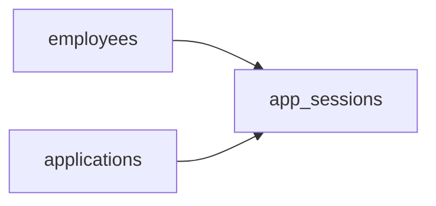

# Open Threads
_Every minute tracked. Every app accounted for._

- **Domain:** data_modeling
- **Difficulty:** Medium
- **Est. time:** 25 min
- **URL:** https://datadriven.io/problems/open_threads

## Problem

We need to track how much time employees spend in each application. HR wants daily summaries of time-per-employee-per-application, and wants to flag any employee spending more than 10 hours/day in a single application. Design the schema to capture this data.

**Concepts tested:** `dmCardinalityRequired`, `dmDataTypes`, `dmDimensionTables`, `dmEntities`, `dmEventSourcing`, `dmFactTables`, `dmForeignKeys`, `dmGrainDefinition`, `dmImmutableLogs`, `dmLateArriving`, `dmManyToMany`, `dmOneToMany`, `dmPreAggregation`, `dmPrimaryKeys`, `dmStarSchema`, `dmSurrogateKeys`

## Solution walkthrough


### Why this problem exists in real interviews

This probes whether a candidate models **open-ended sessions safely** and handles midnight-spanning windows. Both traps kill naive time-tracking schemas the moment the data hits production, and interviewers look for candidates who surface them without being asked.

> **Trick to Solving**
>
> Before drawing tables, a strong candidate asks: what if an employee's session never ends (laptop dies, crash)? And what if a session starts at 11:45 PM and ends at 12:30 AM? Both problems share one solution: nullable `end_ts` plus a daily rollup that splits at midnight.
>
> 1. Make `end_ts` nullable, with a cleanup job that auto-closes stuck sessions
> 2. Build daily rollups that split cross-midnight sessions into two buckets
> 3. Keep employees and applications as dimensions
> 4. Store the raw session fact for drilldown

---

### Break down the requirements

**Step 1: Declare the session grain**

`app_sessions` is one row per continuous use of an application by an employee. Start and end timestamps define the session; null end means the session is still open or was abandoned.

**Step 2: Make `end_ts` nullable**

An app that crashes never emits an end event. If the column is non-null, the ingest job either loses the session or fabricates a fake end. Nullable plus a scheduled cleanup job (close sessions idle for 6 hours) is the honest design.

**Step 3: Handle midnight spans in the rollup**

A session from 23:45 to 00:30 contributes 15 minutes to one day and 30 minutes to the next. The daily rollup job must clip session intervals to day boundaries, or the 10-hour flag triggers on the wrong day.

**Step 4: Keep employees and applications as dimensions**

Conformed dimensions let HR slice by department, office, or application without rebuilding the fact. The session fact carries only surrogate keys and the two timestamps.

---

### The solution

Below is one conceptually sound approach: raw sessions with nullable end, dimensional context on employees and applications, and daily rollups computed downstream.


**employees**

| column | type | key |
|---|---|---|
| employee_id | INT | PK |
| full_name | TEXT |  |
| department | TEXT |  |
| hire_date | DATE |  |

**applications**

| column | type | key |
|---|---|---|
| application_id | INT | PK |
| app_name | TEXT |  |
| vendor | TEXT |  |
| category | TEXT |  |

**app_sessions**

| column | type | key |
|---|---|---|
| session_id | BIGINT | PK |
| employee_id | INT | FK |
| application_id | INT | FK |
| start_ts | TIMESTAMP |  |
| end_ts | TIMESTAMP |  |
| device_id | TEXT |  |


> **Why this works**
>
> Open sessions are honest data, not a bug. The cleanup job is a policy layer on top of the raw fact, which preserves the ability to investigate individual sessions long after the fact. The trade-off is that daily rollups require explicit interval clipping logic rather than a simple SUM.

> **Interviewers watch for**
>
> A strong candidate brings up stuck sessions and midnight spans before the interviewer probes. They also name the cleanup job's SLA and retention window. Weak candidates assume clean start-and-end pairs and then scramble when asked about the 11:55 PM session.

> **Common pitfall**
>
> Computing daily time-in-app as `SUM(end_ts - start_ts) GROUP BY DATE(start_ts)`. A session that spans midnight is entirely attributed to the start day, and any open session is silently excluded. The 10-hour flag fires on the wrong day.

---

### The analysis pattern

**Daily minutes per employee per app with midnight clipping**

```sql
WITH clipped AS (
    SELECT
        s.employee_id,
        s.application_id,
        d.day,
        GREATEST(s.start_ts, d.day::TIMESTAMPTZ) AS clip_start,
        LEAST(COALESCE(s.end_ts, NOW()), (d.day + INTERVAL '1 day')::TIMESTAMPTZ) AS clip_end
    FROM app_sessions s
    CROSS JOIN LATERAL generate_series(
        DATE(s.start_ts),
        DATE(COALESCE(s.end_ts, NOW())),
        INTERVAL '1 day'
    ) AS d(day)
)
SELECT
    employee_id,
    application_id,
    day,
    SUM(EXTRACT(EPOCH FROM (clip_end - clip_start)) / 60) AS minutes_used
FROM clipped
GROUP BY employee_id, application_id, day
HAVING SUM(EXTRACT(EPOCH FROM (clip_end - clip_start)) / 3600) > 10
```

---

### Trade-offs and alternatives

| Raw sessions plus daily clipped rollup | Minute-bucket fact table |
|---|---|
| Raw data is preserved, rollups are recomputable, cleanup is a policy layer. Cost: rollup SQL is heavier because intervals are clipped per day. | Emit a row per minute of activity so rollups are trivial `GROUP BY`s. Cost: volume explodes by 60x, and the ingest path has to debounce duplicate activity. |

---

- **How do you detect a session that legitimately exceeds 24 hours on an always-on dashboard?**
  - _Tests whether the cleanup policy accommodates a known exception pattern._
- **What if an employee works across two time zones in one day?**
  - _Tests whether rollups are in local time or UTC and how that affects the 10-hour threshold._
- **How would you detect suspicious overlap where one employee appears in two sessions at once?**
  - _Tests an integrity check for concurrent sessions on the same employee._
- **At 500k employees, how do you keep the daily rollup fresh for a real-time dashboard?**
  - _Tests incremental rollup strategies and whether it moves to streaming._
