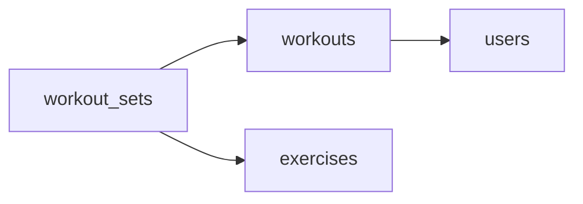

# Personal Best
_Reps, sets, streaks, and personal bests. Gym rats love their stats._

- **Domain:** data_modeling
- **Difficulty:** Easy
- **Est. time:** 15 min
- **URL:** https://datadriven.io/problems/personal_best

## Problem

We're building a fitness app where users log workouts. Each workout has exercises with sets and reps. We need to track progress over time, like 'how much can this user bench press now vs. 3 months ago?' Design the data model.

**Concepts tested:** `dmAttributes`, `dmDataTypes`, `dmEntities`, `dmFirstNormalForm`, `dmForeignKeys`, `dmGrainDefinition`, `dmOneToMany`, `dmPrimaryKeys`, `dmSecondNormalForm`, `dmThirdNormalForm`

## Solution walkthrough


### What this really is

This is a **grain declaration** dressed up as a gym app. Users, workouts, exercises and sets nest four levels deep, and "bench press now vs. 3 months ago" is a maximum over individual sets inside a date window. That answer only exists if one row is one set, carrying its own reps and weight, hung from a workout that carries the date. Anyone can draw users and workouts. What separates candidates is where they stop: at the workout, or at one summary line per exercise per workout. Fold the sets into either and the 225-pound top set averages away into the warm-ups, so the personal record the chart should show was never stored.

> **Model the thing the user saves**
>
> Ask what a single tap in the app records. It is one set: one exercise, some reps, some weight. That is your grain. Everything above it (the workout, the user) is context the set inherits through a key.

### Building it

**Step 1: Declare the grain out loud**

One row in `workout_sets` is one set of one exercise in one workout. Anything coarser buries the heaviest set inside a summary you cannot take a `MAX()` over, because the max was never written down.

**Step 2: Hang the hierarchy on foreign keys**

`workouts.user_id` points at `users`, and `workout_sets.workout_id` points at `workouts`. The set does not carry `user_id` or a date: both are facts about the workout, and storing them twice invites the copies to disagree.

**Step 3: Put the date where the session lives**

`started_at` sits on `workouts`. A session logged the next morning still happened yesterday, so the progress window reads the workout's time, not when each set row was inserted.

**Step 4: Give the exercise an identity**

`workout_sets.exercise_id` references `exercises`, which owns `canonical_name`, `muscle_group` and `equipment`. A name typed on each set would still answer the question for one user; the catalog is what keeps 'Bench Press' and 'bench press' from splitting one history in two.

**Step 5: Type the measures for math**

`reps` is `INT` and `weight_lbs` is `DECIMAL`, so `MAX` and volume arithmetic work without casting. `set_number` keeps order within a workout.


**users**

| column | type | key |
|---|---|---|
| user_id | BIGINT | PK |
| email | TEXT |  |
| display_name | TEXT |  |
| created_at | TIMESTAMP |  |

**exercises**

| column | type | key |
|---|---|---|
| exercise_id | INT | PK |
| canonical_name | TEXT |  |
| muscle_group | TEXT |  |
| equipment | TEXT |  |

**workouts**

| column | type | key |
|---|---|---|
| workout_id | BIGINT | PK |
| user_id | BIGINT | FK |
| started_at | TIMESTAMP |  |
| ended_at | TIMESTAMP |  |
| workout_type | TEXT |  |

**workout_sets**

| column | type | key |
|---|---|---|
| set_id | BIGINT | PK |
| workout_id | BIGINT | FK |
| exercise_id | INT | FK |
| set_number | INT |  |
| reps | INT |  |
| weight_lbs | DECIMAL |  |


| One line per exercise per workout | One row per set |
|---|---|
| A row holds 'Bench Press, 4 sets, 8 reps, 185 lbs'. Which 185? The average, the last, the top? Whatever was chosen, the other sets are gone, and a set of 5 at 225 cannot be recovered. | `workout_sets` holds one atomic set per row. A personal record is the `MAX(weight_lbs)` over one user's sets for one exercise in a date range, with nothing lost to summarizing. |

> **A summary row looks like enough in the demo**
>
> Candidates store `sets`, `reps` and `weight` as three numbers per exercise per workout. It fits the screenshot, then breaks the first time someone does a pyramid: three different weights collapse into one, and the progress chart reports a lift that never happened.

> **Attributes live with what they describe**
>
> `muscle_group` describes the exercise, not the set, so it sits on `exercises`. On `workout_sets` it would depend on `exercise_id` rather than `set_id`, and two sets of the same lift could disagree about which muscle they train.

> **Say the grain before you draw a box**
>
> The tell is a candidate who opens with "one row per set" and derives the tables from it. Candidates who start drawing entities first usually end up with a fat `workouts` table and backfill the sets when the progress question lands.

### Proving the model works

The progress question becomes a plain aggregate: start at the sets, join up to `workouts` for the user and the date, join out to `exercises` for the lift, and take the heaviest set per month.

**Monthly bench press max per user**

```sql
SELECT
    w.user_id,
    DATE_TRUNC('month', w.started_at) AS month,
    MAX(s.weight_lbs) AS max_weight
FROM workout_sets s
JOIN workouts w ON w.workout_id = s.workout_id
JOIN exercises e ON e.exercise_id = s.exercise_id
WHERE e.canonical_name = 'Bench Press'
GROUP BY w.user_id, DATE_TRUNC('month', w.started_at)
ORDER BY w.user_id, month
```

- **How would you model incline vs. flat bench press?**
  - _Whether the candidate adds a variation attribute or a `parent_exercise_id` on `exercises` instead of duplicating catalog rows._
- **A user corrects the weight on last week's set. What happens?**
  - _Destructive update on `workout_sets` vs. a versioned row, and whether an audit trail matters._
- **What changes when cardio arrives and `reps` and `weight_lbs` no longer apply?**
  - _Nullable measures vs. a separate table for timed or distance efforts at its own grain._
