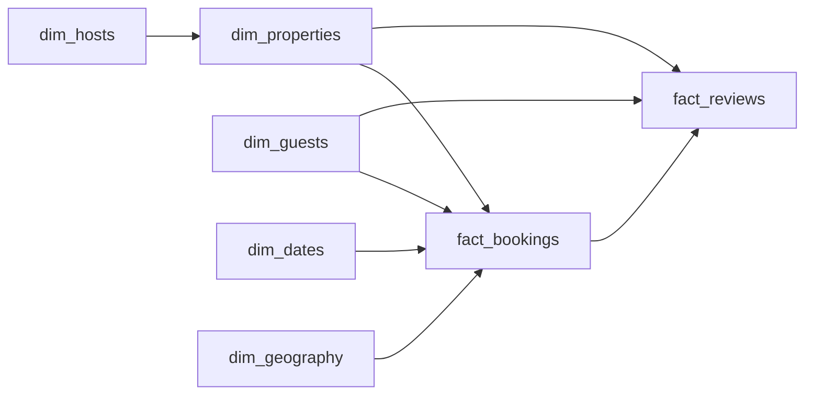

# Property Booking Platform
_Five-star listing. Three-star reality._

- **Domain:** data_modeling
- **Difficulty:** Hard
- **Est. time:** 30 min
- **URL:** https://datadriven.io/problems/property_booking_platform

## Problem

We're building the analytics warehouse for a property booking marketplace. Hosts list properties, guests book stays, and we need to support revenue reporting, host performance, and guest satisfaction analysis. Design the data model.

**Concepts tested:** `dmAttributes`, `dmCompositeKeys`, `dmConstraints`, `dmDataTypes`, `dmDenormalization`, `dmDimensionTables`, `dmFactTables`, `dmForeignKeys`, `dmGrainDefinition`, `dmIndexing`, `dmJunctionTables`, `dmKeyGeneration`, `dmManyToMany`, `dmMetricAdditivity`, `dmOneToMany`, `dmPreAggregation`, `dmPrimaryKeys`, `dmScdStrategy`, `dmScdType2`, `dmStarSchema`, `dmSurrogateKeys`

## Solution walkthrough


### Why this problem exists in real interviews

Hospitality models are a Type 2 SCD probe hidden inside a booking question. Property attributes like price, amenities, and host ownership change over time, and analysts must be able to reconstruct what a listing looked like at the moment the booking was made. The signal is whether the candidate reaches for an effective-dated dimension rather than trusting point-in-time joins on natural keys.

> **Trick to Solving**
>
> The tell is "property details change over time". Before drawing any tables, a strong candidate asks: when a host raises the nightly rate, should last month's bookings still show the old rate in reports? If yes, `dim_properties` is Type 2 and the booking fact must carry the versioned surrogate.
>
> 1. Spot the historical accuracy requirement
> 2. Make `dim_properties` a Type 2 SCD
> 3. Store `property_sk` (versioned) on `fact_bookings`, not `property_id`
> 4. Keep `fact_reviews` attached to the same version the booking saw

---

### Break down the requirements

**Step 1: Declare the booking grain**

`fact_bookings` is one row per confirmed reservation. Check-in and check-out are separate `date_sk` FKs so occupancy and nights can be computed either way.

**Step 2: Type 2 the property dimension**

`dim_properties` carries `valid_from`, `valid_to`, and `is_current`. A rate change, amenity change, or host transfer creates a new row with a new `property_sk`, preserving the old version for historical bookings.

**Step 3: Version-lock the fact**

`fact_bookings.property_sk` points at the version of the property that was live at booking time. This is what lets "revenue per 4-bedroom listing" stay stable even after 4-bedrooms get reclassified.

**Step 4: Separate reviews from bookings**

`fact_reviews` is its own fact with a one-to-one (or one-to-zero) relationship to bookings. Reviews arrive late, have their own grain, and their own ingestion SLA.

**Step 5: Add a conformed geography dimension**

Lat/lon and city descriptors live in `dim_geography`. Multiple facts (bookings, reviews, search impressions) share it so "supply in Barcelona" has one definition.

---

### The solution

Below is one conceptually sound design. The Type 2 `dim_properties` is the anchor; it guarantees that historical bookings report the attributes the guest actually saw.


**dim_guests**

| column | type | key |
|---|---|---|
| guest_sk | BIGINT | PK |
| guest_id | TEXT |  |
| signup_date | DATE |  |
| country | TEXT |  |

**dim_hosts**

| column | type | key |
|---|---|---|
| host_sk | BIGINT | PK |
| host_id | TEXT |  |
| superhost_status | BOOLEAN |  |
| onboarded_at | TIMESTAMP |  |

**dim_properties**

| column | type | key |
|---|---|---|
| property_sk | BIGINT | PK |
| property_id | TEXT |  |
| host_sk | BIGINT | FK |
| property_type | TEXT |  |
| valid_from | TIMESTAMP |  |
| valid_to | TIMESTAMP |  |
| is_current | BOOLEAN |  |

**dim_dates**

| column | type | key |
|---|---|---|
| date_sk | INT | PK |
| calendar_date | DATE |  |
| season | TEXT |  |

**dim_geography**

| column | type | key |
|---|---|---|
| geography_sk | BIGINT | PK |
| city | TEXT |  |
| country | TEXT |  |
| lat | DECIMAL |  |
| lon | DECIMAL |  |

**fact_bookings**

| column | type | key |
|---|---|---|
| booking_id | BIGINT | PK |
| guest_sk | BIGINT | FK |
| property_sk | BIGINT | FK |
| checkin_date_sk | INT | FK |
| checkout_date_sk | INT | FK |
| geography_sk | BIGINT | FK |
| nights | INT |  |
| total_amount | DECIMAL |  |

**fact_reviews**

| column | type | key |
|---|---|---|
| review_id | BIGINT | PK |
| booking_id | BIGINT | FK |
| guest_sk | BIGINT | FK |
| property_sk | BIGINT | FK |
| rating | INT |  |
| submitted_at | TIMESTAMP |  |


> **Why This Design Works**
>
> Versioned dimensions plus surrogate keys on the fact give you historical fidelity for free. Any report joining `fact_bookings` to `dim_properties` on `property_sk` returns the state of the property when the booking was made, not the current state. The cost is storage growth and a slightly more complex ETL that writes new dimension rows on change detection.

> **Interviewers Watch For**
>
> Strong candidates explicitly choose Type 2 and justify it with "bookings must report the property as it existed at the time". They also think about what counts as a versionable change (rate yes, cleaning notes no). Weaker candidates Type 1 everything and silently rewrite history.

> **Common Pitfall**
>
> Joining `fact_bookings` to `dim_properties` on `property_id` (the natural key) plus a timestamp range. This works in theory but collapses under backfills and is much slower than a direct surrogate-key join.

---

### The analysis pattern

**Revenue per property version with current-version lookup**

```sql
SELECT
    p.property_id,
    p.property_type,
    SUM(b.total_amount) AS historical_revenue,
    COUNT(*) AS bookings,
    AVG(r.rating) AS avg_rating,
    BOOL_OR(p.is_current) AS includes_current
FROM fact_bookings b
JOIN dim_properties p ON p.property_sk = b.property_sk
LEFT JOIN fact_reviews r ON r.booking_id = b.booking_id
JOIN dim_dates d ON d.date_sk = b.checkin_date_sk
WHERE d.calendar_date >= '2025-01-01'
GROUP BY p.property_id, p.property_type
ORDER BY historical_revenue DESC
```

---

### Trade-offs and alternatives

| Type 2 SCD on properties | Type 1 with a snapshot fact |
|---|---|
| Historical accuracy, clean surrogate joins, versioned reviews. Cost: more dimension rows, ETL complexity around change detection, separate logic to find the current version. | Simpler dimension, always-current attributes. Cost: historical bookings silently report today's attributes, and any audit of past revenue loses fidelity unless a parallel snapshot table is maintained. |

---

- **A host transfers a property to a new host. Is that a Type 2 change, a new property, or something else?**
  - _Tests judgment on what counts as a versionable change versus entity replacement._
- **Reviews can be edited up to 48 hours after submission. How do you model the edit history?**
  - _Tests whether the candidate appends versions to `fact_reviews` or introduces an audit log._
- **The platform expands to 30 countries, each with its own currency. Where does currency conversion live?**
  - _Tests whether the candidate stores native amount plus an FX lookup rather than a single USD column._
- **GDPR deletion of a guest arrives. What rows go, what rows stay, and how are facts anonymized?**
  - _Tests hard-delete strategy on `dim_guests` with tombstoning on `fact_bookings`._
- **Property volume grows to 50M versions. How does the Type 2 strategy scale?**
  - _Tests partitioning by `valid_from` and indexing `is_current` for the hot-path join._
