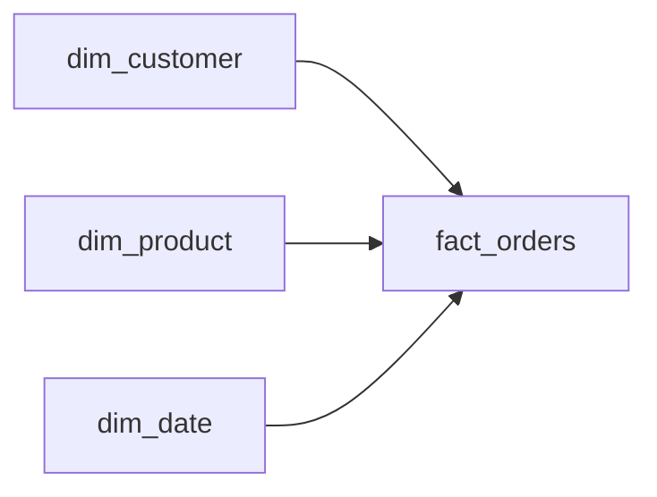

# Retailer Data Warehouse Design
_Queries are crawling. The analysts are not happy._

- **Domain:** data_modeling
- **Difficulty:** Medium
- **Est. time:** 20 min
- **URL:** https://datadriven.io/problems/retailer_data_warehouse_design

## Problem

We're a mid-size e-commerce company processing about 10,000 orders per day. The analytics team needs to build dashboards for sales performance, customer segmentation, and product trends. Right now all the data lives in a normalized Postgres OLTP database and queries are slow. Can you design a dimensional model for the analytics warehouse?

**Concepts tested:** `dmAttributes`, `dmDenormalization`, `dmDimensionTables`, `dmFactTables`, `dmForeignKeys`, `dmGrainDefinition`, `dmMetricAdditivity`, `dmOneToMany`, `dmPrimaryKeys`, `dmStarSchema`, `dmSurrogateKeys`

## Solution walkthrough


### Why this problem exists in real interviews

This is a minimalist star schema probe. Interviewers use it to test whether a candidate can resist the urge to over-engineer: can they declare a clean atomic fact, three conformed dimensions, and stop there? The signal is proportionality between the model and the stated requirements.

> **Trick to Solving**
>
> The tell is the simplicity of the ask. Before drawing any tables, a strong candidate asks: what questions will analysts run, and at what grain? If the answer is "product sales over time", three dimensions and one fact is enough. More tables is a smell.
>
> 1. Declare grain at the order line
> 2. Choose three conformed dimensions and stop
> 3. Assign surrogate keys for evolvability
> 4. Resist adding `dim_geography` or `dim_promotion` unless the prompt names them

---

### Break down the requirements

**Step 1: Fix the grain**

`fact_orders` is one row per product per order. Atomic grain supports every roll-up without pre-aggregation and keeps the model answerable to questions the product team has not yet asked.

**Step 2: Choose the minimum conformed dimensions**

Customer, product, and date cover the stated reporting needs. A fourth dimension like geography is cheap to add later if required; adding it upfront costs maintenance without delivering value.

**Step 3: Use surrogate keys**

`customer_sk`, `product_sk`, and `date_sk` decouple the fact from source system churn. When a customer merges accounts or a product gets relaunched, the surrogate absorbs it.

**Step 4: Keep measures additive**

`quantity` and `extended_amount` roll up cleanly across any dimension combination. Derived measures (ASP, unit price) are computed at query time.

---

### The solution

Below is one conceptually sound design. The restraint is the point: a three-dimension star with an atomic fact answers the stated questions without over-committing.


**dim_customer**

| column | type | key |
|---|---|---|
| customer_sk | BIGINT | PK |
| customer_id | TEXT |  |
| segment | TEXT |  |
| signup_date | DATE |  |

**dim_product**

| column | type | key |
|---|---|---|
| product_sk | BIGINT | PK |
| sku | TEXT |  |
| category | TEXT |  |
| brand | TEXT |  |
| list_price | DECIMAL |  |

**dim_date**

| column | type | key |
|---|---|---|
| date_sk | INT | PK |
| calendar_date | DATE |  |
| day_of_week | INT |  |
| fiscal_quarter | TEXT |  |

**fact_orders**

| column | type | key |
|---|---|---|
| order_line_id | BIGINT | PK |
| order_id | BIGINT |  |
| customer_sk | BIGINT | FK |
| product_sk | BIGINT | FK |
| date_sk | INT | FK |
| quantity | INT |  |
| extended_amount | DECIMAL |  |


> **Why This Design Works**
>
> Minimalism buys evolvability. With only three dimensions, every new analytical question either fits into the existing star or clearly motivates a new dimension. The trade-off is that single-pass denormalized queries need joins, which modern columnar engines handle cheaply.

> **Interviewers Watch For**
>
> Strong candidates state the grain first and explain why extra dimensions are not warranted. They also flag surrogate keys as an insurance policy against source-system changes. Weaker candidates add `dim_store`, `dim_channel`, `dim_promotion` without any prompt requiring them.

> **Common Pitfall**
>
> Over-modeling to look senior. Adding dimensions "because real warehouses have them" burdens the ETL and signals that the candidate is pattern-matching instead of designing for stated requirements.

---

### The analysis pattern

**Top categories by customer segment**

```sql
SELECT
    c.segment,
    p.category,
    SUM(f.extended_amount) AS revenue,
    COUNT(DISTINCT f.order_id) AS orders,
    SUM(f.quantity) AS units
FROM fact_orders f
JOIN dim_customer c ON c.customer_sk = f.customer_sk
JOIN dim_product p ON p.product_sk = f.product_sk
JOIN dim_date d ON d.date_sk = f.date_sk
WHERE d.fiscal_quarter = '2025-Q1'
GROUP BY c.segment, p.category
ORDER BY c.segment, revenue DESC
```

---

### Trade-offs and alternatives

| Minimal three-dimension star | Pre-built warehouse template |
|---|---|
| Clean evolvability, proportional to requirements, fast ETL. Cost: new analytical requests may require adding dimensions over time. | Every dimension you might need is already present. Cost: ETL complexity and storage grow ahead of demand, and many dimensions stay empty for months. |

---

- **Marketing adds a campaign attribution requirement. Do you extend `fact_orders` or add a new dimension?**
  - _Tests whether the candidate introduces `dim_campaign` as a conformed dimension rather than widening the fact._
- **A product is relaunched with the same SKU but a new category. How does `dim_product` respond?**
  - _Tests SCD reasoning and surrogate-key versioning._
- **Analysts want same-store daily revenue. What is missing from the model?**
  - _Tests whether the candidate spots the absent `dim_store` and can justify adding it._
- **Volume is 200M order lines per year. What changes in the physical layout?**
  - _Tests partitioning by `date_sk` and columnar storage considerations._
