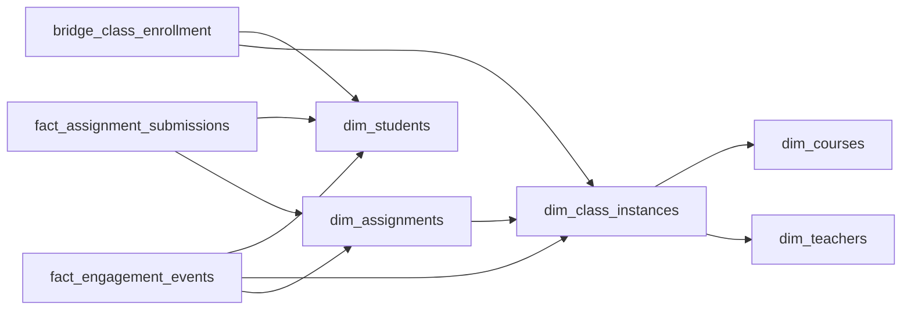

# Signal and Silence
_They opened the assignment. Did they actually read it?_

- **Domain:** data_modeling
- **Difficulty:** Medium
- **Est. time:** 25 min
- **URL:** https://datadriven.io/problems/signal_and_silence

## Problem

We run a digital classroom platform for K-12 schools where teachers post assignments and students submit them, sometimes past the due date. Leadership wants engagement insights that separate students who merely saw an assignment surface in their feed from those who actually opened and read it, and that stay accurate even as rosters change: students transfer or drop mid-semester, and the same course runs as different sections under different teachers each school year. Design a model that keeps these engagement rates correct for both a single teacher's roster and a district-wide dashboard.

**Concepts tested:** `dmConstraints`, `dmDataTypes`, `dmDimensionTables`, `dmEntities`, `dmFactTables`, `dmForeignKeys`, `dmGrainDefinition`, `dmJunctionTables`, `dmManyToMany`, `dmMetricAdditivity`, `dmOneToMany`, `dmPrimaryKeys`, `dmScdType2`, `dmStarSchema`, `dmSurrogateKeys`

## Solution walkthrough


### Strip the costume

This is three identity splits dressed up as an engagement dashboard. 'Algebra I' is two things: a curriculum template and the section Mr. Li teaches this fall. A 'view' is two things: the assignment surfaced in a feed, or a student opened it and read it. A roster is two things: who is enrolled today, and who was enrolled during the week you are measuring. Anyone can draw students, classes and events. What separates candidates is the dated enrollment bridge. Divide last week's reads by today's roster and every student who dropped mid-week leaves the denominator while their reads stay in the numerator. The dashboard trends up on churn alone, and a teacher still cannot tell a student who ignored the work from one who never saw it.

> **Name all three splits before drawing a box**
>
> Course vs class instance, 'impression' vs 'read', and enrollment as a relationship with a lifespan. Once the bridge carries `enrolled_at` and `dropped_at`, the denominator becomes a function of time instead of a snapshot of now.

### How to build it

**Step 1: Split `dim_courses` from `dim_class_instances`**

The course is the reusable template; the instance is one teacher, one section, one `school_year`. Curriculum questions roll up on `course_key`, teacher questions on `class_instance_key`. Fold them together and a syllabus edit rewrites every historical section.

**Step 2: Make enrollment a dated bridge with its own key**

`bridge_class_enrollment` resolves the student to class many-to-many and carries `enrolled_at` and `dropped_at`. Give it a surrogate `enrollment_key`: a student who drops and re-enrolls in the same section is two rows, so (`student_key`, `class_instance_key`) cannot be the key.

**Step 3: Distinguish events by `event_type`**

One row per event in `fact_engagement_events`, tagged 'impression' or 'read' and tied to the assignment it concerns. Collapse them into one view count and 'saw it but never opened it' becomes unanswerable.

**Step 4: Give submissions their own fact**

`fact_assignment_submissions` is one row per student per assignment with `submitted_at`, `grade` and `is_late`. That grain is not the event grain; mixing them forces a dedupe on every lateness or completion aggregate.

### The shape


**dim_students**

| column | type | key |
|---|---|---|
| student_key | BIGINT | PK |
| student_id | VARCHAR |  |
| grade_level | INT |  |
| school_id | VARCHAR |  |

**dim_teachers**

| column | type | key |
|---|---|---|
| teacher_key | BIGINT | PK |
| teacher_id | VARCHAR |  |
| subject | VARCHAR |  |

**dim_courses**

| column | type | key |
|---|---|---|
| course_key | INT | PK |
| course_name | VARCHAR |  |
| subject | VARCHAR |  |
| grade_band | VARCHAR |  |

**dim_class_instances**

| column | type | key |
|---|---|---|
| class_instance_key | BIGINT | PK |
| course_key | INT | FK |
| teacher_key | BIGINT | FK |
| school_year | INT |  |
| section | VARCHAR |  |

**bridge_class_enrollment**

| column | type | key |
|---|---|---|
| enrollment_key | BIGINT | PK |
| student_key | BIGINT | FK |
| class_instance_key | BIGINT | FK |
| enrolled_at | TIMESTAMP |  |
| dropped_at | TIMESTAMP |  |

**dim_assignments**

| column | type | key |
|---|---|---|
| assignment_key | BIGINT | PK |
| class_instance_key | BIGINT | FK |
| title | VARCHAR |  |
| due_at | TIMESTAMP |  |
| max_score | INT |  |

**fact_engagement_events**

| column | type | key |
|---|---|---|
| event_id | BIGINT | PK |
| student_key | BIGINT | FK |
| class_instance_key | BIGINT | FK |
| assignment_key | BIGINT | FK |
| event_type | VARCHAR |  |
| event_ts | TIMESTAMP |  |

**fact_assignment_submissions**

| column | type | key |
|---|---|---|
| submission_id | BIGINT | PK |
| student_key | BIGINT | FK |
| assignment_key | BIGINT | FK |
| submitted_at | TIMESTAMP |  |
| grade | DECIMAL |  |
| is_late | BOOLEAN |  |


> **The denominator is a query over time**
>
> Because each enrollment row has a lifespan, 'this teacher's roster last week' and 'district-wide last quarter' are the same filter with different windows. The cost is one join on the bridge per report, cheap next to a rate you can trust.

> **Today's roster inflates yesterday's rate**
>
> Candidates join events to a roster with no dates, or filter `dropped_at IS NULL`. Students who left inside the window vanish from the bottom of the ratio while their 'read' events stay on top. Scope the bridge to the same window as `event_ts`, every time.

### The query that proves it

**Read rate by class instance, last 7 days**

```sql
SELECT
    ci.class_instance_key,
    COUNT(DISTINCT CASE WHEN e.event_type = 'read' THEN e.student_key END) * 1.0 /
        NULLIF(COUNT(DISTINCT b.student_key), 0) AS read_rate
FROM dim_class_instances ci
JOIN bridge_class_enrollment b
    ON b.class_instance_key = ci.class_instance_key
    AND b.enrolled_at <= CURRENT_DATE
    AND (b.dropped_at IS NULL OR b.dropped_at > CURRENT_DATE - INTERVAL '7 days')
LEFT JOIN fact_engagement_events e
    ON e.class_instance_key = ci.class_instance_key
    AND e.student_key = b.student_key
    AND e.event_ts >= CURRENT_DATE - INTERVAL '7 days'
GROUP BY ci.class_instance_key
```

> **Asking what 'view' means is the seniority tell**
>
> The strong candidate asks in minute one whether a course is the curriculum or the section, and whether a view means surfaced or read. The weak one counts a single view column over the current roster and cannot say what a mid-week drop does to the rate. Note the `COUNT(DISTINCT ...)`: the ratio is non-additive, so recompute it from students, never average section rates.

| Course, class instance, dated bridge | Single flat classes table |
|---|---|
| Curriculum edits touch one `dim_courses` row, teacher attribution is clean, and `enrolled_at` / `dropped_at` rebuild any past roster. | Fewer joins, but a syllabus change rewrites every section, and a dropped student is either invisible or double counted in `read_rate`. |

- **A student moves between two sections of the same course mid-year. What rows change?**
  - _Close one bridge row with `dropped_at`, open another; history survives._
- **How do you roll up a district read rate without double counting students in several classes?**
  - _Distinct students at the rollup grain, not a sum or average of section rates._
- **Impressions arrive at 50k per second per school. What changes in `fact_engagement_events`?**
  - _Partition by event date, and consider splitting the 'impression' stream from reads._
- **A guardian requests deletion of their child's data. What do you touch?**
  - _A cascade keyed on `student_key` across both facts and the bridge._
