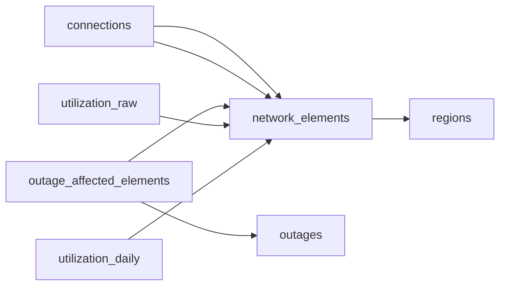

# Telecom Network Connectivity Warehouse
_One device goes down. The ripple keeps going._

- **Domain:** data_modeling
- **Difficulty:** Hard
- **Est. time:** 35 min
- **URL:** https://datadriven.io/problems/telecom_network_connectivity_warehouse

## Problem

We're a telecom provider building a new data warehouse. We need to model our network infrastructure: towers, switches, fiber links, and the connections between them. We also need to track outages and capacity utilization. Can you design this?

**Concepts tested:** `dmAttributes`, `dmCardinalityRequired`, `dmCompositeKeys`, `dmDimensionTables`, `dmEntities`, `dmFactTables`, `dmForeignKeys`, `dmGrainDefinition`, `dmJunctionTables`, `dmManyToMany`, `dmMetricAdditivity`, `dmOneToMany`, `dmPreAggregation`, `dmPrimaryKeys`, `dmStarSchema`

## Solution walkthrough


### What this really is

Strip the telecom costume and this is a graph-modeling problem in an incident-reporting hat. The real question: can you store a network as nodes and edges, not a tree, while keeping utilization at two grains so forensics and dashboards don't fight over one table? Anyone lists `towers` and `switches`. The trap is `connections`: model a neighbor as a `parent_id` on `network_elements` and you've built a tree that can't express a ring or a redundant path, so blast-radius queries silently return the wrong answer. The second trap is a mutable `utilization_pct` column on `network_elements`, which erases every reading the moment the next sample lands.

> **A network is a graph, not a tree**
>
> Give edges their own table. `connections` holds `source_element_id` and `target_element_id`, both foreign keys to `network_elements.element_id`, so any element links to any other in either direction. Then split telemetry by grain: `utilization_raw` at 5-minute resolution for forensics, `utilization_daily` pre-aggregated for dashboards. The daily fact is a deterministic roll-up of raw, so you keep both without duplicating truth.


**regions**

| column | type | key |
|---|---|---|
| region_id | BIGINT | PK |
| region_name | TEXT |  |
| country | TEXT |  |

**network_elements**

| column | type | key |
|---|---|---|
| element_id | BIGINT | PK |
| element_type | TEXT |  |
| region_id | BIGINT | FK |
| installed_at | TIMESTAMP |  |
| capacity_gbps | DECIMAL |  |

**connections**

| column | type | key |
|---|---|---|
| connection_id | BIGINT | PK |
| source_element_id | BIGINT | FK |
| target_element_id | BIGINT | FK |
| link_type | TEXT |  |
| bandwidth_gbps | DECIMAL |  |

**outages**

| column | type | key |
|---|---|---|
| outage_id | BIGINT | PK |
| started_at | TIMESTAMP |  |
| ended_at | TIMESTAMP |  |
| severity | TEXT |  |
| root_cause | TEXT |  |

**outage_affected_elements**

| column | type | key |
|---|---|---|
| outage_id | BIGINT | FK |
| element_id | BIGINT | FK |
| impact_pct | DECIMAL |  |

**utilization_raw**

| column | type | key |
|---|---|---|
| sample_id | BIGINT | PK |
| element_id | BIGINT | FK |
| sampled_at | TIMESTAMP |  |
| bytes_in | BIGINT |  |
| bytes_out | BIGINT |  |

**utilization_daily**

| column | type | key |
|---|---|---|
| usage_date | DATE | PK |
| element_id | BIGINT | FK |
| avg_utilization_pct | DECIMAL |  |
| peak_utilization_pct | DECIMAL |  |


**Step 1: Split nodes from edges**

`network_elements` is the node table; `connections` is the edge table with `source_element_id` and `target_element_id` both keying `element_id`. `link_type` carries directionality, so a one-way fiber run and a bidirectional switch link stay distinguishable. This shape survives rings and dual-homed paths.

**Step 2: Keep telemetry at two grains**

The grain of `utilization_raw` is one row per (`element_id`, `sampled_at`); `utilization_daily` is one row per (`element_id`, `usage_date`). Both are additive facts and the daily table is fully rebuildable from raw, so a corrupt roll-up is a recompute, not data loss. Dashboards hit daily thousands of times a day; raw only during an investigation.

**Step 3: Model the outage as an event, then bridge it**

An `outages` row has a lifecycle (`started_at`, `ended_at`, `severity`, `root_cause`), and `outage_affected_elements` resolves the many-to-many between one incident and the elements it hit, with `impact_pct` as the edge attribute. Its composite grain (`outage_id`, `element_id`) makes weighted downtime per element computable, and `network_elements.region_id` conforms every incident to a region for one clean roll-up path.

> **The edge table is the seniority tell**
>
> Strong candidates reach for a separate `connections` table unprompted and name directionality via `link_type`; they justify `utilization_daily` with a storage-versus-query-frequency argument, not 'it's faster'. Weaker ones hang a `neighbor_id` on `network_elements` or push utilization onto the element row, and never notice they've lost the ability to look back.

> **A mutable gauge column is a shredder**
>
> The tempting mistake is a `current_utilization_pct` column on `network_elements` updated in place. It destroys history: after an incident you cannot reconstruct what the link was carrying when it failed, and every SLA report becomes unbackable. Append to `utilization_raw` and let `utilization_daily` fold it.

**Weighted downtime minutes per region per month**

```sql
SELECT
    r.region_name,
    DATE_TRUNC('month', o.started_at) AS month,
    SUM(EXTRACT(EPOCH FROM (o.ended_at - o.started_at)) / 60 * oae.impact_pct / 100) AS weighted_downtime_minutes,
    COUNT(DISTINCT o.outage_id) AS incidents,
    AVG(ud.peak_utilization_pct) AS avg_peak_utilization
FROM outages o
JOIN outage_affected_elements oae ON oae.outage_id = o.outage_id
JOIN network_elements e ON e.element_id = oae.element_id
JOIN regions r ON r.region_id = e.region_id
LEFT JOIN utilization_daily ud
    ON ud.element_id = e.element_id
   AND ud.usage_date = o.started_at::date
WHERE o.started_at >= '2025-01-01'
GROUP BY r.region_name, month
ORDER BY weighted_downtime_minutes DESC
```

| One relational warehouse | Graph store plus time-series store |
|---|---|
| Topology, incidents and dual-grain telemetry share one schema, so blast-radius, capacity and forensics are all reachable from `connections`, `utilization_daily` and `outage_affected_elements` with plain joins. Cost: raw-sample storage, an ETL job for the roll-up, and a composite index on (`element_id`, `sampled_at`). | Native traversal in a graph engine over `connections`, optimized ingestion in a time-series store for `utilization_raw`. Cost: two systems to run, cross-system stitching to tie an outage to its samples, and two query languages for one incident review. |

- **Elements form a directed graph with redundant paths. How do you compute blast radius for an outage?**
  - _Tests a recursive CTE over `connections` and whether they snapshot topology rather than traverse live edges._
- **Samples arrive out of order from 100 regional collectors. How does `utilization_raw` stay correct?**
  - _Tests event-time versus ingestion-time and an idempotent upsert on (`element_id`, `sampled_at`)._
- **Raw samples are kept 90 days but `utilization_daily` for 24 months. How is retention enforced without losing the roll-up?**
  - _Tests partitioning `utilization_raw` by `sampled_at` and rebuilding daily before the partition ages out._
