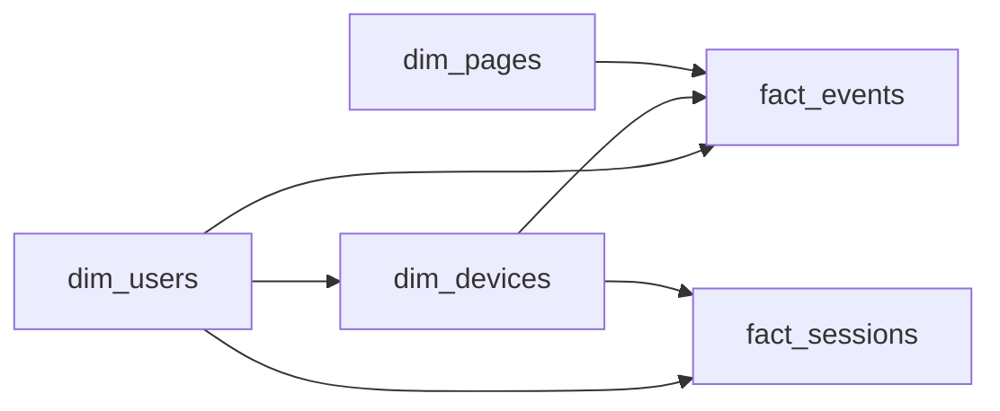

# The Anonymous Majority
_Millions of clicks, mostly anonymous._

- **Domain:** data_modeling
- **Difficulty:** Medium
- **Est. time:** 25 min
- **URL:** https://datadriven.io/problems/the_anonymous_majority

## Problem

We run a large e-commerce marketplace where shoppers browse on web and mobile, often switching devices before they buy. Capture every interaction as a raw event that records the page, the specific on-page element touched, and the kind of action it was, then roll those events up into per-session summaries that trace the path to purchase. At 600 million events a day kept for 13 months, the raw layer has to stay prunable by day. Design the data model.

**Concepts tested:** `dmDenormalization`, `dmDimensionTables`, `dmFactTables`, `dmForeignKeys`, `dmGrainDefinition`, `dmImmutableLogs`, `dmIndexing`, `dmMedallion`, `dmMetricAdditivity`, `dmOneToMany`, `dmPreAggregation`, `dmPrimaryKeys`, `dmStarSchema`, `dmSurrogateKeys`

## Solution walkthrough


### Why this problem exists in real interviews

This probes whether a candidate can design a **two-level fact model** and reason about identity resolution at scale. Six hundred million events per day is a partitioning signal; cross-device stitching is a dimension signal; sessionization is a windowing signal. Missing any one of the three is a flag.

> **Trick to Solving**
>
> Before drawing any tables, a strong candidate asks: what is the SLA on sessionization and can a device be identified before a user logs in? The signal here is that you need a raw atomic fact and a derived sessions fact, and an identity bridge from `device_id` to `user_id`.
>
> 1. Declare the event fact at one row per raw event
> 2. Declare the session fact at one row per session
> 3. Add a device-to-user resolution on `dim_devices`
> 4. Partition the event fact by `event_date`

---

### Break down the requirements

**Step 1: Declare two grains**

`fact_events` is one row per raw event (click, page view, product interaction). It carries `event_type`, the event timestamp, a `page_key`, and an `element_id` for the specific on-page element touched. `fact_sessions` is one row per session, derived from events with a 30-minute inactivity window.

**Step 2: Partition raw events by `event_date`**

At 600M rows per day, pruning by date is the difference between a ten-second query and a ten-hour query. `event_date` is the partition key; any downstream job that skips the predicate is a flag.

**Step 3: Resolve identity on `dim_devices`**

Anonymous traffic arrives keyed by `device_id`. Once the user logs in, the device inherits a `user_id`. Store that mapping with `first_seen_at` and `resolved_user_key` on `dim_devices` so retroactive attribution can run.

**Step 4: Sessionize in a batch job**

The session boundary is defined by a 30-minute gap. Compute sessions downstream of the raw events using a window function and write the result to `fact_sessions`. Do not try to assign sessions at ingest time; late events would invalidate the boundary.

**Step 5: Conform `dim_users` and `dim_pages`**

Both fact tables share the user and page dimensions, which keeps pre-login and post-login reporting on the same page taxonomy.

---

### The solution

Below is one conceptually sound approach: a two-level fact star partitioned by date. The grain split anchors the storage and query plan.


**dim_users**

| column | type | key |
|---|---|---|
| user_key | BIGINT | PK |
| user_id | TEXT |  |
| signup_date | DATE |  |
| country | TEXT |  |

**dim_devices**

| column | type | key |
|---|---|---|
| device_key | BIGINT | PK |
| device_id | TEXT |  |
| platform | TEXT |  |
| resolved_user_key | BIGINT | FK |
| first_seen_at | TIMESTAMP |  |

**dim_pages**

| column | type | key |
|---|---|---|
| page_key | INT | PK |
| url_path | TEXT |  |
| page_type | TEXT |  |
| section | TEXT |  |

**fact_events**

| column | type | key |
|---|---|---|
| event_id | BIGINT | PK |
| event_date | DATE |  |
| user_key | BIGINT | FK |
| device_key | BIGINT | FK |
| page_key | INT | FK |
| element_id | TEXT |  |
| event_type | TEXT |  |
| event_ts | TIMESTAMP |  |

**fact_sessions**

| column | type | key |
|---|---|---|
| session_id | BIGINT | PK |
| user_key | BIGINT | FK |
| device_key | BIGINT | FK |
| session_start | TIMESTAMP |  |
| session_end | TIMESTAMP |  |
| event_count | INT |  |
| had_purchase | BOOLEAN |  |


> **Why this works**
>
> Raw and derived facts live on separate tables with conformed dimensions. Analysts query `fact_sessions` for funnel and retention, and drop to `fact_events` only when a session-level metric is not enough. The canonical trade-off is storage (two tables) for query cost (sessions are pre-aggregated).

> **Interviewers watch for**
>
> A strong candidate volunteers the partition key, the sessionization window, and the identity bridge without prompting. They also mention that the sessionization job is a batch job, not a real-time one, because late-arriving events would otherwise invalidate assigned session IDs.

> **Common pitfall**
>
> Assigning `session_id` at ingest time on the raw event. A late event arriving 10 minutes after the gap closes would either split a session retroactively or attach to the wrong one. Derive sessions downstream, not at the edge.

---

### The analysis pattern

**Purchase funnel by session**

```sql
SELECT
    DATE(s.session_start) AS day,
    COUNT(*) AS sessions,
    SUM(CASE WHEN s.had_purchase THEN 1 ELSE 0 END) AS converting_sessions,
    AVG(s.event_count) AS avg_events_per_session
FROM fact_sessions s
JOIN dim_users u ON u.user_key = s.user_key
WHERE s.session_start >= CURRENT_DATE - INTERVAL '7 days'
GROUP BY DATE(s.session_start)
ORDER BY day
```

---

### Trade-offs and alternatives

| Two-level star with partitioning | Single event table with session window at query time |
|---|---|
| Cheap reads on derived sessions, date partitioning prunes the raw table. Cost: two ETL jobs to maintain, and sessions lag raw events by the batch cadence. | Only one table; compute sessions on the fly with window functions. Cost: every dashboard pays the windowing cost, and at 600M rows per day the query tax compounds. |

---

- **How do you retroactively stitch anonymous sessions to a user who logs in three days later?**
  - _Tests identity resolution and whether `resolved_user_key` can be updated and propagated._
- **What changes at 6B events per day instead of 600M?**
  - _Tests whether the candidate sub-partitions by hour and moves sessionization to stream processing._
- **How do you enforce GDPR deletion when a user deletes their account?**
  - _Tests whether the candidate hashes `user_id` on `fact_events` or uses a tombstone on `dim_users`._
- **What if an event arrives 6 hours late from mobile?**
  - _Tests late-arriving fact handling and session reprocessing windows._
- **How do you measure cross-device attribution when a user starts on mobile and converts on desktop?**
  - _Tests the device dimension, the identity bridge, and the definition of a session across devices._
