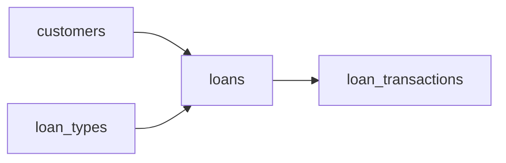

# The Balance Always Reconciles
_Money out, payments back. The balance has to be exact._

- **Domain:** data_modeling
- **Difficulty:** Easy
- **Est. time:** 15 min
- **URL:** https://datadriven.io/problems/the_balance_always_reconciles

## Problem

We're a consumer lending company offering personal loans, auto loans, and mortgages, and each of those products carries its own standard interest rate and term length. A customer can hold several loans at once, and every payment lands as its own transaction against a loan. Design a schema that lets the operations team read each loan's outstanding balance from those payments and the risk team flag delinquent accounts.

**Concepts tested:** `dmAttributes`, `dmConstraints`, `dmEntities`, `dmFirstNormalForm`, `dmForeignKeys`, `dmGrainDefinition`, `dmImmutableLogs`, `dmKeyGeneration`, `dmMetricAdditivity`, `dmOneToMany`, `dmPrimaryKeys`, `dmSecondNormalForm`, `dmSurrogateKeys`, `dmThirdNormalForm`

## Solution walkthrough


### Why this problem exists in real interviews

This is a normalization puzzle dressed up as a lending system. The real skill being probed: can you tell which numbers are facts you store and which are answers you compute? The trap is outstanding balance. It looks like a column you keep on the loan, so candidates store it and try to keep it in sync. Cache it and the first missed update silently drifts the stored number away from the ledger, and now no two reports agree. Derive it from the transaction log and it can never be wrong.

> **Trick to Solving**
>
> When a prompt lists several "types" of something (personal, auto, mortgage) with their own rates and terms, the trick is to lift those attributes into a dimension. Before drawing tables, a strong candidate asks: is outstanding balance a stored column or a derived aggregate?
>
> 1. Pull loan types into a dim table with rate and term columns
> 2. Keep loans as the instance fact of a customer taking a loan
> 3. Model every payment as a row in `loan_transactions`
> 4. Derive outstanding balance via SUM, never store it

---

### Break down the requirements

**Step 1: Identify the four entities**

`customers`, `loan_types`, `loans`, `loan_transactions`. Each has a clean grain and no redundant attributes.

**Step 2: Normalize loan types**

Rate, term, and product name belong on `loan_types`. Repeating them per loan row invites update anomalies when the product team renames a product.

**Step 3: Grain of `loan_transactions`**

One row equals one money movement on one loan: payment, disbursement, fee, or refund. `paid_amount` is signed or typed.

**Step 4: Compute outstanding balance**

`principal_amount - SUM(paid_amount)` via a GROUP BY on `loan_id`. The aggregate is always in sync because the underlying fact is the ledger.

---

### The solution

Below is one defensible model. The transaction log as source of truth is the conceptual anchor: balances are derived, never cached in-row.


**customers**

| column | type | key |
|---|---|---|
| customer_id | BIGINT | PK |
| full_name | TEXT |  |
| email | TEXT |  |
| joined_at | DATE |  |

**loan_types**

| column | type | key |
|---|---|---|
| loan_type_id | INT | PK |
| product_name | TEXT |  |
| default_rate | DECIMAL |  |
| default_term_months | INT |  |

**loans**

| column | type | key |
|---|---|---|
| loan_id | BIGINT | PK |
| customer_id | BIGINT | FK |
| loan_type_id | INT | FK |
| principal_amount | DECIMAL |  |
| origination_date | DATE |  |
| status | TEXT |  |

**loan_transactions**

| column | type | key |
|---|---|---|
| transaction_id | BIGINT | PK |
| loan_id | BIGINT | FK |
| transaction_type | TEXT |  |
| paid_amount | DECIMAL |  |
| transaction_date | DATE |  |


> **Why this works**
>
> Deriving balance from a ledger is the accounting-grade pattern. Storing balance as a column looks efficient until the first missed update creates drift, at which point reconciliation is a nightmare. A SUM over a properly indexed fact is both correct and fast enough.

> **Interviewers watch for**
>
> A strong candidate says "the balance is a derived view" out loud and pushes back on any design that caches it as an UPDATEable column without a corresponding event row.

> **Common pitfall**
>
> Storing `outstanding_balance` as a column on `loans` and keeping it in sync via triggers. The first replication lag or missed trigger creates a silent drift between the ledger and the balance, which is exactly the failure the ledger model exists to prevent.

---

### The analysis pattern

With the schema above, outstanding balance falls out of a single aggregate query. This is a supporting example of how the design pays off, not the graded artifact.

**Current outstanding balance per loan**

```sql
SELECT
    l.loan_id,
    c.full_name,
    lt.product_name,
    l.principal_amount - COALESCE(SUM(tx.paid_amount), 0) AS outstanding_balance
FROM loans l
JOIN customers c ON c.customer_id = l.customer_id
JOIN loan_types lt ON lt.loan_type_id = l.loan_type_id
LEFT JOIN loan_transactions tx
  ON tx.loan_id = l.loan_id
 AND tx.transaction_type = 'payment'
WHERE l.status = 'active'
GROUP BY l.loan_id, c.full_name, lt.product_name, l.principal_amount
```

---

### Trade-offs and alternatives

| Derived balance from ledger | Stored balance column |
|---|---|
| Balance is a SUM over `loan_transactions` at read time.

* One source of truth
* No drift possible
* Read cost scales with transaction count per loan | Balance maintained as an UPDATEable column on loans.

* O(1) read per loan
* Silent drift on missed updates
* Reconciliation jobs become mandatory |

---

- **How do you handle a refinance where an old loan is closed and a new one is opened?**
  - _Tests whether the candidate models refinance as a status transition plus a `parent_loan_id` link._
- **How do you compute days past due for each loan?**
  - _Tests whether the candidate derives it from expected payment schedule vs actual transactions._
- **How would you partition `loan_transactions` if volume reached 500M rows?**
  - _Tests scale thinking: date partitioning and clustering by `loan_id`._
- **What changes if a payment applies partially to interest and partially to principal?**
  - _Tests whether `transaction_type` is fine-grained enough to decompose._
