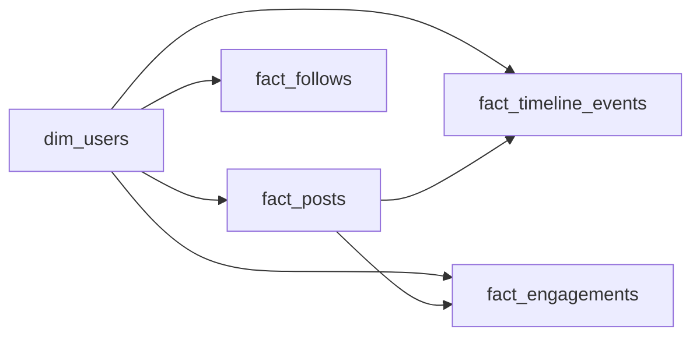

# The Celebrity Problem
_One post. A million notifications. Something has to give._

- **Domain:** data_modeling
- **Difficulty:** Medium
- **Est. time:** 25 min
- **URL:** https://datadriven.io/problems/the_celebrity_problem

## Problem

We are building a social platform where users can post content, follow other users, and see a personalized timeline of posts from people they follow. The data science team needs to analyze engagement patterns, and the product team wants to support timeline queries at scale. Design the data model.

**Concepts tested:** `dmCardinalityRequired`, `dmDimensionTables`, `dmEntities`, `dmFactTables`, `dmForeignKeys`, `dmGrainDefinition`, `dmJunctionTables`, `dmManyToMany`, `dmMetricAdditivity`, `dmOneToMany`, `dmPreAggregation`, `dmPrimaryKeys`, `dmStarSchema`, `dmSurrogateKeys`

## Solution walkthrough


### Why this problem exists in real interviews

The celebrity problem probes whether a candidate understands skew: one user with 100M followers breaks every naive fanout-on-write design. The signal is whether the candidate proposes a hybrid delivery strategy (push for regular users, pull for celebrities) and models the decision as data rather than application logic. This is an art-over-science design because the cutoff is a tunable threshold, not a mathematical optimum.

> **Trick to Solving**
>
> The tell is "one user has millions of followers". Before drawing any tables, a strong candidate asks: at what follower count does fanout-on-write become more expensive than fanout-on-read? That threshold is what lives in `dim_users.is_celebrity`, and the `delivery_path` column on the timeline fact is what lets you measure whether the choice is correct.
>
> 1. Spot the skew signal in the prompt
> 2. Tag celebrities on `dim_users` with a tunable threshold
> 3. Record `delivery_path` on `fact_timeline_events` to audit the choice
> 4. Keep `fact_follows` as the self-referential many-to-many for graph traversal

---

### Break down the requirements

**Step 1: Tag users as celebrities**

`dim_users.is_celebrity` is a boolean derived from `follower_count`. The threshold is a policy decision; storing it as data lets the pipeline flip users as they grow.

**Step 2: Self-referential follows**

`fact_follows` with `(follower_sk, followed_sk)` as the composite key is the graph. Queries like "pull the latest posts from the accounts I follow" live here.

**Step 3: Timeline events are delivery records**

`fact_timeline_events` is one row per (viewer, post) delivery, with `delivery_path` recording whether the post was pushed at write time or pulled at read time. This is what makes the hybrid observable.

**Step 4: Engagement is a separate fact**

`fact_engagements` records likes, reposts, and replies. Keeping engagement separate from timeline delivery lets engagement rates be computed per delivery path.

**Step 5: Keep `fact_posts` atomic**

One row per post. The author is the only dimension FK because all other analytics (delivery, engagement) happen through separate facts.

---

### The solution

Below is one defensible model. The `is_celebrity` flag and the `delivery_path` column are the anchor: together they make the hybrid fanout strategy a first-class, measurable property of the system.


**dim_users**

| column | type | key |
|---|---|---|
| user_sk | BIGINT | PK |
| user_id | TEXT |  |
| handle | TEXT |  |
| follower_count | BIGINT |  |
| is_celebrity | BOOLEAN |  |

**fact_posts**

| column | type | key |
|---|---|---|
| post_id | BIGINT | PK |
| author_sk | BIGINT | FK |
| created_at | TIMESTAMP |  |
| body | TEXT |  |

**fact_follows**

| column | type | key |
|---|---|---|
| follower_sk | BIGINT | FK |
| followed_sk | BIGINT | FK |
| followed_at | TIMESTAMP |  |

**fact_timeline_events**

| column | type | key |
|---|---|---|
| timeline_event_id | BIGINT | PK |
| user_sk | BIGINT | FK |
| post_id | BIGINT | FK |
| delivered_at | TIMESTAMP |  |
| delivery_path | TEXT |  |

**fact_engagements**

| column | type | key |
|---|---|---|
| engagement_id | BIGINT | PK |
| user_sk | BIGINT | FK |
| post_id | BIGINT | FK |
| engagement_type | TEXT |  |
| engaged_at | TIMESTAMP |  |


> **Why This Design Works**
>
> Treating the fanout decision as data rather than application logic means you can measure it. You can A/B test the celebrity threshold, audit delivery latency per path, and compute engagement lift on pushed-versus-pulled posts. The trade-off is a more complex write path and the need for a reconciliation job that keeps the timeline fact consistent with new follows.

> **Interviewers Watch For**
>
> Strong candidates name fanout-on-write versus fanout-on-read and pick a hybrid with a justification. They also think about what happens when a regular user crosses the celebrity threshold mid-day. Weaker candidates propose a single delivery strategy and ignore the skew.

> **Common Pitfall**
>
> Hardcoding the celebrity threshold in the application. When you want to adjust it, you now have a deployment instead of a config change, and historical delivery records cannot be compared across threshold regimes.

---

### The analysis pattern

**Delivery path engagement lift**

```sql
SELECT
    te.delivery_path,
    COUNT(*) AS deliveries,
    COUNT(DISTINCT te.user_sk) AS unique_viewers,
    COUNT(e.engagement_id) AS engagements,
    COUNT(e.engagement_id)::NUMERIC / NULLIF(COUNT(*), 0) AS engagement_rate
FROM fact_timeline_events te
LEFT JOIN fact_engagements e
    ON e.post_id = te.post_id
   AND e.user_sk = te.user_sk
   AND e.engaged_at BETWEEN te.delivered_at AND te.delivered_at + INTERVAL '24 hours'
WHERE te.delivered_at >= NOW() - INTERVAL '7 days'
GROUP BY te.delivery_path
ORDER BY engagement_rate DESC
```

---

### Trade-offs and alternatives

| Hybrid push-pull with `is_celebrity` flag | Pure fanout-on-read for everyone |
|---|---|
| Handles skew, measurable per-path engagement, tunable threshold. Cost: dual delivery paths in the write pipeline and a reconciliation job to heal timeline gaps. | Single simple write path, no reconciliation. Cost: every timeline load pays the join cost, and hot feeds become the bottleneck regardless of user size. |

---

- **A user crosses the celebrity threshold at 2pm. What happens to posts made at 1pm that were already pushed?**
  - _Tests whether the candidate proposes a migration job or accepts a short period of dual delivery._
- **How would you measure whether the celebrity threshold is set correctly?**
  - _Tests whether `delivery_path` plus engagement data supports a feedback loop on the threshold._
- **A celebrity deletes a post. How do pushed and pulled timelines converge?**
  - _Tests tombstoning on `fact_posts` and whether timeline events filter deleted posts at read time._
- **How would you handle a user who follows 50k celebrities, making fanout-on-read slow?**
  - _Tests whether the candidate introduces a personalized pre-materialized feed for heavy followers._
