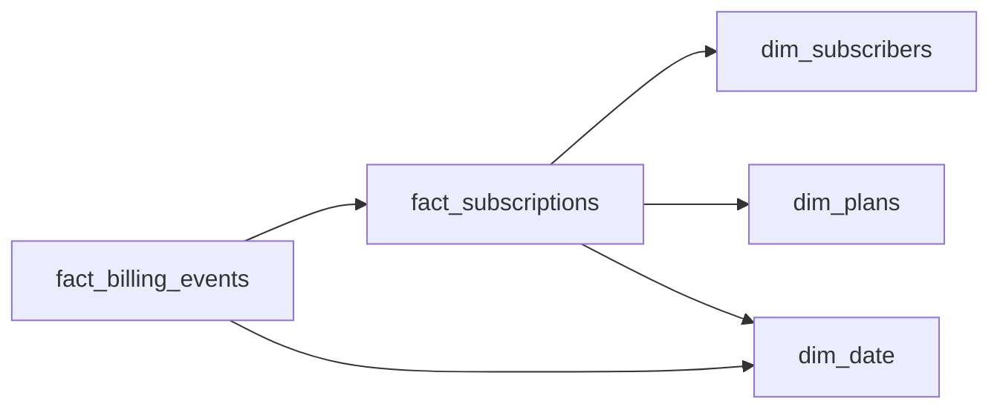

# The Churner Who Came Back
_They cancelled. They came back. The report has to tell both stories correctly._

- **Domain:** data_modeling
- **Difficulty:** Hard
- **Est. time:** 30 min
- **URL:** https://datadriven.io/problems/the_churner_who_came_back

## Problem

We have a global subscription business with hundreds of millions of subscribers across multiple plan tiers and regions. Subscribers can upgrade, downgrade, pause, cancel, and re-subscribe. Finance and product analytics need a data model that supports churn analysis, revenue reporting, and plan mix reporting. Design the data model.

**Concepts tested:** `dmAttributes`, `dmDimensionTables`, `dmEntities`, `dmFactTables`, `dmForeignKeys`, `dmGrainDefinition`, `dmKeyGeneration`, `dmManyToMany`, `dmMetricAdditivity`, `dmOlapCubes`, `dmOneToMany`, `dmPrimaryKeys`, `dmScdType2`, `dmStarSchema`, `dmSurrogateKeys`

## Solution walkthrough


### What this really is

This is a grain question disguised as a subscription business. The real skill is modeling one person who has several separate spans of being a customer. Anyone can draw a subscribers table and a plans table. The separating move is to declare `fact_subscriptions` at **one row per contiguous subscription period**, so a churner who comes back gets a new row, and to make plan price a Type 2 dimension. Update the subscriber's row in place on resubscribe and the win-back overwrites the churn. Last quarter's churn count then quietly drops, and the returning customer looks like they never left.

> **Ask whether a comeback is a new subscription**
>
> Before drawing a box, ask finance how churn is attributed across the gap. The answer pins the grain: cancel then resubscribe closes one period with an `end_reason` and opens another. Churn, reactivation and MRR roll-forward all become row counts and sums.

### Building it

**Step 1: Fix the grain of `fact_subscriptions`**

One row per subscriber per contiguous period, bounded by `period_start_ts` and a nullable `period_end_ts`. `mrr_usd` is additive across subscribers and tiers within a date. It is not additive across time, so sum it at a point in time and never down a month.

**Step 2: Make `dim_plans` Type 2 on price**

`monthly_price` changes. Each version gets a new `plan_sk` with `effective_from` and `is_current`, and the fact points at the version in effect when the period opened. History never reprices by accident.

**Step 3: Give cash its own fact**

Charges, refunds, retries and proration live on `fact_billing_events` at event grain, keyed back to `subscription_id`. Accrual MRR and cash movement are different questions. One table answering both double-counts every retried payment.

**Step 4: Key both facts to a conformed `dim_date`**

Each fact carries its own integer FK: `start_date_key` on periods, `event_date_key` on billing events. Finance gets fiscal periods and month ends from one calendar, and the date join is a key match instead of a cast on every row.


**dim_subscribers**

| column | type | key |
|---|---|---|
| subscriber_sk | BIGINT | PK |
| subscriber_id | TEXT |  |
| country | TEXT |  |
| effective_from | TIMESTAMP |  |
| effective_to | TIMESTAMP |  |
| is_current | BOOLEAN |  |

**dim_plans**

| column | type | key |
|---|---|---|
| plan_sk | BIGINT | PK |
| plan_code | TEXT |  |
| tier | TEXT |  |
| monthly_price | DECIMAL |  |
| currency | TEXT |  |
| effective_from | TIMESTAMP |  |
| is_current | BOOLEAN |  |

**dim_date**

| column | type | key |
|---|---|---|
| date_key | INT | PK |
| calendar_date | DATE |  |
| fiscal_period | TEXT |  |
| is_month_end | BOOLEAN |  |

**fact_subscriptions**

| column | type | key |
|---|---|---|
| subscription_id | BIGINT | PK |
| subscriber_sk | BIGINT | FK |
| plan_sk | BIGINT | FK |
| start_date_key | INT | FK |
| period_start_ts | TIMESTAMP |  |
| period_end_ts | TIMESTAMP |  |
| mrr_usd | DECIMAL |  |
| end_reason | TEXT |  |

**fact_billing_events**

| column | type | key |
|---|---|---|
| billing_event_id | BIGINT | PK |
| subscription_id | BIGINT | FK |
| event_date_key | INT | FK |
| event_ts | TIMESTAMP |  |
| event_type | TEXT |  |
| amount_local | DECIMAL |  |
| amount_usd | DECIMAL |  |


> **A relationship needs a column that carries it**
>
> Candidates draw a line from `fact_subscriptions` to `dim_date` and reuse `subscriber_sk` as the key. One FK column cannot point at two tables. Every relationship needs its own column, here `start_date_key`, keyed FK to `date_key`.

> **Grain stated before any boxes**
>
> The senior tell is saying the grain out loud first, then defending Type 2 on `dim_plans` with a finance restatement and keeping PII on `dim_subscribers` only, so an erasure request never touches retained financial facts.

| Period-grain fact, Type 2 plans | One row per subscriber, updated in place |
|---|---|
| A comeback is a new row and the gap survives. MRR at a date is a filter on `period_start_ts` and `period_end_ts`. Old periods keep the `plan_sk` they were sold at. | Resubscribing overwrites `end_reason`, so churn is rewritten after the fact. Win-back analysis has nothing to count, and a price change silently reprices every historical row. |

**Active subs, MRR and churn by fiscal period and tier**

```sql
SELECT
    d.fiscal_period,
    p.tier,
    COUNT(DISTINCT s.subscriber_sk) AS active_subs,
    SUM(s.mrr_usd) AS mrr_usd,
    SUM(CASE WHEN s.end_reason = 'voluntary_churn' THEN 1 ELSE 0 END) AS churned
FROM fact_subscriptions s
JOIN dim_plans p ON p.plan_sk = s.plan_sk
JOIN dim_date d ON d.date_key = CAST(TO_CHAR(s.period_start_ts, 'YYYYMMDD') AS INT)
WHERE s.period_start_ts <= d.calendar_date
  AND (s.period_end_ts IS NULL OR s.period_end_ts > d.calendar_date)
GROUP BY d.fiscal_period, p.tier
```

Note `COUNT(DISTINCT s.subscriber_sk)`: a churner who came back inside one fiscal period has two rows, and a plain `COUNT(*)` would count them twice. Churn is a `SUM` over `end_reason`, which works because each period closes exactly once.

- **This query buckets periods by the date they started. How would you build a true month-end active snapshot?**
  - _Tests joining periods to every `is_month_end` date rather than to `start_date_key`._
- **Finance restates last quarter's tier prices. What changes and what stays?**
  - _Tests Type 2 on `dim_plans` and stable `plan_sk` on historical facts._
- **Product wants pause and resume reported apart from cancel and resubscribe. Does the grain change?**
  - _Tests whether `end_reason` is enough or a pause needs its own period._
- **At 500M subscribers, how would you partition both facts?**
  - _Tests `start_date_key` versus `event_date_key` as partition columns._
