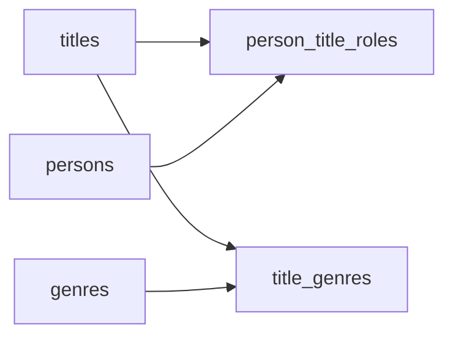

# The Credits Roll
_Searchable from every angle. Design it so nothing gets lost._

- **Domain:** data_modeling
- **Difficulty:** Hard
- **Est. time:** 40 min
- **URL:** https://datadriven.io/problems/the_credits_roll

## Problem

We run a streaming catalog where people search for films by title, by the actors in them, by the director, or by anyone else credited on the production, and also browse by genre. The same person is often credited more than once on one film, say as both its writer and its director, and every acting credit carries the character played and a billing order so the top-billed cast surface first. Design the data model behind this catalog, and outline how you would build the search architecture on top of it.

**Concepts tested:** `dmAttributes`, `dmConstraints`, `dmDataTypes`, `dmEntities`, `dmFirstNormalForm`, `dmForeignKeys`, `dmJunctionTables`, `dmManyToMany`, `dmPrimaryKeys`, `dmSecondNormalForm`, `dmSurrogateKeys`, `dmThirdNormalForm`

## Solution walkthrough


### Why this problem exists in real interviews

This is a many-to-many with role attributes wearing a movie-catalog costume, and it hides a second trap: multi-attribute search at scale does not live in SQL. Persons appear on many titles in different roles, and a candidate who collapses role into a scalar on the person loses the entire query plan. Get the role placement wrong and an actor who later directs splits into two person rows, doubling them in every search result.

> **Trick to Solving**
>
> Before drawing tables, a strong candidate asks: how is the same person represented when they hold multiple roles on the same title, and where does fuzzy search run? The signal is that role lives on the junction row, and the search index is a downstream projection.
>
> 1. Model titles and persons as independent dimensions
> 2. Put role on the junction table, not on the person
> 3. Represent genres through a separate junction
> 4. Treat the search engine as a materialized projection

---

### Break down the requirements

**Step 1: Separate titles and persons**

Both are first-class entities. A person has a stable identity independent of their filmography, and a title has a stable identity independent of its cast. Two dimensions, one junction.

**Step 2: Model role on the junction**

`person_title_roles` sits at the grain of one row per person per title per role, so the same person can be credited as writer and as director on one film without duplication. You can key this two ways: a composite PK on `(person_id, title_id, role)`, or a surrogate PK alongside those three columns. Both capture the grain; the composite form makes it self-documenting, the surrogate form is friendlier to foreign keys pointing at the junction. What is NOT defensible is dropping role out of that grain.

**Step 3: Separate genres into their own junction**

Genres are also many-to-many with titles. Conform genres as their own small dimension with a `title_genres` junction rather than stuffing them into an array column on `titles`.

**Step 4: Push search to a dedicated engine**

Full-text and multi-attribute search at scale is not a SQL `LIKE` problem. The relational model is the source of truth; a search index (Elasticsearch, OpenSearch) is a denormalized projection rebuilt from change streams on these tables.

---

### The solution

Below is one defensible design: two dimensions, two junctions, and a note that the search index is a projection of this relational model. Here the junction is shown with a composite key across its three grain columns; a surrogate key beside those same three columns is equally acceptable.


**titles**

| column | type | key |
|---|---|---|
| title_id | BIGINT | PK |
| name | TEXT |  |
| release_year | INT |  |
| runtime_minutes | INT |  |
| content_type | TEXT |  |

**persons**

| column | type | key |
|---|---|---|
| person_id | BIGINT | PK |
| full_name | TEXT |  |
| birth_year | INT |  |
| primary_profession | TEXT |  |

**person_title_roles**

| column | type | key |
|---|---|---|
| person_id | BIGINT | PK |
| title_id | BIGINT | PK |
| role | TEXT | PK |
| character_name | TEXT |  |
| credit_order | INT |  |

**genres**

| column | type | key |
|---|---|---|
| genre_id | INT | PK |
| genre_name | TEXT |  |

**title_genres**

| column | type | key |
|---|---|---|
| title_id | BIGINT | PK |
| genre_id | INT | PK |


> **Why this works**
>
> Role as a junction attribute supports the 'who directed and also wrote' case without duplicating a person row. The trade-off is that search queries still fan out across four tables, which is why a secondary search index is part of the architecture rather than an afterthought.

> **Interviewers watch for**
>
> Strong candidates mention the search engine as a projection in the first minute, not at the end. They also propose a change data capture pipeline from the OLTP tables into the index. Weak candidates try to solve multi-attribute search with SQL `LIKE` and trigram indexes on ten million titles.

> **Common pitfall**
>
> Adding a `role` column to `persons` as a scalar. An actor who later directs becomes two different person rows, which breaks every credit query and doubles their appearance in search results. This is the mistake that matters, far more than whether the junction is keyed by a composite or a surrogate.

---

### The analysis pattern

**Titles matching an actor search**

```sql
SELECT
    t.name,
    t.release_year,
    STRING_AGG(DISTINCT g.genre_name, ', ') AS genres,
    STRING_AGG(DISTINCT ptr.role, ', ') AS roles
FROM titles t
JOIN person_title_roles ptr ON ptr.title_id = t.title_id
JOIN persons p ON p.person_id = ptr.person_id
LEFT JOIN title_genres tg ON tg.title_id = t.title_id
LEFT JOIN genres g ON g.genre_id = tg.genre_id
WHERE p.full_name = 'Tilda Swinton'
GROUP BY t.name, t.release_year
ORDER BY t.release_year DESC
```

---

### Trade-offs and alternatives

| Relational with search index projection | Document store as source of truth |
|---|---|
| Strong relational integrity, clean updates, search index is a materialized view. Cost: two systems to keep in sync via CDC. | Denormalized document per title with embedded cast and genres. Fast single-document reads. Cost: updating one actor across every title they ever appeared in is a fan-out write, and referential integrity is the application's problem. |

---

- **How would you support searching by alias when an actor uses multiple stage names?**
  - _Tests whether the candidate adds a `person_aliases` table._
- **How would the model handle a TV series with per-episode guest appearances?**
  - _Tests adding an episode entity between title and `person_title_roles`._
- **How do you propagate a corrected release year from `titles` into the search index?**
  - _Tests CDC and search index rebuild strategy._
- **At 100M titles and 500M credits, how do you partition `person_title_roles`?**
  - _Tests sharding strategies on high-cardinality many-to-many._
