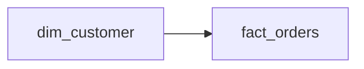

# The Customer Who Changed
_She moved. She upgraded. She became someone new. The record has to keep up._

- **Domain:** data_modeling
- **Difficulty:** Hard
- **Est. time:** 25 min
- **URL:** https://datadriven.io/problems/the_customer_who_changed

## Problem

Our customer dimension needs to track historical changes to attributes like address, membership tier, and email. When we look at an order from 6 months ago, we need the customer's attributes as of that date, not today's values. Design the schema.

**Concepts tested:** `dmAttributes`, `dmConstraints`, `dmDimensionTables`, `dmEntities`, `dmFactTables`, `dmForeignKeys`, `dmGrainDefinition`, `dmMetricAdditivity`, `dmOneToMany`, `dmPrimaryKeys`, `dmScdStrategy`, `dmScdType2`, `dmStarSchema`, `dmSurrogateKeys`

## Solution walkthrough


### Why this problem exists in real interviews

Type 2 SCD is the single most common data modeling interview question because it forces the candidate to articulate a trade-off in plain language: do historical facts report the attributes that were true at the time, or the attributes that are true now? The signal is whether the candidate names Type 1 and Type 2 explicitly and picks between them with a justification rooted in the business question, not textbook dogma.

> **Trick to Solving**
>
> The tell is "preserve history of customer attribute changes". Before drawing any tables, a strong candidate asks: which attributes matter for historical fidelity, and which can be overwritten safely? Loyalty tier yes, email no. This answer drives the SCD strategy per column.
>
> 1. Spot the historical fidelity requirement
> 2. Commit to Type 2 with `valid_from` / `valid_to` / `is_current`
> 3. Give `dim_customer` a surrogate key and version it on change
> 4. Store `customer_sk` on `fact_orders`, not `customer_id`

---

### Break down the requirements

**Step 1: Introduce a surrogate key**

`customer_sk` is a BIGINT generated per version. `customer_id` stays as the natural key that joins versions of the same customer together.

**Step 2: Add the effective-dated columns**

`valid_from` and `valid_to` define the window during which this version was live. `is_current` is a boolean convenience for hot-path lookups of the present state.

**Step 3: Version-lock the fact**

`fact_orders.customer_sk` points at the version that was current at order time. This is the load-bearing decision: any fact joined to dim on `customer_sk` returns the historical attributes, not the current ones.

**Step 4: Close out the prior version on change**

When a customer's segment changes, the ETL sets the old row's `valid_to` and `is_current = false`, then inserts a new row with `valid_from = now()` and a fresh `customer_sk`. The original row stays untouched for audit.

---

### The solution

Below is one conceptually sound approach. The surrogate key plus effective dates is the Kimball canon; the fact's surrogate FK is what makes historical queries work without temporal join gymnastics.


**dim_customer**

| column | type | key |
|---|---|---|
| customer_sk | BIGINT | PK |
| customer_id | TEXT |  |
| segment | TEXT |  |
| loyalty_tier | TEXT |  |
| valid_from | TIMESTAMP |  |
| valid_to | TIMESTAMP |  |
| is_current | BOOLEAN |  |

**fact_orders**

| column | type | key |
|---|---|---|
| order_line_id | BIGINT | PK |
| order_id | BIGINT |  |
| customer_sk | BIGINT | FK |
| order_timestamp | TIMESTAMP |  |
| net_amount | DECIMAL |  |


> **Why This Design Works**
>
> Writing the version surrogate onto the fact at load time pays a tiny one-time cost to avoid an expensive temporal range join at read time. Every historical query is a simple equi-join. The trade-off is ETL complexity and dimension storage growth proportional to change rate.

> **Interviewers Watch For**
>
> Strong candidates distinguish per-column SCD strategy (Type 1 for cosmetic fields, Type 2 for analytical fields) and explain why the surrogate key lives on the fact. They also mention `is_current` as an index-friendly hot-path filter. Weaker candidates add Type 2 to every column and explode storage.

> **Common Pitfall**
>
> Joining fact to dim on `customer_id` and then filtering with `order_timestamp BETWEEN valid_from AND valid_to`. This works but is slow, fragile under backfills, and defeats the reason for having a surrogate key in the first place.

---

### The analysis pattern

**Revenue by historical customer segment**

```sql
SELECT
    c.segment AS segment_at_order_time,
    COUNT(DISTINCT f.order_id) AS orders,
    SUM(f.net_amount) AS revenue
FROM fact_orders f
JOIN dim_customer c ON c.customer_sk = f.customer_sk
WHERE f.order_timestamp >= '2025-01-01'
GROUP BY c.segment
ORDER BY revenue DESC
```

---

### Trade-offs and alternatives

| Type 2 with surrogate FK on fact | Type 1 with natural key on fact |
|---|---|
| Historical fidelity, fast equi-joins, clean audit. Cost: ETL writes a new row on every change, storage scales with change rate, and `is_current` needs an index. | One row per customer, minimal storage, simple ETL. Cost: historical reports silently show today's attributes, and segment-lift analysis becomes impossible. |

---

- **A customer's email address changes. Is that Type 1, Type 2, or something else?**
  - _Tests per-column SCD judgment; email is usually Type 1 unless audit requires otherwise._
- **A batch of historical orders is backfilled three months late. How do you assign the correct `customer_sk`?**
  - _Tests lookup by `customer_id` plus `order_timestamp` against `valid_from` and `valid_to`._
- **`dim_customer` grows to 500M rows. How do you keep the `is_current = true` lookup fast?**
  - _Tests partial index on `is_current` and whether to separate current and historical tables._
- **A GDPR deletion request arrives for a customer with 10 historical versions. What happens?**
  - _Tests hard-delete strategy versus tombstoning, and whether facts retain a redacted surrogate._
- **A segment reclassification affects 2M customers retroactively. Is that a Type 2 insert or a Type 1 update?**
  - _Tests the distinction between a real attribute change and a corrected classification._
