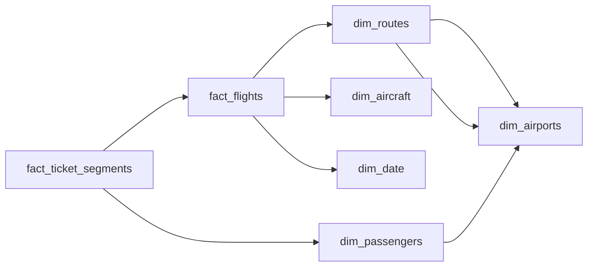

# The Double Count
_One flight carries hundreds of seats; one ticket spans many flights. Model them so neither gets counted twice._

- **Domain:** data_modeling
- **Difficulty:** Medium
- **Est. time:** ? min
- **URL:** https://datadriven.io/problems/the_double_count

## Problem

Each flight record is one departure between two airports on one day, flying that airport pair's fixed published distance in miles with hundreds of passengers aboard, while a passenger can connect across several flights and every ticket's fare has already been split into a share for each flight its passenger flies. From these records the warehouse must show how late each flight pushed back and why, how many seats it offered and how full it flew, and the revenue earned per seat mile, keeping what happens to a flight separate from what each passenger flies so no seat, mile or fare is counted twice. The raw operational numbers are kept as recorded so they still roll up correctly across routes and days.

**Concepts tested:** `dmAttributes`, `dmDimensionTables`, `dmFactTables`, `dmForeignKeys`, `dmGrainDefinition`, `dmJunctionTables`, `dmManyToMany`, `dmMetricAdditivity`, `dmOneToMany`, `dmPrimaryKeys`, `dmStarSchema`, `dmSurrogateKeys`

## Solution walkthrough


### What this problem really is

Strip the airline costume and this is a **grain collision**: three stakeholders each imply a different unit of analysis in one prompt. Operations lives at one row per flight leg (`load_factor`, `delay_minutes`), while revenue lives at one row per passenger per leg. Passenger-to-flight is many-to-many, so the tempting move, folding both onto one wide row, forces a double count. Get it wrong and you either count each seat once per passenger onboard or count each fare once per leg flown, and finance and operations report different totals from the same table.

> **Two grains hide in one prompt**
>
> The whole design turns on noticing the collision before you sketch tables. Split into two facts over conformed dimensions: `fact_flights` at one row per scheduled leg for load factor and delay, and `fact_ticket_segments` at one row per passenger per leg for fare. Each measure stays additive at its own grain, and no query mixes seats with fares.

### Building it, decision by decision

**Step 1: Declare the flight-leg grain out loud**

`fact_flights` is one row per scheduled flight leg, keyed by `flight_key`. Say it before drawing anything: every measure on this table must be additive at the leg grain, which immediately rules out anything passenger-shaped living here.

**Step 2: Resolve the many-to-many with a bridge fact**

A leg carries hundreds of passengers; an itinerary spans many legs. `fact_ticket_segments` links `dim_passengers` to `fact_flights` at one row per passenger per leg. This is the bridge that keeps fares off the flight row and keeps seat counts off the fare row.

**Step 3: Store load factor's ingredients, not the ratio**

Keep `seats_available` and `passengers_boarded` as separate raw columns and let consumers form the ratio. A pre-computed percentage cannot re-aggregate across routes or days, because averaging ratios is not the ratio of sums.

**Step 4: Store raw delay, not a verdict**

Keep `delay_minutes` (or the scheduled and actual departure times) plus a `scheduled_dep_date_key` FK to `dim_date`. A single `on_time` boolean answers 'was it late' but throws away magnitude, so average delay by fleet type and on-time rate by route both become unanswerable.

**Step 5: Model delay cause as a leg attribute**

Carrier, weather, and NAS reasons attach to the leg as `delay_cause`, an attribute on the fact row. That lets analysts slice performance by why a departure slipped without a separate bridge, since a cause is one value per leg.

**Step 6: Conform the shared dimensions**

`dim_aircraft`, `dim_routes`, `dim_airports`, and `dim_date` are shared by both facts. Conforming them means finance and operations join the same calendar and the same airports, so their numbers reconcile by construction instead of in a meeting.

### The reference design


**dim_date**

| column | type | key |
|---|---|---|
| date_key | INT | PK |
| full_date | DATE |  |
| day_of_week | INT |  |
| is_holiday | BOOLEAN |  |

**dim_airports**

| column | type | key |
|---|---|---|
| airport_key | INT | PK |
| iata_code | TEXT |  |
| city | TEXT |  |
| country | TEXT |  |
| timezone | TEXT |  |

**dim_routes**

| column | type | key |
|---|---|---|
| route_key | INT | PK |
| origin_key | INT | FK |
| destination_key | INT | FK |
| distance_miles | INT |  |

**dim_aircraft**

| column | type | key |
|---|---|---|
| aircraft_key | INT | PK |
| tail_number | TEXT |  |
| fleet_type | TEXT |  |
| total_seats | INT |  |

**dim_passengers**

| column | type | key |
|---|---|---|
| passenger_key | BIGINT | PK |
| loyalty_tier | TEXT |  |
| home_airport_key | INT | FK |

**fact_flights**

| column | type | key |
|---|---|---|
| flight_key | BIGINT | PK |
| route_key | INT | FK |
| aircraft_key | INT | FK |
| scheduled_dep_date_key | INT | FK |
| seats_available | INT |  |
| passengers_boarded | INT |  |
| delay_minutes | INT |  |
| delay_cause | TEXT |  |

**fact_ticket_segments**

| column | type | key |
|---|---|---|
| segment_key | BIGINT | PK |
| flight_key | BIGINT | FK |
| passenger_key | BIGINT | FK |
| fare_class | TEXT |  |
| revenue_usd | FLOAT |  |


> **Distinct grains stay composable**
>
> Load factor rolls up from `fact_flights`; revenue per seat mile rolls up from `fact_ticket_segments` joined to `dim_routes.distance_miles`. Neither query double counts because each fact owns one grain. The trade is storage for clarity: repeating `flight_key` on every segment costs bytes but keeps the two grains joinable and correct.

> **Stating the grain is the seniority tell**
>
> Strong candidates name the grain before drawing, keep `delay_minutes` and `delay_cause` raw on the leg instead of collapsing to `on_time`, and volunteer that storing `load_factor` as a percentage silently breaks roll-ups. Weak ones fold passengers and flights together, then cannot explain why on-time performance suddenly depends on revenue rows.

> **A boolean throws away the magnitude**
>
> Storing a pre-judged `on_time` flag instead of raw delay. It answers 'was it late' but not 'how late' or 'why', so average delay by fleet type and on-time percentage by route both become unrecoverable without the original timing.

### The analysis pattern

**Load factor, delay, and RASM by route and month**

```sql
SELECT
    r.route_key,
    DATE_TRUNC('month', d.full_date) AS month,
    SUM(f.passengers_boarded)::NUMERIC / NULLIF(SUM(f.seats_available), 0) AS load_factor,
    AVG(f.delay_minutes) AS avg_delay_minutes,
    SUM(ts.revenue_usd) / NULLIF(SUM(f.seats_available * r.distance_miles), 0) AS rasm
FROM fact_flights f
JOIN dim_routes r ON r.route_key = f.route_key
JOIN dim_date d ON d.date_key = f.scheduled_dep_date_key
JOIN fact_ticket_segments ts ON ts.flight_key = f.flight_key
GROUP BY r.route_key, DATE_TRUNC('month', d.full_date)
```

| Two-fact star | Single wide fact |
|---|---|
| Clean grain per fact, conformed dimensions, additive measures. Cost: revenue queries need a join and ETL maintains two load paths. Evolves cleanly when new passenger attributes arrive. | One row per passenger per leg with flight attributes denormalized on. Lower join cost for passenger queries, but operational metrics need `COUNT(DISTINCT flight_key)`, double counting is one `GROUP BY` slip away, and any flight-level attribute change rewrites billions of rows. |

- **How would you handle a codeshare flight where the marketing carrier differs from the operating carrier?**
  - _Tests separating the operating leg from the ticket-segment grain._
- **What if `dim_aircraft` is repainted and re-registered mid-year, changing `tail_number` and `total_seats`?**
  - _Tests SCD Type 2 reasoning on equipment that drives load factor._
- **How would you backfill `fact_flights` when `delay_cause` arrives 48 hours late from the FAA feed?**
  - _Tests late-arriving fact handling and reprocessing windows._
- **At 30k legs per day, how would you partition `fact_flights` for a year-over-year dashboard?**
  - _Tests partitioning on `scheduled_dep_date_key` for time-series pruning._
