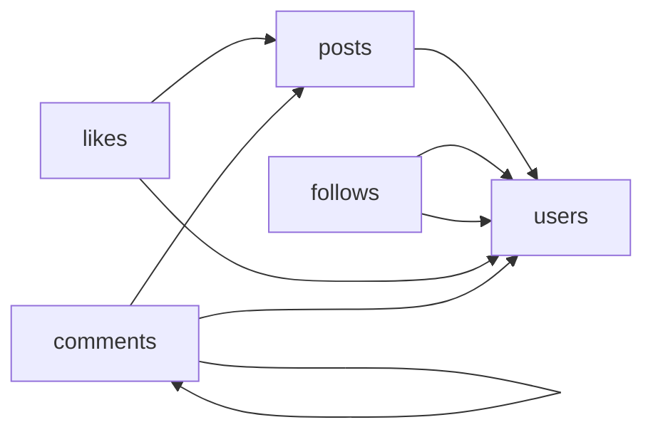

# The Endless Thread
_Follows, likes, replies to replies. It never stops._

- **Domain:** data_modeling
- **Difficulty:** Medium
- **Est. time:** 25 min
- **URL:** https://datadriven.io/problems/the_endless_thread

## Problem

Dashboards for a photo-and-video social network keep showing the same account following one creator twice and the same user liking one post twice, so the engagement team wants a warehouse model where a follow is identified by exactly who follows whom and a like by exactly which user liked which post, making either duplicate impossible to store without any application checks. Users create posts that are each a photo or a video, follow one another one direction at a time, and like posts, while a comment either sits on a post or replies to another comment. Design the model so the product team can report engagement per content type.

**Concepts tested:** `dmAttributes`, `dmCompositeKeys`, `dmConstraints`, `dmEntities`, `dmFirstNormalForm`, `dmForeignKeys`, `dmGrainDefinition`, `dmJunctionTables`, `dmManyToMany`, `dmMetricAdditivity`, `dmOneToMany`, `dmPrimaryKeys`, `dmSecondNormalForm`, `dmSelfReferential`, `dmSurrogateKeys`, `dmThirdNormalForm`

## Solution walkthrough


### What this problem really is

Strip the social-network costume and this is two many-to-many relationships plus one self-reference, and the whole design is decided by how you key the junctions. `follows` relates users to users, `likes` relates users to posts, and `comments.parent_comment_id` points back at `comments`. Anyone can draw five boxes. What separates candidates is the junction key: leave the junction keyless, or reach for a surrogate `follow_id` or `like_id`, and nothing stops the same (`follower_id`, `followed_id`) pair from landing twice. The prompt says a follow is identified by who follows whom and duplicates must be **impossible to store without any application checks**, and only a primary key on the pair itself can promise that.

> **Make the pair the key, not a byproduct**
>
> On each junction the two foreign keys together ARE the primary key. `(follower_id, followed_id)` on `follows` and `(user_id, post_id)` on `likes` make a duplicate relationship physically unstorable, with no application check in the loop. Two FK badges and no PK promise nothing: the table is a heap that takes the same pair as often as it is sent.

### Building the model

**Step 1: Separate entities from relationships**

`users`, `posts`, and `comments` own their identity, so each gets a surrogate key (`user_id`, `post_id`, `comment_id`). `follows` and `likes` are not entities, they are relationships, so they become junction tables keyed on the participants themselves, never on a fresh invented id.

**Step 2: Put the content type on the post**

Every post is a photo or a video, and the report is engagement per content type, so `posts` carries a `content_type` holding 'photo' or 'video'. It lives on the post, not on `likes` or `comments`: an engagement row inherits its content type through `post_id`, so the fact is stored once.

**Step 3: Model `follows` as a self-referential junction**

`follows` relates users to users, so `follower_id` and `followed_id` are both foreign keys to `users.user_id`, and together they form the composite primary key. That pair is what makes following someone twice impossible. Direction matters: `follower_id` acts, `followed_id` is followed, so the edge stays one-directional.

**Step 4: Key `likes` on the pair, not an id**

Same shape, different pair. `likes` has `user_id` and `post_id` as its composite primary key, each also a foreign key. A second identical row is rejected by the key itself. Keep it a clean pair with no stray `comment_id`, so the grain stays one row per user per liked post.

**Step 5: Self-reference comments for threads**

A comment either sits on a post or replies to another comment, so `comments` carries both `post_id` and a nullable `parent_comment_id` that points back at `comments.comment_id`. Top-level comments leave `parent_comment_id` null; replies point at their parent. No separate threads table is needed.


**users**

| column | type | key |
|---|---|---|
| user_id | BIGINT | PK |
| handle | TEXT |  |
| created_at | TIMESTAMP |  |
| country | TEXT |  |

**posts**

| column | type | key |
|---|---|---|
| post_id | BIGINT | PK |
| user_id | BIGINT | FK |
| content_type | VARCHAR |  |
| body | TEXT |  |
| created_at | TIMESTAMP |  |
| is_deleted | BOOLEAN |  |

**follows**

| column | type | key |
|---|---|---|
| follower_id | BIGINT | PK |
| followed_id | BIGINT | PK |
| followed_at | TIMESTAMP |  |

**likes**

| column | type | key |
|---|---|---|
| user_id | BIGINT | PK |
| post_id | BIGINT | PK |
| liked_at | TIMESTAMP |  |

**comments**

| column | type | key |
|---|---|---|
| comment_id | BIGINT | PK |
| post_id | BIGINT | FK |
| user_id | BIGINT | FK |
| parent_comment_id | BIGINT | FK |
| body | TEXT |  |
| created_at | TIMESTAMP |  |


> **The pair as the key is the tell**
>
> Strong candidates make each junction's foreign-key pair its primary key and draw two distinct edges from `follows` to `users`, one for `follower_id` and one for `followed_id`. They thread replies through `parent_comment_id` instead of inventing a threads table. Weaker ones leave the junction with two FK badges and no PK, or bolt on a `follow_id`, and never notice the duplicate is still legal.

> **A junction without its pair as key is a silent bug**
>
> Adding `follow_id` to `follows` or `like_id` to `likes`, or leaving the junction unkeyed, looks harmless and **passes every insert**, which is exactly the danger: it moves duplicate-prevention out of the schema and into whatever the application remembers to check. The same slip smears an extra dimension across the grain when a stray `comment_id` sneaks onto `likes`.

The product team's report falls straight out of this shape. Because a like and a comment each reach exactly one post, and the post carries `content_type`, engagement rolls up per content type without double counting: count each side per post first, then sum.

**Engagement per content type**

```sql
SELECT
    u.handle,
    COUNT(*) FILTER (WHERE f.followed_at >= NOW() - INTERVAL '7 days') AS new_followers,
    COUNT(*) AS total_followers,
    COUNT(DISTINCT p.post_id) AS posts_this_week
FROM users u
JOIN follows f ON f.followed_id = u.user_id
LEFT JOIN posts p
    ON p.user_id = u.user_id
   AND p.created_at >= NOW() - INTERVAL '7 days'
GROUP BY u.handle
HAVING COUNT(*) FILTER (WHERE f.followed_at >= NOW() - INTERVAL '7 days') > 0
ORDER BY new_followers DESC
LIMIT 50
```

| Junction tables with composite keys | Graph database backing store |
|---|---|
| Duplicate prevention is a schema invariant, counting rows in `follows` is cheap, and every BI tool already speaks SQL. Cost: the composite index is a little bulkier than a surrogate, and a relationship that grows many attributes gets awkward. | Native traversal makes mutual-follow and recommendation queries fast. Cost: a second storage system to run, a duplicate analytics layer, and most warehouses and BI tools do not speak Cypher or Gremlin. |

- **A celebrity gains 100M rows in `follows`. Does keying and partitioning on `followed_id` still hold up?**
  - _Tests partitioning the junction by `followed_id` to keep hot-user fanout tractable._
- **Users can mute each other without unfollowing. Where does that relationship live?**
  - _Tests adding a new junction rather than widening `follows`._
- **Threads go 50 levels deep. Does the `parent_comment_id` self-reference still serve reads?**
  - _Tests recursive CTE feasibility versus a materialized path alternative._
