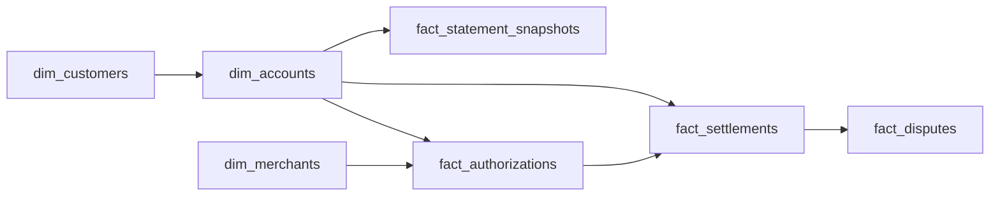

# The Float

- **Domain:** data_modeling
- **Difficulty:** Medium
- **Est. time:** 25 min
- **URL:** https://datadriven.io/problems/the_float

## Problem

A card issuer needs a warehouse that reconciles what a cardholder can spend right now against what has actually posted to their account. Every swipe creates a temporary hold that later settles, often for a different amount and sometimes never, and a cardholder can dispute a charge after it posts. Model the schema that supports available-credit checks, statement generation, and dispute tracking across accounts that each belong to a customer.

**Concepts tested:** `dmAttributes`, `dmConstraints`, `dmDataTypes`, `dmDimensionTables`, `dmEntities`, `dmFactTables`, `dmForeignKeys`, `dmGrainDefinition`, `dmManyToMany`, `dmMetricAdditivity`, `dmOneToMany`, `dmPreAggregation`, `dmPrimaryKeys`, `dmStarSchema`, `dmSurrogateKeys`

## Solution walkthrough


### Why this problem exists in real interviews

This is authorization-versus-settlement reconciliation wearing a warehouse-design costume. The real skill being probed: can you separate the hold event from the posting event when they share an amount only by coincidence? Anyone can draw a transactions table. The trap is treating one swipe as one row. Get that wrong and available credit is silently wrong, an expired hold inflates spend forever, and a restaurant tip that settles above the hold has nowhere to live.

> **Trick to solving**
>
> The moment the prompt says a hold 'settles for a different amount and sometimes never', you have two grains, not one. An authorization is a state that opens and later resolves; a settlement is what actually hits the ledger. Model them apart, link settlement to its auth with a one-to-many edge, and available credit falls out cleanly: limit minus posted minus still-open holds.

---

### Break down the requirements

**Step 1: Anchor balances on the account, not the customer**

A customer can hold several cards. Credit limit and available credit are properties of an account, so `dim_accounts` carries the limit and every fact hangs off `account_key`. Customer is a dimension one level up.

**Step 2: Split the hold from the post**

`fact_authorizations` is the hold: amount, `authorized_at`, `expires_at`, and a status. `fact_settlements` is what posts: it references the originating auth and carries its own `posted_amount` and `posted_at`. One auth can yield zero settlements (expired), one, or several (partial captures), so the settlement-to-auth edge is one-to-many.

**Step 3: Make balances a snapshot, not a replay**

Available credit on the hot path cannot rescan billions of events. `fact_statement_snapshots` stores one row per account per cycle with posted, pending, and available balances. Those are semi-additive: you can sum across accounts, never across cycles.

**Step 4: Keep disputes reversible**

A dispute targets one settled charge. `fact_disputes` references the settlement and carries a reason code, state, and `resolution_amount`. The original posted amount is never mutated, so the ledger stays auditable.

---

### The reference model

Two event facts (authorizations, settlements) linked one-to-many, a periodic snapshot for statement balances, a dispute fact hanging off settlements, and conformed customer, account, and merchant dimensions. The snapshot is what keeps the authorization hot path fast; the event facts are what keep it correct.


**dim_customers**

| column | type | key |
|---|---|---|
| customer_key | BIGINT | PK |
| full_name | TEXT |  |
| ssn_hash | TEXT |  |
| joined_at | TIMESTAMP |  |

**dim_accounts**

| column | type | key |
|---|---|---|
| account_key | BIGINT | PK |
| customer_key | BIGINT | FK |
| card_last4 | TEXT |  |
| credit_limit | DECIMAL |  |
| status | TEXT |  |
| opened_at | TIMESTAMP |  |

**dim_merchants**

| column | type | key |
|---|---|---|
| merchant_key | BIGINT | PK |
| merchant_name | TEXT |  |
| category_code | TEXT |  |
| country | TEXT |  |

**fact_authorizations**

| column | type | key |
|---|---|---|
| auth_key | BIGINT | PK |
| account_key | BIGINT | FK |
| merchant_key | BIGINT | FK |
| auth_amount | DECIMAL |  |
| authorized_at | TIMESTAMP |  |
| expires_at | TIMESTAMP |  |
| auth_status | TEXT |  |

**fact_settlements**

| column | type | key |
|---|---|---|
| settlement_key | BIGINT | PK |
| auth_key | BIGINT | FK |
| account_key | BIGINT | FK |
| merchant_key | BIGINT | FK |
| posted_amount | DECIMAL |  |
| posted_at | TIMESTAMP |  |
| cycle_date_key | INT | FK |

**fact_disputes**

| column | type | key |
|---|---|---|
| dispute_key | BIGINT | PK |
| settlement_key | BIGINT | FK |
| account_key | BIGINT | FK |
| reason_code | TEXT |  |
| status | TEXT |  |
| resolution_amount | DECIMAL |  |
| disputed_at | TIMESTAMP |  |

**fact_statement_snapshots**

| column | type | key |
|---|---|---|
| snapshot_key | BIGINT | PK |
| account_key | BIGINT | FK |
| cycle_date_key | INT | FK |
| posted_balance | DECIMAL |  |
| pending_balance | DECIMAL |  |
| available_credit | DECIMAL |  |
| minimum_due | DECIMAL |  |


> **Interviewers watch for**
>
> A strong candidate says the words 'the hold and the post are different events' before drawing anything, and models available credit as limit minus posted minus open holds rather than as a running sum of one transaction table. They also note that expired auths must drop out of the pending total on their own, without a settlement to release them.

> **Common pitfall**
>
> One `fact_transactions` table with a single amount and a status column. It looks tidy until a $40 dinner hold settles at $48 with tip: there is no place for both numbers, partial captures have no home, and an expired hold that never settles quietly overstates spend because nothing ever posts to zero it out.

| Single transaction table | Split auth and settlement |
|---|---|
| One row per charge with amount and status.

* Simple to draw
* Cannot represent hold != post amount
* Partial captures and tips have no home
* Expired holds silently inflate spend | One fact for the hold, one for the post, linked one-to-many.

* Hold and settled amounts each have a home
* Zero, one, or many settlements per auth
* Expired holds drop out of pending on their own
* Available credit is limit minus posted minus open holds |

> **How it scales**
>
> At billions of auths a year, the available-credit check cannot scan history. Keep open holds cheap to find (`auth_status` plus `expires_at`, indexed) or maintain a pending balance the snapshot rolls forward, and partition the event facts by `posted_at`. The snapshot table stays small: one row per account per cycle, which is what statement reads and regulators hit.

### The available-credit read

**Available credit for an account right now**

```sql
SELECT
    a.account_key,
    a.credit_limit,
    COALESCE(posted.posted_balance, 0) AS posted_balance,
    COALESCE(holds.pending_balance, 0) AS pending_balance,
    a.credit_limit
      - COALESCE(posted.posted_balance, 0)
      - COALESCE(holds.pending_balance, 0) AS available_credit
FROM dim_accounts a
LEFT JOIN (
    SELECT account_key, SUM(posted_amount) AS posted_balance
    FROM fact_settlements
    GROUP BY account_key
) posted ON posted.account_key = a.account_key
LEFT JOIN (
    SELECT account_key, SUM(auth_amount) AS pending_balance
    FROM fact_authorizations
    WHERE auth_status = 'open'
      AND expires_at > NOW()
    GROUP BY account_key
) holds ON holds.account_key = a.account_key
WHERE a.account_key = 550142
```

---

- **A single hold settles in three partial captures over two days. How does the model release the pending amount as each capture posts?**
  - _Tests whether the candidate ties settlements back to the auth and decrements or closes the hold as captures arrive._
- **How do you reproduce an account's available credit exactly as it stood at a statement close nine months ago?**
  - _Tests reliance on the periodic snapshot versus replaying the event stream, and reproducibility for regulators._
- **A dispute wins and issues a provisional credit that is later reversed when the merchant provides evidence. How is that sequence modeled?**
  - _Tests whether disputes are modeled as signed, stateful adjustments rather than a mutation of the original settlement._
