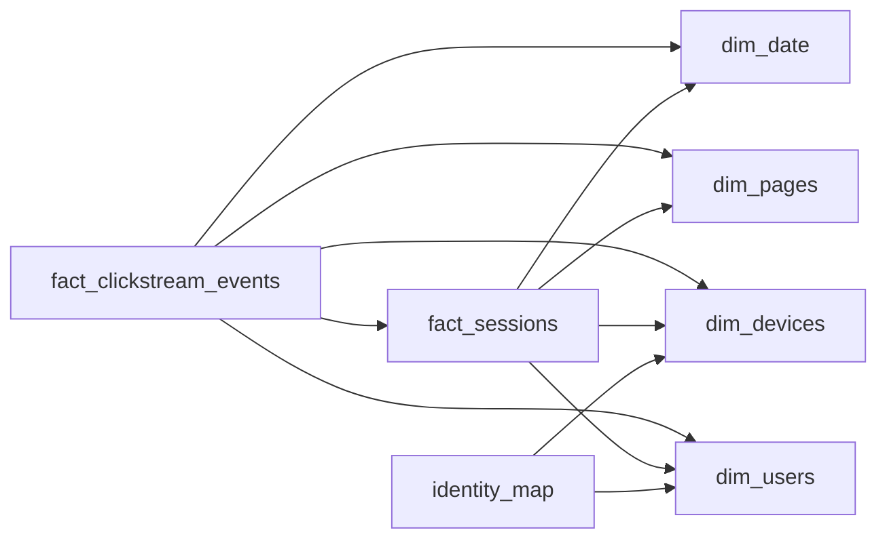

# The Gaps Between Clicks
_A visit is a story with a start and an end. Draw the model that finds where one ends and who was really there._

- **Domain:** data_modeling
- **Difficulty:** Hard
- **Est. time:** ? min
- **URL:** https://datadriven.io/problems/the_gaps_between_clicks

## Problem

We run a consumer web and mobile product that emits a high-volume clickstream: every page view, tap, and scroll lands as an event tied to a device, and a visitor is usually anonymous for a while before they sign in. Analysts need visit-level analysis (how long a session runs, how many events it holds, where it drops off) as well as daily engagement rolled up by page and device, where a session is activity with no more than a thirty-minute gap between consecutive events. Design a model that serves both the visit-level questions and the daily rollups, keeps a person's anonymous and signed-in activity connected, and credits each visit to whoever held the device during the window when that activity happened, since a shared device can pass from one person to another and each of them owns it only for a bounded stretch of time.

**Concepts tested:** `dmAttributes`, `dmCardinalityRequired`, `dmDataTypes`, `dmDenormalization`, `dmDimensionTables`, `dmFactTables`, `dmForeignKeys`, `dmGrainDefinition`, `dmKeyGeneration`, `dmLateArriving`, `dmManyToMany`, `dmOneToMany`, `dmPreAggregation`, `dmPrimaryKeys`, `dmStarSchema`, `dmSurrogateKeys`

## Solution walkthrough

### Why this problem exists in real interviews

This is sessionization plus identity stitching dressed up as clickstream analytics. Anyone can draw an event table with a `user_id` and a `session_id` column. The two things that separate candidates: recognizing that a session has its own grain (it is derived, not given), and that identity is time-bounded, not a current-state foreign key. Miss the second one and the first time a shared device gets reassigned, every old visit silently re-attributes to the new owner and your retention numbers lie.

> **Trick to Solving**
>
> Read the prompt for two grains hiding in one ask. 'How long a session runs' and 'where it drops off' are session-grain and event-grain questions. The thirty-minute gap is not a query predicate; it is a pipeline step that mints a `session_key` once and stamps it everywhere. Solve sessionization in the ETL, attribution with a dated map, and both questions become simple aggregations.

---

### Break down the requirements

**Step 1: Declare the event grain**

`fact_clickstream_events` is one row per raw event: a tap, a scroll, a page view, tied to a device and a page at a timestamp. This is the atomic substrate for journeys and drop-off funnels. Keep it lean; it carries billions of rows a day.

**Step 2: Derive the session, do not query for it**

Order events per device by timestamp and open a new session whenever the gap to the previous event exceeds thirty minutes. That logic runs once in the pipeline and produces a `session_key`. Recomputing this window on every dashboard query is the slow, fragile path that breaks the moment events arrive out of order.

**Step 3: Promote the session to its own fact**

`fact_sessions` is one row per session: start and end timestamps, duration, event count, entry page, exit page. Visit-level metrics are now additive and the table is orders of magnitude smaller than the event fact, so routine dashboards never touch the raw stream.

**Step 4: Stitch identity with a dated map**

`identity_map` links `device_key` to `user_key` with `valid_from` and `valid_to`. At processing time you resolve the user for each event using the window it falls in, then snapshot that `user_key` onto the session rows. A device handed to a new user opens a new mapping row; old activity keeps its original owner.

---

### The reference model

Two facts over conformed dimensions. The `session_key` is the spine: it is the primary key of `fact_sessions` and a foreign key on every event, so the same gap rule binds both grains. The resolved `user_key` is snapshotted onto the session fact rather than joined live, which is what keeps anonymous and signed-in history connected without letting reassignment rewrite the past.

**dim_date**

| column | type | key |
|---|---|---|
| date_key | INT | PK |
| full_date | DATE |  |
| day_of_week | INT |  |
| is_weekend | BOOLEAN |  |

**dim_pages**

| column | type | key |
|---|---|---|
| page_key | INT | PK |
| path | TEXT |  |
| page_type | TEXT |  |
| section | TEXT |  |

**dim_devices**

| column | type | key |
|---|---|---|
| device_key | BIGINT | PK |
| device_id | TEXT |  |
| platform | TEXT |  |
| os_version | TEXT |  |
| app_version | TEXT |  |

**dim_users**

| column | type | key |
|---|---|---|
| user_key | BIGINT | PK |
| signup_at | TIMESTAMP |  |
| account_tier | TEXT |  |
| home_country | TEXT |  |

**identity_map**

| column | type | key |
|---|---|---|
| map_id | BIGINT | PK |
| device_key | BIGINT | FK |
| user_key | BIGINT | FK |
| valid_from | TIMESTAMP |  |
| valid_to | TIMESTAMP |  |

**fact_sessions**

| column | type | key |
|---|---|---|
| session_key | BIGINT | PK |
| device_key | BIGINT | FK |
| user_key | BIGINT | FK |
| start_date_key | INT | FK |
| entry_page_key | INT | FK |
| exit_page_key | INT | FK |
| started_at | TIMESTAMP |  |
| ended_at | TIMESTAMP |  |
| event_count | INT |  |
| duration_seconds | INT |  |

**fact_clickstream_events**

| column | type | key |
|---|---|---|
| event_id | BIGINT | PK |
| session_key | BIGINT | FK |
| device_key | BIGINT | FK |
| user_key | BIGINT | FK |
| page_key | INT | FK |
| date_key | INT | FK |
| event_type | TEXT |  |
| event_ts | TIMESTAMP |  |

> **Why this works**
>
> The expensive, order-sensitive work (gap detection and identity resolution) happens once in the pipeline and is frozen into keys on the rows. Every downstream question is then a plain aggregation: visit duration off `fact_sessions`, drop-off off `fact_clickstream_events`, daily engagement off either, all sharing the same dimensions.

> **Interviewers Watch For**
>
> A candidate who declares the grain out loud before drawing tables, who names sessionization as a derived attribute rather than a query, and who catches the device-reassignment trap unprompted. Saying the words 'point-in-time attribution' and 'snapshot the `user_key`' is the senior tell here.

> **Common Pitfall**
>
> Modeling `user_key` as a live join from device to its current owner, often as a single `mapped_at` timestamp with an `is_current` flag. The day a tablet is reassigned, that flag flips and every historical session and event re-attributes to the new user, so last quarter's funnels change retroactively. Time-bound the mapping with `valid_from` and `valid_to` instead. The other classic miss is cramming session metrics as columns on the event fact, which forces a window function on billions of rows for a number that should be one read.

> **How It Scales**
>
> `fact_clickstream_events` partitioned by `date_key` and clustered by `device_key` prunes to a single day and walks one device cheaply. `fact_sessions` is typically 10 to 50x smaller, so the dashboards that ask 'average session length yesterday' never scan the raw stream. Late events landing a few minutes after a session closed are reconciled in the next micro-batch by re-evaluating only the affected device-day.

---

### Trade-offs and alternatives

| Session as its own fact | Session as columns on the event fact |
|---|---|
| Visit metrics are precomputed and additive.

* Dashboards read a small table
* Entry and exit pages are first-class
* One extra ETL step to maintain | No second table to build.

* Every visit metric is a window over billions of rows
* Out-of-order events corrupt the boundary mid-query
* Daily session counts require COUNT(DISTINCT) on the hot path |

---

- **A user signs in on two devices at once. How do you keep their sessions distinct while still rolling up to one person?**
  - _Tests whether session grain stays per-device while user-level rollups aggregate across the `identity_map`._
- **An event arrives ten minutes late, after its session was already closed and counted. How does the model heal?**
  - _Tests reprocessing strategy: re-derive the affected device-day session boundaries and update `event_count` rather than mutating history blindly._
- **Product wants funnel conversion across a multi-day journey, not a single visit. What changes?**
  - _Tests introducing a higher-grain visit or journey concept above sessions without collapsing the existing grains._
- **At billions of rows per day, how would you physically lay out `fact_clickstream_events`?**
  - _Tests partitioning by date, clustering by device, and routing routine reads to `fact_sessions`._
