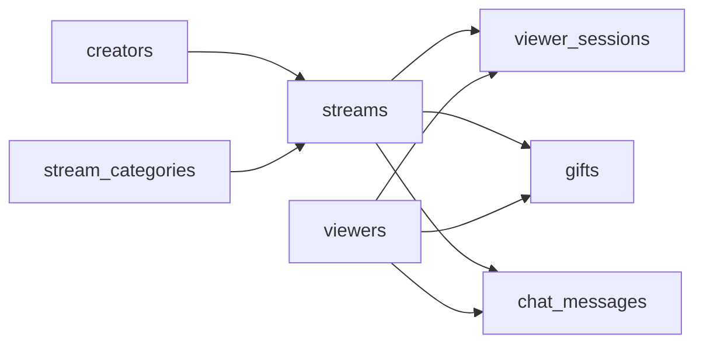

# The Gift Economy
_Someone goes live, thousands tune in, chat explodes, and virtual gifts start flying._

- **Domain:** data_modeling
- **Difficulty:** Medium
- **Est. time:** 25 min
- **URL:** https://datadriven.io/problems/the_gift_economy

## Problem

We run a livestream platform where creators go live and viewers drop in and out, fire off chat, and send paid virtual gifts that fund creator payouts. The same broadcast produces viewer visits, chat, and gift purchases at wildly different volumes, and every past gift must keep paying out the exact dollar amount it was worth the moment it was sent, even after finance reprices the gift catalog. Design the data model behind payouts, content recommendations, and engagement analytics.

**Concepts tested:** `dmAttributes`, `dmCardinalityRequired`, `dmConstraints`, `dmDataTypes`, `dmDimensionTables`, `dmEntities`, `dmFactTables`, `dmFirstNormalForm`, `dmForeignKeys`, `dmGrainDefinition`, `dmJunctionTables`, `dmManyToMany`, `dmOneToMany`, `dmPrimaryKeys`, `dmSecondNormalForm`, `dmStarSchema`, `dmThirdNormalForm`

## Solution walkthrough


### Why this problem exists in real interviews

Underneath the livestream costume, this is a multi-grain fact modeling problem with one immutable money event hiding inside it. Anyone can list creators, streams, and viewers. What separates candidates is refusing the one big `events` table: viewer sessions, gifts, and chat live at three different grains and volumes, and the gift row has to snapshot its dollar amount at send time. Miss the per-visit session grain and concurrent-viewer math collapses; miss the snapshot and a repriced gift catalog silently rewrites last month's payouts.

> **Trick to Solving**
>
> When a prompt mentions several event types with wildly different cardinality and one is monetary, the trick is to notice gift events must snapshot dollar amount at purchase time. Before drawing tables, a strong candidate asks: does chat volume dwarf gift volume, and is payout accuracy audited?
>
> 1. Split `viewer_sessions`, gifts, and chat into separate fact tables
> 2. Snapshot gift amount onto the gift event row
> 3. Model `viewer_sessions` at per-visit grain, not per-stream grain
> 4. Streams and creators stay as dimensions

---

### Break down the requirements

**Step 1: Separate fact tables by grain**

`viewer_sessions`, `gifts`, and `chat_messages` each get their own fact. Chat is 100x the volume of gifts; overloading crushes partition pruning.

**Step 2: Model viewer sessions at per-visit grain**

A viewer may join and leave a stream five times. Each visit is a row with `join_time` and `leave_time`. Per-stream aggregation is a GROUP BY on top.

**Step 3: Snapshot gift amounts**

`gifts.amount_usd` is captured at purchase time. If the gift catalog repriced tomorrow, payout math would not change yesterday's numbers.

**Step 4: Keep creators and categories as dimensions**

`creators` and `stream_categories` rarely change per row of fact and are shared across every event type, so they stay conformed dimensions. The receiving creator is always reachable by joining a gift or session through its `streams` row.

---

### The solution

Below is one defensible model. The anchor is per-visit grain for viewer sessions and snapshotted gift amounts, which keeps both engagement and payouts correct under change.


**creators**

| column | type | key |
|---|---|---|
| creator_id | BIGINT | PK |
| handle | TEXT |  |
| country | TEXT |  |
| joined_at | DATE |  |

**viewers**

| column | type | key |
|---|---|---|
| viewer_id | BIGINT | PK |
| handle | TEXT |  |
| signup_date | DATE |  |

**stream_categories**

| column | type | key |
|---|---|---|
| category_id | INT | PK |
| name | TEXT |  |

**streams**

| column | type | key |
|---|---|---|
| stream_id | BIGINT | PK |
| creator_id | BIGINT | FK |
| category_id | INT | FK |
| started_at | TIMESTAMP |  |
| ended_at | TIMESTAMP |  |
| status | TEXT |  |

**viewer_sessions**

| column | type | key |
|---|---|---|
| session_id | BIGINT | PK |
| viewer_id | BIGINT | FK |
| stream_id | BIGINT | FK |
| join_time | TIMESTAMP |  |
| leave_time | TIMESTAMP |  |

**gifts**

| column | type | key |
|---|---|---|
| gift_event_id | BIGINT | PK |
| viewer_id | BIGINT | FK |
| stream_id | BIGINT | FK |
| gift_type | TEXT |  |
| amount_usd | DECIMAL |  |
| sent_at | TIMESTAMP |  |

**chat_messages**

| column | type | key |
|---|---|---|
| message_id | BIGINT | PK |
| viewer_id | BIGINT | FK |
| stream_id | BIGINT | FK |
| body | TEXT |  |
| sent_at | TIMESTAMP |  |


> **Why this works**
>
> Three fact tables sharing the same dimensions honor Kimball's grain rule: a fact is atomic if and only if every measure makes sense at that row. Sessions, gifts, and chat do not share a grain, so they do not share a table.

> **Interviewers watch for**
>
> A strong candidate immediately says 'viewer sessions are per visit, not per stream' and mentions snapshotting the gift amount because payouts are legally binding. They also ask about retention: chat may live 30 days, gifts forever.

> **Common pitfall**
>
> A single `events` table with `event_type` = 'session' or 'gift' or 'chat'. The sparse columns, mixed cardinality, and mutable gift amount all combine into a maintenance nightmare. Creator payouts in particular become uninvestigable.

---

### The analysis pattern

**Creator payout by stream**

```sql
SELECT
    c.handle AS creator,
    s.stream_id,
    SUM(g.amount_usd) AS gross_gifts_usd,
    COUNT(DISTINCT vs.viewer_id) AS unique_viewers
FROM streams s
JOIN creators c ON c.creator_id = s.creator_id
LEFT JOIN gifts g ON g.stream_id = s.stream_id
LEFT JOIN viewer_sessions vs ON vs.stream_id = s.stream_id
WHERE s.started_at >= NOW() - INTERVAL '7 days'
GROUP BY c.handle, s.stream_id
ORDER BY gross_gifts_usd DESC
```

---

### Trade-offs and alternatives

| Fact per event type | Unified events table |
|---|---|
| Separate `viewer_sessions`, gifts, `chat_messages`.

* Each fact has a clean grain and its own retention
* Partition pruning works per workload
* Cross-event queries require UNION ALL | One events table with `event_type` enum.

* Simpler ingest
* Null-heavy rows and coarse retention
* Payout queries scan chat volume for no reason |

---

- **A creator disputes a payout. How does the schema support forensic audit?**
  - _Tests whether gift events are immutable and whether `amount_usd` is snapshotted._
- **How do you compute average concurrent viewers over a stream's duration?**
  - _Tests whether `viewer_sessions` supports range overlap aggregations._
- **Chat retention is 30 days by law but gifts must be kept seven years. How is that enforced?**
  - _Tests whether per-fact retention policies are expressible and whether the candidate reaches for partitioning._
- **How would the schema support replay for content moderation review?**
  - _Tests whether `chat_messages` and streams have enough temporal fidelity to reconstruct a window._
