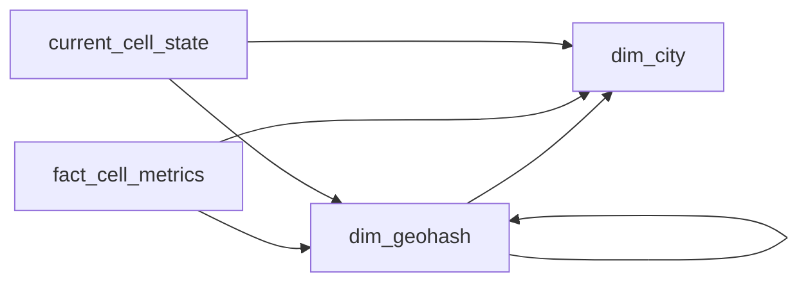

# The Heat of the Map

- **Domain:** data_modeling
- **Difficulty:** Hard
- **Est. time:** 30 min
- **URL:** https://datadriven.io/problems/the_heat_of_the_map

## Problem

Grab's dispatch team runs a live map showing, for every geohash cell in a city, a surge multiplier driven by how far open requests outrun available drivers and a congestion score comparing observed speed to the road's free-flow speed, refreshed each minute. The schema backs both the always-on map, which needs only the current value in each cell, and analysts who replay how surge built up across a city over the past week. The cells nest, so a coarse cell's surge has to reconcile against the finer cells inside it and up to the one city each cell sits in, and you cannot get there by averaging one cell's ratio with another's.

**Concepts tested:** `dmCompositeKeys`, `dmConstraints`, `dmDimensionTables`, `dmFactTables`, `dmForeignKeys`, `dmGrainDefinition`, `dmMetricAdditivity`, `dmOneToMany`, `dmPreAggregation`, `dmPrimaryKeys`, `dmStarSchema`, `dmSurrogateKeys`

## Solution walkthrough

### What this really is

Under the surge-map costume, this problem combines two things: a **non-additive measure** and a split between current state and history. Surge and congestion are ratios, and ratios do not roll up. Most candidates draw a cell table and a time column. What separates them is whether they keep the numerator and the denominator behind each factor. Store only `surge_factor` and the first district view averages forty child multipliers. It reports a surge that no driver count supports, and nobody can reproduce it.

> **Keep both sides of every ratio**
>
> Store `open_requests` with `available_drivers`, and `observed_speed_kmh` with `free_flow_speed_kmh`. A coarse cell sums each side across its children and divides once. The stored factors are a convenience, never the source of truth.

### Build it in order

**Step 1: Declare the grain first**

One row in `fact_cell_metrics` is one geohash cell in one minute, so the composite key is (`geohash`, `minute_bucket`). That makes it a periodic snapshot rather than an event log. Replay then scans a clean time series instead of rebuilding state from raw demand events.

**Step 2: Model the nesting in `dim_geohash`**

Geohash prefixes nest by construction. A self-referencing `parent_geohash` plus `precision` gives you the rollup path without a bridge table. A `city_id` foreign key resolves any cell to its one city straight from the dimension.

**Step 3: Give the map its own table**

`current_cell_state` holds one row per cell, keyed by `geohash` alone and overwritten each minute. The map reads it by key and never touches history. It carries the same ingredients as the fact, so zooming out on the live map reconciles the same way replay does.

**Step 4: Use a surrogate key for city**

`city_id` is an `INT` surrogate on `dim_city`. Cities get renamed and change timezone; the key does not. Both fact tables repeat `city_id` on purpose. A week of city replay then prunes to one city without first joining a billion rows through `dim_geohash`.

### The reference model

`fact_cell_metrics` is the per-minute history. `current_cell_state` is its latest-minute projection. Both hang off the same `dim_geohash` and `dim_city`, so a cell means the same thing on the map and in replay.

**dim_city**

| column | type | key |
|---|---|---|
| city_id | INT | PK |
| name | TEXT |  |
| country | TEXT |  |
| timezone | TEXT |  |

**dim_geohash**

| column | type | key |
|---|---|---|
| geohash | TEXT | PK |
| city_id | INT | FK |
| parent_geohash | TEXT | FK |
| precision | INT |  |
| center_lat | DECIMAL |  |
| center_lng | DECIMAL |  |

**fact_cell_metrics**

| column | type | key |
|---|---|---|
| geohash | TEXT | PK |
| minute_bucket | TIMESTAMP | PK |
| city_id | INT | FK |
| open_requests | INT |  |
| available_drivers | INT |  |
| observed_speed_kmh | DECIMAL |  |
| free_flow_speed_kmh | DECIMAL |  |
| surge_factor | DECIMAL |  |
| congestion_factor | DECIMAL |  |

**current_cell_state**

| column | type | key |
|---|---|---|
| geohash | TEXT | PK |
| city_id | INT | FK |
| minute_bucket | TIMESTAMP |  |
| open_requests | INT |  |
| available_drivers | INT |  |
| observed_speed_kmh | DECIMAL |  |
| free_flow_speed_kmh | DECIMAL |  |
| surge_factor | DECIMAL |  |
| congestion_factor | DECIMAL |  |

> **The map never pays for history**
>
> Take 40k active cells in each of 30 cities: about 1.2M fact rows a minute, or roughly 12B a week. Partition `fact_cell_metrics` by `minute_bucket` so replay prunes to its window. `current_cell_state` stays near 1.2M rows, so a map redraw is a key lookup, not a latest-per-cell scan.

> **Averaged ratios pass the demo**
>
> At the finest precision, storing only `surge_factor` looks correct. It breaks at the first zoom-out. A busy cell with 1 driver and an empty cell with 50 drivers average to a mid surge that matches neither. Collapsing the inputs into one `demand_count` breaks the same way.

> **Grain and additivity said out loud**
>
> Strong candidates state the grain before they draw a table. They call the factors non-additive without being asked, and they justify `current_cell_state` in one sentence about scan cost.

| Ingredients plus factors | Factors only |
|---|---|
| Rows are slightly wider. Any coarse cell or city recomputes exactly from its children, and a disputed multiplier can be audited against its inputs. | Rows are narrow and fine at one zoom level. Every rollup to a parent cell or a city averages ratios and is wrong, with nothing to reconcile against. |

- **After 7 days you keep only 5-minute rollups. How do you compress `fact_cell_metrics` without breaking reconciliation?**
  - _Sum the ingredients per bucket, then recompute the factors. Never average them._
- **A traffic event lands 3 minutes late. What happens to the snapshot and to `current_cell_state`?**
  - _Late data: the upsert must check `minute_bucket` so an older minute cannot overwrite a newer one._
- **Product wants to A/B two surge formulas in one city. What changes?**
  - _Add a formula-version key to the grain instead of overloading `surge_factor`._
