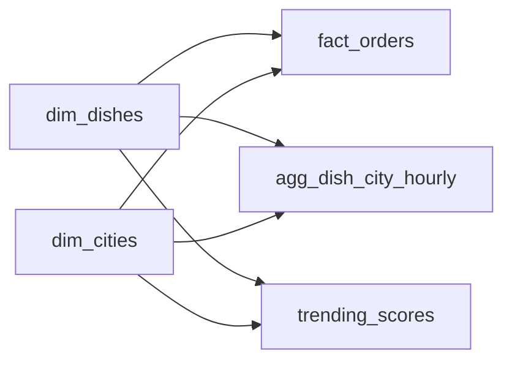

# The Hunger Shift
_What's everyone eating? The answer changes hourly._

- **Domain:** data_modeling
- **Difficulty:** Medium
- **Est. time:** 25 min
- **URL:** https://datadriven.io/problems/the_hunger_shift

## Problem

We run a food-delivery marketplace, and product wants a live board of the dishes surging in each city right now, the kind of thing that reads 'pad thai is up 40 percent in Austin this week.' A single order usually bundles several different dishes, and the same dish shows up under many spellings across restaurant menus. The board refreshes every 15 minutes across hundreds of cities.

**Concepts tested:** `dmDataTypes`, `dmDenormalization`, `dmDimensionTables`, `dmFactTables`, `dmForeignKeys`, `dmGrainDefinition`, `dmOneToMany`, `dmPreAggregation`, `dmPrimaryKeys`, `dmStarSchema`, `dmSurrogateKeys`

## Solution walkthrough


### Why this problem exists in real interviews

This is a pre-aggregation and dimensional-conformance problem wearing a food-delivery costume. Anyone can draw a star schema. The signal is two decisions: normalizing dish names into `dim_dishes` so counts do not fragment across menu variants, and materializing `agg_dish_city_hourly` so a 15-minute refresh never scans raw orders. Miss the first and 'Pad Thai' trends nowhere because its orders scatter across 'pad thai noodles' and 'Thai Noodles'. Miss the second and the dashboard blows its SLA the moment real volume arrives.

> **Trick to Solving**
>
> Before drawing any tables, a strong candidate asks: "what is the refresh budget and the worst-case query volume, and can I afford raw scans?" A 15-minute refresh at 10M orders per day means pre-aggregation is the only option. The dish dimension matters because the same dish lives under many names in raw order data.
>
> 1. Confirm refresh SLA and raw volume
> 2. Normalize dish names into `dim_dishes`
> 3. Pre-aggregate at (dish, city, hour) grain
> 4. Store trending ratios as a separate materialization

---

### Break down the requirements

**Step 1: Normalize dish names with `dim_dishes`**

Restaurants call the same thing by different names. A canonical dimension with a `canonical_name` and a synonyms map prevents trending signals from fragmenting.

**Step 2: Keep `fact_orders` at order-item grain**

An order averages 2.5 items, so the atomic fact is one row per order item, each with its own surrogate key and a `dish_sk`. Grouping items back to a parent order rides on `order_id`. This is the source of truth for every downstream rollup and the input to the aggregation job. Leaving it at 'order grain' while carrying `dish_sk` breaks the primary key.

**Step 3: Pre-aggregate at dish-city-hour**

`agg_dish_city_hourly` is built on a schedule. A 15-minute refresh reads this table, never the raw fact.

**Step 4: Materialize `trending_scores`**

Trending ratio is `recent_count / baseline_count`. Storing the computed values with `computed_at` lets the dashboard read a single row per dish and city. Storing the raw counts alongside the ratio is the more defensible choice because it makes the score auditable, but a table that carries only the derived percent change at (dish, city) grain is still a valid trending materialization.

---

### The solution

Below is one defensible model. The conceptual anchor is the pre-aggregation layer: raw order items feed `agg_dish_city_hourly`, which feeds `trending_scores`.


**dim_dishes**

| column | type | key |
|---|---|---|
| dish_sk | BIGINT | PK |
| canonical_name | TEXT |  |
| cuisine | TEXT |  |
| tags | JSON |  |

**dim_cities**

| column | type | key |
|---|---|---|
| city_sk | BIGINT | PK |
| city_name | TEXT |  |
| metro_area | TEXT |  |
| timezone | TEXT |  |

**fact_orders**

| column | type | key |
|---|---|---|
| order_item_sk | BIGINT | PK |
| order_id | BIGINT |  |
| dish_sk | BIGINT | FK |
| city_sk | BIGINT | FK |
| order_ts | TIMESTAMP |  |
| quantity | INT |  |
| amount | FLOAT |  |

**agg_dish_city_hourly**

| column | type | key |
|---|---|---|
| dish_sk | BIGINT | FK |
| city_sk | BIGINT | FK |
| hour_bucket | TIMESTAMP |  |
| order_count | INT |  |
| gross_sales | FLOAT |  |

**trending_scores**

| column | type | key |
|---|---|---|
| dish_sk | BIGINT | FK |
| city_sk | BIGINT | FK |
| computed_at | TIMESTAMP |  |
| recent_count | INT |  |
| baseline_count | INT |  |
| trending_ratio | FLOAT |  |


> **Why this design holds up**
>
> The atomic fact stays available for ad hoc analysis while the dashboard reads a compact materialization. The dish dimension unifies menu variants into one canonical signal. The aggregation layer pays for itself within the first refresh.

> **What strong candidates do**
>
> They ask about refresh budget before drawing boxes. They pin the order fact at order-item grain with its own surrogate key the moment they hear an order has multiple dishes. They recognize the dish normalization problem without being told, and explain why the atomic fact still exists: for backfills, incident debugging, and future metrics.

> **Red flags to avoid**
>
> Computing trending scores from raw orders at query time cannot meet a 15-minute SLA. Marking `order_sk` as the primary key while the row carries a dish key silently assumes one dish per order, which the 2.5-items-per-order fact contradicts. Collapsing the atomic fact into the aggregate blocks backfills and new metrics. Skipping dish normalization fragments trending signals across menu synonyms.

---

### The analysis pattern

**Currently trending dishes per city**

```sql
SELECT
    d.canonical_name,
    c.city_name,
    t.trending_ratio
FROM trending_scores t
JOIN dim_dishes d ON d.dish_sk = t.dish_sk
JOIN dim_cities c ON c.city_sk = t.city_sk
WHERE t.computed_at = (SELECT MAX(computed_at) FROM trending_scores)
  AND t.trending_ratio > 1.2
ORDER BY c.city_name, t.trending_ratio DESC
```

---

### Trade-offs and alternatives

| Pre-aggregation layer plus canonical dish dimension | On-demand query over raw orders |
|---|---|
| Refresh SLA is achievable. Atomic fact remains for backfills. Requires an aggregation job and a dish resolution pipeline. Storage cost is low relative to raw orders. | No aggregation job to maintain. Simpler to reason about. Cannot meet a 15-minute refresh at high volume without a columnar engine and aggressive caching. |

---

- **How would you handle a new menu item that has no synonym mapping yet?**
  - _Tests fallback logic when `dim_dishes` has no canonical match._
- **What is the exact definition of `recent_count` and `baseline_count`?**
  - _Tests whether trending windows are explicit and consistent._
- **How would you backfill `agg_dish_city_hourly` if a dish synonym mapping changes retroactively?**
  - _Tests reprocessability of the aggregation layer._
- **How would you extend the dashboard to support a 1-minute refresh during peak hours?**
  - _Tests pre-aggregation cadence and potential stream processing._
- **How would you prevent a single viral order spike from skewing trending ratios?**
  - _Tests smoothing, floor thresholds on baseline counts, and outlier handling._
