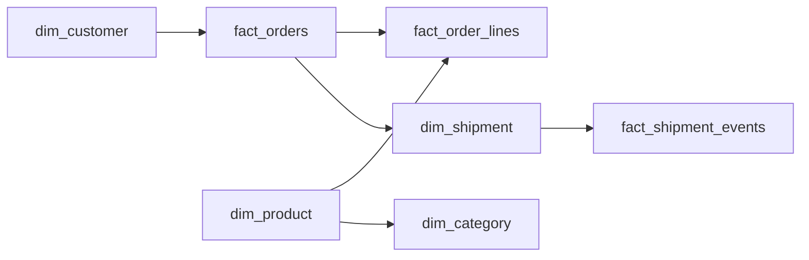

# The JSON Files That Became a Data Mart
_Three semi-structured inputs. One queryable warehouse._

- **Domain:** data_modeling
- **Difficulty:** Medium
- **Est. time:** 30 min
- **URL:** https://datadriven.io/problems/the_json_files_that_became_a_data_mart

## Problem

A retail client delivers three daily JSON feeds from its e-commerce platform, every record keyed by a string source ID like 'ORD-20260401-0042', and wants them turned into a relational data mart whose joins run on the warehouse's own integer keys with the source IDs kept alongside. Orders arrive as `{order_id, customer:{id, name, email}, line_items:[{product_id, qty, price}], status}`; products as `{product_id, name, categories:[{id, name, parent_id}]}`, where `parent_id` chains categories up to three levels deep; and shipments as `{shipment_id, order_id, address:{street, city, country}, status_history:[{status, timestamp}]}`, where one order can span several shipments. Design the dimensional schema that captures every order, line item, product category, shipment, and shipment status transition.

**Concepts tested:** `dmAttributes`, `dmCardinalityRequired`, `dmConstraints`, `dmDenormalization`, `dmDimensionTables`, `dmEntities`, `dmFactTables`, `dmForeignKeys`, `dmGrainDefinition`, `dmImmutableLogs`, `dmJunctionTables`, `dmKeyGeneration`, `dmMetricAdditivity`, `dmOneToMany`, `dmPrimaryKeys`, `dmStarSchema`, `dmSurrogateKeys`

## Solution walkthrough


### Why this problem exists in real interviews

This probes whether you can translate nested document structure into relational grain. The signal is whether you recognize that a JSON array inside a parent object is a child entity at a finer grain, and that naively mirroring the document produces repeating groups that destroy join performance.

> **Trick to Solving**
>
> Before drawing any tables, a strong candidate asks: "what is the unique row in each output table and which JSON array produced it?" Every array inside a JSON document is a candidate child fact. Name the grain out loud for each output, then back-solve columns from the source payload.
>
> 1. Inventory every array in the payloads
> 2. Declare a grain for each array (one row per element)
> 3. Keep parent attributes on the parent table only
> 4. Assign surrogate keys; keep source IDs as natural keys

---

### Break down the requirements

**Step 1: Unfold `line_items` into `fact_order_lines`**

The `line_items` array is one row per item per order. Embedding line fields as columns on `fact_orders` would create a repeating group and break any per-product analysis.

**Step 2: Unfold `status_history` into `fact_shipment_events`**

Status history is a sequence of status transitions per shipment. Model it as `fact_shipment_events` at one-row-per-transition grain, each event carrying `shipment_sk` so transitions from different shipments of the same order never blur together. The shipment header itself, including its address object, lands in `dim_shipment`, which keeps `order_sk` so partial fulfillment stays first-class.

**Step 3: Normalize customer and product as conformed dimensions**

`dim_customer` and `dim_product` get surrogate keys; source IDs stay as natural keys. This lets the mart evolve without coupling to the source document shape.

**Step 4: Model categories as a closure-style dimension**

Nested category hierarchies flatten into `dim_category` with `path` and `depth`. A bridge table is a defensible alternative, but a denormalized path is cheaper for BI.

**Step 5: Separate order header from order lines**

`fact_orders` stores order-total and status, `fact_order_lines` stores per-product measures. The split prevents fan-out on queries that only need header counts.

---

### The solution

Below is one conceptually sound approach. The grain of each child fact is derived directly from the corresponding JSON array.


**dim_customer**

| column | type | key |
|---|---|---|
| customer_sk | BIGINT | PK |
| customer_nk | TEXT |  |
| email | TEXT |  |
| country | TEXT |  |
| created_at | TIMESTAMP |  |

**dim_product**

| column | type | key |
|---|---|---|
| product_sk | BIGINT | PK |
| product_nk | TEXT |  |
| name | TEXT |  |
| sku | TEXT |  |
| list_price | DECIMAL |  |

**dim_category**

| column | type | key |
|---|---|---|
| category_sk | BIGINT | PK |
| product_sk | BIGINT | FK |
| path | TEXT |  |
| leaf_name | TEXT |  |
| depth | INT |  |

**fact_orders**

| column | type | key |
|---|---|---|
| order_sk | BIGINT | PK |
| order_nk | TEXT |  |
| customer_sk | BIGINT | FK |
| order_ts | TIMESTAMP |  |
| order_total | DECIMAL |  |
| status | TEXT |  |

**fact_order_lines**

| column | type | key |
|---|---|---|
| order_line_sk | BIGINT | PK |
| order_sk | BIGINT | FK |
| product_sk | BIGINT | FK |
| quantity | INT |  |
| unit_price | DECIMAL |  |
| line_total | DECIMAL |  |

**dim_shipment**

| column | type | key |
|---|---|---|
| shipment_sk | BIGINT | PK |
| shipment_nk | TEXT |  |
| order_sk | BIGINT | FK |
| street | TEXT |  |
| city | TEXT |  |
| country | TEXT |  |

**fact_shipment_events**

| column | type | key |
|---|---|---|
| shipment_event_sk | BIGINT | PK |
| shipment_sk | BIGINT | FK |
| event_ts | TIMESTAMP |  |
| status | TEXT |  |
| carrier | TEXT |  |


> **Why this design holds up**
>
> Splitting the document along its natural arrays turns analytic questions into simple joins. Any new product attribute lands on `dim_product` without touching the fact, and any new shipment status transition appends one row to `fact_shipment_events` without a migration.

> **What strong candidates do**
>
> They never model a JSON array as repeating columns. They explicitly declare grain per output table. They distinguish the natural keys that came from the source (`order_nk`, `customer_nk`, `shipment_nk`) from surrogate keys that the mart owns, and they anchor each shipment event to a specific shipment so partial fulfillment stays separable.

> **Red flags to avoid**
>
> Storing `line_items` as a JSON column on `fact_orders` defers the problem to query time. Deleting and re-inserting customer rows on every order drops history. Attaching shipment events to `order_sk` alone mixes two shipments of one order into one indistinguishable stream, and dropping the address object loses the destination entirely. Letting the category hierarchy live as a recursive self-join without a denormalized path makes BI tools struggle.

---

### The analysis pattern

**Top products by category path in the last 30 days**

```sql
SELECT
    p.name AS product,
    c.path AS category_path,
    SUM(ol.quantity) AS units_sold,
    SUM(ol.line_total) AS gross_sales
FROM fact_order_lines ol
JOIN fact_orders o ON o.order_sk = ol.order_sk
JOIN dim_product p ON p.product_sk = ol.product_sk
JOIN dim_category c ON c.product_sk = p.product_sk
WHERE o.order_ts >= NOW() - INTERVAL '30 days'
  AND o.status = 'fulfilled'
GROUP BY p.name, c.path
```

---

### Trade-offs and alternatives

| Fully normalized star | Document-preserving OBT |
|---|---|
| Child arrays unfold into their own facts. Writes are heavier (multiple inserts per document). Reads are cheap and each dimension evolves independently. Best when downstream BI drives the workload. | One wide fact stores JSON payloads as semi-structured columns. Ingestion is a single insert. Reads pay the cost of JSON parsing every query. Best when query patterns are exploratory and storage is cheap. |

---

- **What if a product moves between categories over time? How does `dim_category` change?**
  - _Tests whether the candidate considers Type 2 SCD on category assignment._
- **How would you backfill `fact_shipment_events` from a source that now emits `status_history` in a different shape?**
  - _Tests schema evolution and ingestion re-processability._
- **What is the grain of `dim_category` and why is `depth` stored denormalized?**
  - _Tests understanding of closure tables vs materialized path trade-offs._
- **How does the mart handle a JSON payload missing `line_items`?**
  - _Tests late-arriving or malformed data handling._
- **If the source publishes an order update two days late, which tables are touched?**
  - _Tests idempotent upsert strategy on `fact_orders` and `fact_order_lines`._
