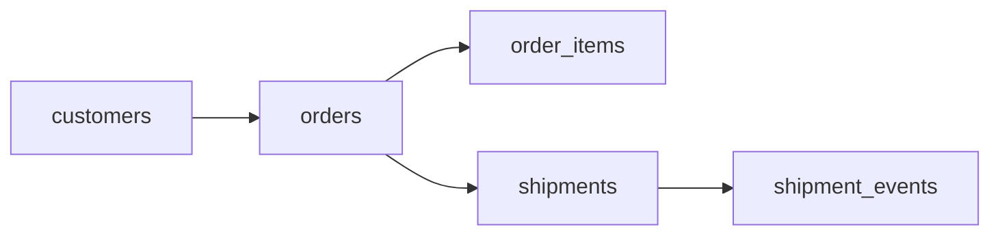

# The Last Mile
_Order placed. Now track it to the door._

- **Domain:** data_modeling
- **Difficulty:** Medium
- **Est. time:** 30 min
- **URL:** https://datadriven.io/problems/the_last_mile

## Problem

An order on our platform can ship in multiple packages, each moving separately through the carrier network from warehouse to doorstep. Operations needs to see every order's current status alongside the scan-by-scan history of each package. Design the data model.

**Concepts tested:** `dmAttributes`, `dmDataTypes`, `dmDimensionTables`, `dmEntities`, `dmFactTables`, `dmForeignKeys`, `dmGrainDefinition`, `dmOneToMany`, `dmPrimaryKeys`, `dmSnowflakeSchema`

## Solution walkthrough


### Why this problem exists in real interviews

The interviewer is probing whether a candidate separates **state** from state transitions. An order and a shipment each have a current status, but the history of how they got there is a distinct entity. Getting this right is the difference between a model that answers "where is my package now" and one that answers "why did this package take four days in Memphis".

> **Trick to Solving**
>
> The tell is any mention of tracking history or status over time. Before drawing any tables, a strong candidate asks: do we need to reconstruct the state at any prior point, or only the current state? If the answer is "reconstruct history", an event log is the anchor.
>
> 1. Spot the temporal reconstruction requirement
> 2. Model shipments as a state entity with a `current_status`
> 3. Model `shipment_events` as an immutable append-only log
> 4. Keep `order_items` at the line grain so partial shipments compose cleanly

---

### Break down the requirements

**Step 1: Separate entities from events**

`shipments` is the entity (current carrier, current status, tracking number). `shipment_events` is the event log (every scan, every status change). Two tables, two grains.

**Step 2: Choose the order-item grain**

`order_items` is one row per line item. This supports partial shipments, partial cancellations, and backorders without widening the order row.

**Step 3: Prefer to derive order status**

`orders` does not need a status column of its own. The overall order state can be derived on read by rolling up its shipments (open until every shipment is delivered). A mutable status column on the order row drifts the moment a single package updates and needs a write on every scan, so the cleaner model derives it.

**Step 4: Keep shipment status denormalized for reads**

`shipments.current_status` is a cached projection of that shipment's event log. It costs a small consistency burden in exchange for fast "where is my package" lookups without an aggregate over events.

**Step 5: Make events append-only**

`shipment_events` should never be updated. Corrections are new rows with a `CORRECTION` event type. This is what lets the model survive carrier data quality issues.

---

### The solution

Below is one conceptually sound approach. The split between `shipments` and `shipment_events` is the design anchor; the event log is the source of truth and the shipment row is a convenience projection. The overall order state rolls up from its shipments, so `orders` does not carry its own status column.


**customers**

| column | type | key |
|---|---|---|
| customer_id | BIGINT | PK |
| email | TEXT |  |
| created_at | TIMESTAMP |  |

**orders**

| column | type | key |
|---|---|---|
| order_id | BIGINT | PK |
| customer_id | BIGINT | FK |
| placed_at | TIMESTAMP |  |
| total_amount | DECIMAL |  |

**order_items**

| column | type | key |
|---|---|---|
| order_item_id | BIGINT | PK |
| order_id | BIGINT | FK |
| sku | TEXT |  |
| quantity | INT |  |
| unit_price | DECIMAL |  |

**shipments**

| column | type | key |
|---|---|---|
| shipment_id | BIGINT | PK |
| order_id | BIGINT | FK |
| carrier | TEXT |  |
| tracking_number | TEXT |  |
| current_status | TEXT |  |

**shipment_events**

| column | type | key |
|---|---|---|
| event_id | BIGINT | PK |
| shipment_id | BIGINT | FK |
| event_type | TEXT |  |
| event_timestamp | TIMESTAMP |  |
| location | TEXT |  |


> **Why This Design Works**
>
> The entity-plus-event pattern gives you two things for one storage cost: fast current-state reads from `shipments` and full historical reconstruction from `shipment_events`. The trade-off is eventual consistency between the two, which is acceptable because the event log is always authoritative when they disagree.

> **Interviewers Watch For**
>
> Strong candidates explicitly call out that `shipments.current_status` is derived, not authoritative, and that the order has no status of its own (it rolls up from its shipments). They also handle the case where one order has multiple shipments (split fulfillment). Weaker candidates push status history into a JSONB blob on shipments and lose the ability to query "all packages stuck in Memphis for >2 days".

> **Common Pitfall**
>
> Mutating the event log to "fix" a bad carrier scan. This destroys the audit trail and makes SLA measurement inconsistent across runs. Always append a correction event instead.

---

### The analysis pattern

**Shipments with longest dwell in transit**

```sql
WITH hops AS (
    SELECT
        shipment_id,
        location,
        event_timestamp,
        LEAD(event_timestamp) OVER (PARTITION BY shipment_id ORDER BY event_timestamp) AS next_ts
    FROM shipment_events
    WHERE event_type = 'SCAN'
)
SELECT
    s.tracking_number,
    s.carrier,
    h.location,
    EXTRACT(EPOCH FROM (h.next_ts - h.event_timestamp)) / 3600 AS hours_stuck
FROM hops h
JOIN shipments s ON s.shipment_id = h.shipment_id
WHERE h.next_ts IS NOT NULL
ORDER BY hours_stuck DESC
LIMIT 25
```

---

### Trade-offs and alternatives

| Entity plus event log | Event sourcing only |
|---|---|
| Current state is a fast single-row read; full history is reconstructible; corrections are auditable. Cost: dual-write consistency between `shipments` and `shipment_events` and a background reconciliation job. | Single source of truth, perfect auditability. Cost: every current-state read is an aggregation over the log, and downstream consumers need a projection layer or a stateful view. |

---

- **An order ships in two boxes that arrive on different days. How does the model represent partial fulfillment?**
  - _Tests the one-to-many between orders and shipments and whether `order_items` can attribute to multiple shipments._
- **A carrier occasionally sends out-of-order status events. How do you compute the canonical timeline?**
  - _Tests event time versus ingestion time and ordering by `event_timestamp`, not insertion order._
- **Customer service needs to view the exact state of an order as of 3 days ago. How?**
  - _Tests whether the candidate reconstructs state from `shipment_events` rather than trusting `current_status`._
- **How would you detect shipments stuck in transit beyond SLA without scanning the full event log every hour?**
  - _Tests indexing strategy on `shipment_events` and whether the candidate proposes a materialized summary._
