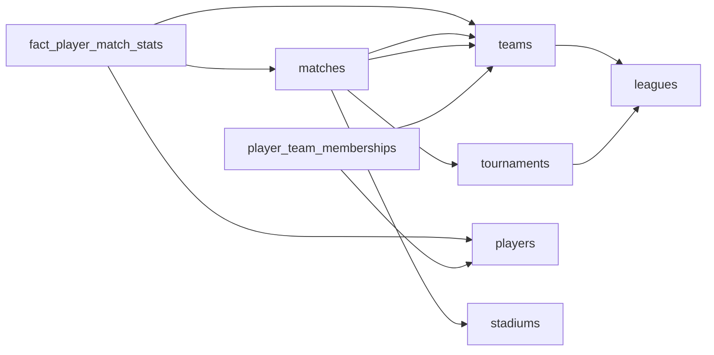

# The League With Too Many Loyalties
_A player can belong to many teams. The schema must agree._

- **Domain:** data_modeling
- **Difficulty:** Hard
- **Est. time:** 40 min
- **URL:** https://datadriven.io/problems/the_league_with_too_many_loyalties

## Problem

Design a data model for a sports tournament platform. The platform tracks multiple leagues, each with multiple teams. Players belong to teams, but can also represent national teams in separate competitions. Each match has two teams, takes place at a stadium, and produces per-player and per-team stats. Analytics need cumulative player scores across all matches in a tournament.

**Concepts tested:** `dmAttributes`, `dmCompositeKeys`, `dmConstraints`, `dmDimensionTables`, `dmEntities`, `dmFactTables`, `dmForeignKeys`, `dmGrainDefinition`, `dmJunctionTables`, `dmManyToMany`, `dmMetricAdditivity`, `dmOneToMany`, `dmPreAggregation`, `dmPrimaryKeys`, `dmScdStrategy`, `dmScdType2`, `dmStarSchema`, `dmSurrogateKeys`

## Solution walkthrough


### What this really is

This is a time-bounded many-to-many wearing a sports jersey. Anyone can draw `players` and `teams`. What separates candidates is where the team lives. Put a `team_id` on `players` and the model knows only who a player plays for today. **Every past goal silently moves to the new club** the moment a transfer is recorded, and a striker who also plays for his country collapses into one team.

> **History on the bridge, team on the stat row**
>
> Two facts, two homes. Who a player belonged to, and when, is an effective-dated row in `player_team_memberships` with `start_date` and `end_date`. Who he played for in a given match is `team_id` stamped on the `fact_player_match_stats` row at load time. Neither is ever derived from the current state of `players`.

### Building it

**Step 1: Declare the grain before any column**

`fact_player_match_stats` is one row per player per match. The natural key is the composite (`match_id`, `player_id`); a surrogate `player_match_stat_id` is the PK and the pair gets a unique constraint. `goals`, `assists` and `minutes` are fully additive, so a tournament total is a plain `SUM`.

**Step 2: Make player-to-team an effective-dated junction**

`player_team_memberships` holds `player_id`, `team_id` and a validity window. A club spell and a national-team spell are two rows that may overlap in time, which is exactly what a single FK cannot express. An open spell has `end_date` as `NULL`.

**Step 3: Give `matches` two team FKs, not a junction**

A match has exactly two teams in fixed roles. `home_team_id` and `away_team_id` both reference `teams`, and `home_score` / `away_score` carry the team-level result on the match row itself. A bridge here buys nothing and turns every fixture query into a self-join.

**Step 4: Separate the competition from the club structure**

`teams` hang off `leagues`; `matches` hang off `tournaments`. A league season is a tournament with a `league_id`; an international cup has `league_id` as `NULL` and its teams carry `team_type` of 'national'. That is how one player appears in both competitions cleanly.


**leagues**

| column | type | key |
|---|---|---|
| league_id | BIGINT | PK |
| name | VARCHAR |  |
| country | VARCHAR |  |

**tournaments**

| column | type | key |
|---|---|---|
| tournament_id | BIGINT | PK |
| league_id | BIGINT | FK |
| name | VARCHAR |  |
| season | VARCHAR |  |
| start_date | DATE |  |
| end_date | DATE |  |

**teams**

| column | type | key |
|---|---|---|
| team_id | BIGINT | PK |
| league_id | BIGINT | FK |
| name | VARCHAR |  |
| team_type | VARCHAR |  |

**stadiums**

| column | type | key |
|---|---|---|
| stadium_id | BIGINT | PK |
| name | VARCHAR |  |
| city | VARCHAR |  |
| capacity | INT |  |

**players**

| column | type | key |
|---|---|---|
| player_id | BIGINT | PK |
| full_name | VARCHAR |  |
| dob | DATE |  |
| nationality | VARCHAR |  |

**player_team_memberships**

| column | type | key |
|---|---|---|
| membership_id | BIGINT | PK |
| player_id | BIGINT | FK |
| team_id | BIGINT | FK |
| start_date | DATE |  |
| end_date | DATE |  |

**matches**

| column | type | key |
|---|---|---|
| match_id | BIGINT | PK |
| tournament_id | BIGINT | FK |
| home_team_id | BIGINT | FK |
| away_team_id | BIGINT | FK |
| stadium_id | BIGINT | FK |
| kickoff_ts | TIMESTAMP |  |
| home_score | INT |  |
| away_score | INT |  |

**fact_player_match_stats**

| column | type | key |
|---|---|---|
| player_match_stat_id | BIGINT | PK |
| match_id | BIGINT | FK |
| player_id | BIGINT | FK |
| team_id | BIGINT | FK |
| goals | INT |  |
| assists | INT |  |
| minutes | INT |  |


| SCD Type 2 on players | Effective-dated junction |
|---|---|
| Versions `players` with a current `team_id`. Works while a player has one team at a time. The moment a club spell and a national call-up overlap, you need two current rows for one person and the dimension stops meaning anything. | `player_team_memberships` is the SCD2 idea moved onto the relationship itself. Concurrent spells are just two rows; `players` stays a stable, one-row-per-person dimension. |

> **Overlapping spells double your totals**
>
> If the same `player_id` and `team_id` get two memberships whose windows overlap, the as-of join matches both and every goal counts twice. Enforce non-overlap per pair (an exclusion constraint, or a load-time check), and use half-open windows: `kickoff_ts >= start_date` and `kickoff_ts < end_date`.

**Tournament scoring leaders, transfer-correct**

```sql
SELECT
    p.full_name,
    t.name AS tournament,
    SUM(s.goals) AS goals,
    SUM(s.assists) AS assists
FROM fact_player_match_stats s
JOIN players p ON p.player_id = s.player_id
JOIN matches m ON m.match_id = s.match_id
JOIN tournaments t ON t.tournament_id = m.tournament_id
JOIN player_team_memberships ptm
  ON ptm.player_id = s.player_id
 AND ptm.team_id = s.team_id
 AND m.kickoff_ts >= ptm.start_date
 AND (ptm.end_date IS NULL OR m.kickoff_ts < ptm.end_date)
WHERE t.tournament_id = 7
GROUP BY p.full_name, t.name
```

> **Name the grain out loud, then defend `team_id` on the fact**
>
> The senior tell is saying "one row per player per match" before drawing a column, then explaining why `team_id` is denormalized onto the fact: it is the attribution as of kickoff, immutable, so leaderboards never re-derive it from a join that a backdated transfer could change.

- **A transfer is backdated two weeks. Which rows change: `player_team_memberships`, `fact_player_match_stats`, or both?**
  - _Tests whether the fact's `team_id` is treated as immutable history or restated._
- **How would you pre-aggregate tournament leaderboards at 40 leagues and 20 seasons?**
  - _Tests additivity of `goals` and `minutes` and a summary table keyed by `tournament_id`, `player_id`._
- **Where do per-team stats beyond `home_score` / `away_score` live, such as possession or shots?**
  - _Tests a second fact at team-by-match grain versus widening `matches`._
