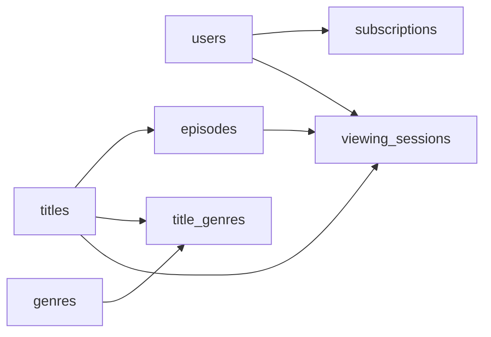

# The Long Play
_They pressed play. What happened next is the whole question._

- **Domain:** data_modeling
- **Difficulty:** Medium
- **Est. time:** 25 min
- **URL:** https://datadriven.io/problems/the_long_play

## Problem

We run a movie streaming platform and need a data model for our analytics warehouse. The catalog includes both standalone movies and multi-episode series, every title can be tagged with more than one genre, and a user's subscription tier can change over time. We want to understand what people watch, how they engage, and which content drives subscriptions. Design the schema.

**Concepts tested:** `dmAttributes`, `dmConstraints`, `dmDataTypes`, `dmDimensionTables`, `dmEntities`, `dmFactTables`, `dmForeignKeys`, `dmGrainDefinition`, `dmJunctionTables`, `dmManyToMany`, `dmMetricAdditivity`, `dmOneToMany`, `dmPrimaryKeys`, `dmScdType2`, `dmStarSchema`, `dmSurrogateKeys`

## Solution walkthrough


### Why this problem exists in real interviews

This probes whether a candidate can model a **content hierarchy** (title down to episode) alongside a viewing fact at session grain and express a many-to-many genre relationship correctly. Subscription temporality is the stealth difficulty: churn and upgrade tracking need effective-dated rows, not a single status column.

> **Trick to Solving**
>
> When a prompt mixes “what people watch” with “drives subscriptions,” the trick is to notice you have two facts (viewing and subscriptions) and one hierarchy (title to episode). Before drawing tables, a strong candidate asks: is a show a title or a collection of episodes, and how many genres can a title have?
>
> 1. Build titles with episodes hanging off them
> 2. Declare `viewing_sessions` at per-play grain
> 3. Use `title_genres` as an M:N junction
> 4. Model subscriptions with `start_date` and `end_date`

---

### Break down the requirements

**Step 1: Build the content hierarchy**

`titles` (movies and series), `episodes` for series content. A movie is a title without episodes; a series is a title with many. Season and episode number are attributes on each episode.

**Step 2: Declare the viewing grain**

`viewing_sessions` is one row per play: user, content, `start_time`, duration, `percent_watched`. Per-title aggregation sits on top.

**Step 3: Model genres as M:N**

A title can be Sci-Fi and Drama. `title_genres` is the junction, keyed by (`title_id`, `genre_id`). A single FK cannot express this and forces nonsense compromises.

**Step 4: Model subscriptions temporally**

`subscriptions` has `start_date`, `end_date`, and `tier`. A user upgrading from standard to premium is a new row, not an UPDATE.

---

### The solution

Below is one defensible model. The anchor is per-session grain on `viewing_sessions` plus a clean M:N for genres; the rest of the schema falls out.


**users**

| column | type | key |
|---|---|---|
| user_id | BIGINT | PK |
| email | TEXT |  |
| country | TEXT |  |
| signup_date | DATE |  |

**subscriptions**

| column | type | key |
|---|---|---|
| subscription_id | BIGINT | PK |
| user_id | BIGINT | FK |
| tier | TEXT |  |
| start_date | DATE |  |
| end_date | DATE |  |

**titles**

| column | type | key |
|---|---|---|
| title_id | BIGINT | PK |
| name | TEXT |  |
| kind | TEXT |  |
| release_year | INT |  |

**episodes**

| column | type | key |
|---|---|---|
| episode_id | BIGINT | PK |
| title_id | BIGINT | FK |
| season_number | INT |  |
| episode_number | INT |  |
| runtime_minutes | INT |  |

**genres**

| column | type | key |
|---|---|---|
| genre_id | INT | PK |
| name | TEXT |  |

**title_genres**

| column | type | key |
|---|---|---|
| title_id | BIGINT | FK |
| genre_id | INT | FK |

**viewing_sessions**

| column | type | key |
|---|---|---|
| session_id | BIGINT | PK |
| user_id | BIGINT | FK |
| title_id | BIGINT | FK |
| episode_id | BIGINT | FK |
| start_time | TIMESTAMP |  |
| duration_sec | INT |  |
| percent_watched | DECIMAL |  |


> **Why this works**
>
> The session grain supports engagement analytics and recommendation signals. The title-to-episode hierarchy plus nullable `episode_id` on `viewing_sessions` handles both movies and series cleanly. Effective-dated subscriptions make churn and upgrade math deterministic.

> **Interviewers watch for**
>
> A strong candidate refuses to put a single `genre` column on titles and names M:N out loud. They also treat subscription tier changes as new rows, which unlocks proper churn analysis.

> **Common pitfall**
>
> A `genre` TEXT column on titles or a comma-separated string. Every genre-level query becomes a LIKE over a non-normalized string, and joining in genre hierarchies is impossible. A second pitfall: UPDATEing subscriptions.tier in place and losing the upgrade timeline.

---

### The analysis pattern

**Hours watched by genre in the last 30 days**

```sql
SELECT
    g.name AS genre,
    SUM(vs.duration_sec) / 3600.0 AS hours_watched,
    COUNT(DISTINCT vs.user_id) AS unique_viewers
FROM viewing_sessions vs
JOIN title_genres tg ON tg.title_id = vs.title_id
JOIN genres g ON g.genre_id = tg.genre_id
WHERE vs.start_time >= NOW() - INTERVAL '30 days'
GROUP BY g.name
ORDER BY hours_watched DESC
```

---

### Trade-offs and alternatives

| Session fact + M:N genres | Rolled-up daily fact |
|---|---|
| `viewing_sessions` at per-play grain.

* Engagement metrics at any granularity
* Recommendation features are immediate
* Full fidelity comes at storage cost | A `user_title_daily` table pre-aggregated per user per title per day.

* Cheap for dashboards
* Loses session-level signal
* Recommendations need another pipeline |

---

- **How do you attribute a subscription signup to a specific title watched during a free trial?**
  - _Tests whether the schema supports first-session-before-signup attribution via `viewing_sessions` and subscriptions._
- **A series is relicensed and five episodes are removed. How do historical viewing counts behave?**
  - _Tests whether episodes is soft-deleted with an `effective_to` column or hard-deleted and violating history._
- **How would you compute binge coefficient (average gap between sessions in a series)?**
  - _Tests whether `viewing_sessions` supports per-user per-title window functions._
- **How does the schema change if a user shares an account with three viewers on different profiles?**
  - _Tests whether the candidate introduces a `viewer_profile` dimension below user._
