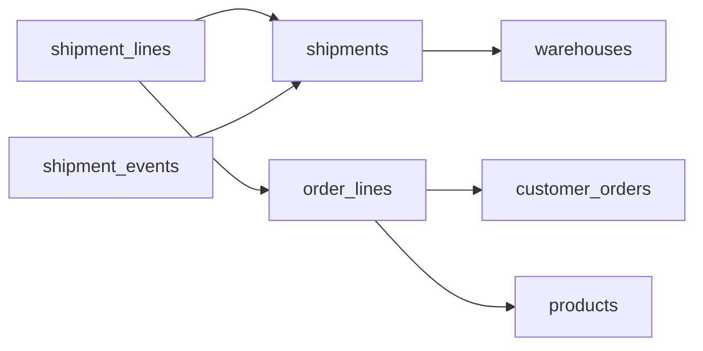

# The Long Route
_A package splits, reroutes, and (maybe) arrives._

- **Domain:** data_modeling
- **Difficulty:** Hard
- **Est. time:** 30 min
- **URL:** https://datadriven.io/problems/the_long_route

## Problem

When a delivery runs late, we can see which stage its outbound shipment is in right now but not the path it took through picking, packing and loading, or when each stage happened. Every outbound shipment leaves from one fulfillment center and carries items from many different customer orders, while one order's items often split across shipments from several centers. Design the data model that keeps every outbound shipment's full stage history, not just its latest stop.

**Concepts tested:** `dmAttributes`, `dmCardinalityRequired`, `dmCompositeKeys`, `dmConstraints`, `dmEntities`, `dmEventSourcing`, `dmFirstNormalForm`, `dmForeignKeys`, `dmGrainDefinition`, `dmImmutableLogs`, `dmJunctionTables`, `dmLateArriving`, `dmManyToMany`, `dmOneToMany`, `dmPrimaryKeys`, `dmSecondNormalForm`, `dmSurrogateKeys`, `dmThirdNormalForm`

## Solution walkthrough


### What this problem really is

This is a history problem dressed up as a logistics schema. 'The path it took and when each stage happened' cannot live in one field: every new stage would overwrite the last. Anyone can draw shipments, orders and fulfillment centers. What separates candidates is two refusals: **no mutable `status` column on `shipments`**, and no single `order_id` hung on `shipments`. Miss the first and you can say where a box is now but never why it sat in picking for six hours. Miss the second and a truck carrying ten orders can name only one of them.

> **A stage change is a new row**
>
> Each time a shipment reaches a stage, insert one row into `shipment_events` with the stage and when it happened, and never touch it again. The current stage is derived: the latest `event_ts` per `shipment_id`. History is the table; 'now' is just its last row.

### Building it in order

**Step 1: Pin the shared dimensions**

`warehouses` and `products` are referenced from several places and change slowly. Give each a surrogate PK so a renamed SKU or a relabeled center never breaks a join. A shipment leaves from exactly one center, so `shipments.warehouse_id` is a plain FK.

**Step 2: Keep orders at line grain**

`customer_orders` holds the header and `order_lines` one product per order with its quantity. The split happens below the header: part of a line can leave from one center and the rest from another, so the link to shipments has to hang off the line, not the order.

**Step 3: Resolve the split with `shipment_lines`**

One order line can ship from two centers, and one truck carries many orders. That is many to many, so it needs a junction. The grain of `shipment_lines` is one order line inside one shipment, carrying `quantity_shipped` so a partial shipment is just a smaller number. Its natural key is (`shipment_id`, `order_line_id`): keep the surrogate PK, but enforce that pair as unique.

**Step 4: Log stages in `shipment_events`**

The grain is one stage reached by one shipment. `event_ts` records when it happened on the floor; `recorded_at` records when we learned about it. Scanners buffer offline and replay hours later, so the two diverge. Keeping both lets you order by reality while still auditing late arrivals.


**products**

| column | type | key |
|---|---|---|
| product_id | BIGINT | PK |
| sku | TEXT |  |
| product_name | TEXT |  |
| weight_kg | FLOAT |  |

**warehouses**

| column | type | key |
|---|---|---|
| warehouse_id | INT | PK |
| name | TEXT |  |
| region | TEXT |  |

**customer_orders**

| column | type | key |
|---|---|---|
| order_id | BIGINT | PK |
| customer_id | BIGINT |  |
| placed_at | TIMESTAMP |  |

**order_lines**

| column | type | key |
|---|---|---|
| order_line_id | BIGINT | PK |
| order_id | BIGINT | FK |
| product_id | BIGINT | FK |
| quantity | INT |  |
| unit_price | DECIMAL |  |

**shipments**

| column | type | key |
|---|---|---|
| shipment_id | BIGINT | PK |
| warehouse_id | INT | FK |
| carrier | TEXT |  |
| created_at | TIMESTAMP |  |

**shipment_lines**

| column | type | key |
|---|---|---|
| shipment_line_id | BIGINT | PK |
| shipment_id | BIGINT | FK |
| order_line_id | BIGINT | FK |
| quantity_shipped | INT |  |

**shipment_events**

| column | type | key |
|---|---|---|
| event_id | BIGINT | PK |
| shipment_id | BIGINT | FK |
| event_type | TEXT |  |
| event_ts | TIMESTAMP |  |
| recorded_at | TIMESTAMP |  |


> **A status on the order header leaks back in**
>
> Candidates who avoid `shipments.status` often add `customer_orders.status` instead. A split order sits in two centers at two stages, so no single value is true. Derive an order's progress from the latest events of its shipments, reached through `shipment_lines`.

| One row per transition | One row per stage visit |
|---|---|
| `shipment_id`, `event_type`, `event_ts`. Pure append: a late scan is just another insert. Dwell time needs `LEAD()` to pair each stage with the next one. | `shipment_id`, `stage`, `entered_at`, `exited_at`. Dwell is `exited_at - entered_at` with no window. But closing a stage updates the previous row, and a scan arriving hours late can land between two rows you already closed. |

> **Both shapes work; the cost is where they differ**
>
> Either history shape keeps the path, and either passes. The tell is defending the choice out loud: the transition log pays a window at read time, the stage-visit table pays an update plus a re-pairing whenever a scan arrives late.

**Dwell time per stage per fulfillment center**

```sql
WITH paired AS (
    SELECT
        se.shipment_id,
        se.event_type,
        se.event_ts,
        LEAD(se.event_ts) OVER (PARTITION BY se.shipment_id ORDER BY se.event_ts) AS next_event_ts
    FROM shipment_events se
)
SELECT
    s.warehouse_id,
    p.event_type,
    AVG(EXTRACT(EPOCH FROM (p.next_event_ts - p.event_ts)) / 3600) AS avg_hours_in_stage
FROM paired p
JOIN shipments s ON s.shipment_id = p.shipment_id
WHERE p.next_event_ts IS NOT NULL
GROUP BY s.warehouse_id, p.event_type
```

> **Order by `event_ts`, audit by `recorded_at`**
>
> A late scan replayed at 3am must still land in its true position, which is why the pairing orders by `event_ts`. Treat a correction as a new row too, never an `UPDATE`, or the audit trail you designed for quietly disappears.

- **At 10M shipments a day, how do you partition `shipment_events`?**
  - _Range on `event_ts`, plus a materialized current-stage table for hot reads._
- **How do you stop a shipment moving from 'delivered' back to 'loaded'?**
  - _Where the state machine lives: a constraint, the writer service, or a validation job._
- **A customer returns one unit and it is re-shelved. Where does that go?**
  - _Whether a return is a new reverse flow or more stages on the original shipment line._
