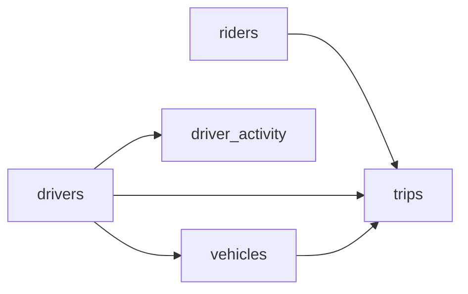

# The Meter's Running
_Riders, drivers, and fares. Everyone takes a cut._

- **Domain:** data_modeling
- **Difficulty:** Medium
- **Est. time:** 25 min
- **URL:** https://datadriven.io/problems/the_meter_s_running

## Problem

We run a ride-sharing marketplace and need a data model that follows every ride through its full lifecycle, from the moment a rider requests one to the drop-off, capturing where each trip started and ended, how far it went, the fare, and the surge multiplier in effect. Analysts measure driver utilization as the share of a driver's online time spent carrying a passenger, so we also record every time a driver goes online or offline, and they track weekly rider retention and revenue. Design the schema behind these dashboards.

**Concepts tested:** `dmAttributes`, `dmDataTypes`, `dmDimensionTables`, `dmEntities`, `dmFactTables`, `dmForeignKeys`, `dmGrainDefinition`, `dmOneToMany`, `dmPrimaryKeys`, `dmStarSchema`

## Solution walkthrough


### Why this problem exists in real interviews

Strip the ride-sharing costume and this is temporal fact modeling. The interviewer already assumes you can list riders, drivers, and trips. What separates candidates is two moves: pulling the vehicle out of the driver entity, and refusing to store the trip's lifecycle as a single status column. Get the second one wrong and every question the dashboards actually ask (median wait time, driver utilization, SLA compliance) becomes impossible without rebuilding history from an event log you never designed.

> **Trick to Solving**
>
> The tell is "requested, accepted, started, ended". These are timestamps on one entity, not values of one column. Before drawing any tables, a strong candidate asks: does the business need state-transition analytics (wait time, time to accept) or just completed-trip reporting? Here it needs the former, so the lifecycle moments are first-class timestamp columns on the trip, at least a start time and an end time, ideally a request time too.
>
> 1. Separate the driver entity from the vehicle entity
> 2. Keep drivers one-to-many with vehicles
> 3. Put every state-transition timestamp on the trip row
> 4. Log driver online/offline transitions in their own table
> 5. Treat the trip as an accumulating snapshot fact

---

### Break down the requirements

**Step 1: Identify the dimensions and the fact**

Rider, driver, vehicle, and trip. Driver and vehicle are distinct because one driver can switch vehicles and one vehicle can be shared across drivers in a fleet model. Collapsing them loses that cardinality.

**Step 2: Model the trip as an accumulating snapshot**

A single `trips` row captures the whole lifecycle: `requested_at`, `started_at`, `ended_at`, plus `distance`, `surge_multiplier`, `fare`, and pickup/dropoff coordinates. At minimum keep a start and an end timestamp so durations are computable; adding the request time unlocks wait-time analytics. Updates are fine here because the grain is one row per trip and the row is mutable until the trip completes.

**Step 3: Keep vehicle under driver**

`vehicles.driver_id` captures the current assignment. If vehicles routinely change drivers across shifts, a separate `driver_vehicle_assignments` table is a natural extension, but the base model starts with the one-to-many.

**Step 4: Log driver online/offline time**

Utilization (minutes with a passenger over minutes online) cannot be answered from the trips table alone, because a driver is online and idle between trips. A `driver_activity` log with one row per status change (`status_at`, `status`, `city`) reconstructs online time so utilization becomes a windowed diff. Storing it pre-aggregated by day would throw away the transitions this metric is built from.

**Step 5: Declare constraints explicitly**

`ended_at >= started_at`, `started_at >= requested_at`, `fare >= 0`. These are cheap correctness guarantees that catch upstream bugs at insert time.

---

### The solution

Below is one defensible model. Treating `trips` as an accumulating snapshot is the anchor: all lifecycle timestamps live in one row so wait-time and duration analytics are trivial, while `driver_activity` carries the online/offline history utilization needs.


**riders**

| column | type | key |
|---|---|---|
| rider_id | BIGINT | PK |
| email | TEXT |  |
| phone | TEXT |  |
| signup_at | TIMESTAMP |  |
| home_city | TEXT |  |

**drivers**

| column | type | key |
|---|---|---|
| driver_id | BIGINT | PK |
| license_number | TEXT |  |
| onboarded_at | TIMESTAMP |  |
| rating_avg | FLOAT |  |

**vehicles**

| column | type | key |
|---|---|---|
| vehicle_id | BIGINT | PK |
| driver_id | BIGINT | FK |
| make_model | TEXT |  |
| year | INT |  |
| vin | TEXT |  |

**driver_activity**

| column | type | key |
|---|---|---|
| activity_id | BIGINT | PK |
| driver_id | BIGINT | FK |
| status | VARCHAR |  |
| status_at | TIMESTAMP |  |
| city | VARCHAR |  |

**trips**

| column | type | key |
|---|---|---|
| trip_id | BIGINT | PK |
| rider_id | BIGINT | FK |
| driver_id | BIGINT | FK |
| vehicle_id | BIGINT | FK |
| requested_at | TIMESTAMP |  |
| started_at | TIMESTAMP |  |
| ended_at | TIMESTAMP |  |
| pickup_lat | FLOAT |  |
| pickup_lng | FLOAT |  |
| dropoff_lat | FLOAT |  |
| dropoff_lng | FLOAT |  |
| distance | FLOAT |  |
| surge_multiplier | FLOAT |  |
| fare | FLOAT |  |


> **Why This Design Works**
>
> Accumulating snapshot grain is the right Kimball fact type when an entity has a bounded, well-known lifecycle. It trades write-once immutability for a single queryable row per trip, which makes wait-time, ETA-accuracy, and fare analytics single-pass queries. The cost is that trips are mutable until the final state lands.

> **Interviewers Watch For**
>
> Strong candidates distinguish an accumulating snapshot from a transaction fact, and they realize utilization needs an activity log the trips table cannot supply. They also think about partial trips (cancelled, rider no-show) and allow NULL lifecycle timestamps. Weaker candidates put every status change of a trip in a separate table and then struggle to answer "average wait time this week".

> **Common Pitfall**
>
> Storing trip state as a single TEXT `status` column with values like `requested`, `started`, `completed`. You lose the ability to answer any time-between-states question without reconstructing history from an event log you did not build. Keep the timestamps first-class instead.

---

### The analysis pattern

**Median wait time by city and hour**

```sql
SELECT
    r.home_city,
    DATE_TRUNC('hour', t.requested_at) AS hour_bucket,
    COUNT(*) AS trips,
    PERCENTILE_CONT(0.5) WITHIN GROUP (
        ORDER BY EXTRACT(EPOCH FROM (t.started_at - t.requested_at))
    ) AS median_wait_seconds,
    SUM(t.fare) AS gross_fare
FROM trips t
JOIN riders r ON r.rider_id = t.rider_id
WHERE t.started_at IS NOT NULL
  AND t.requested_at >= NOW() - INTERVAL '7 days'
GROUP BY r.home_city, hour_bucket
ORDER BY r.home_city, hour_bucket
```

---

### Trade-offs and alternatives

| Accumulating snapshot trip fact | Immutable trip event log |
|---|---|
| Single row per trip, lifecycle timestamps on one record, fast wait-time queries. Cost: rows are mutable until completion, requiring careful write semantics and idempotent updates. | Append-only, perfect audit, easy replay. Cost: every analytical query reconstructs trip state via window functions or a separate projection, and simple questions become harder. |

---

- **Surge pricing changes fare rules mid-trip. Where does the surge multiplier live?**
  - _Tests whether the candidate adds a fare component column or a separate `fare_components` table._
- **One driver logs in on two phones and requests overlap. How does the constraint set protect trip integrity?**
  - _Tests uniqueness constraints on (`driver_id`, `active_trip`) and idempotent trip creation._
- **A rider cancels after the driver is en route. How does the accumulating snapshot represent cancellation?**
  - _Tests NULL semantics on `started_at` and whether a `cancellation_reason` column is warranted._
- **Background checks expire and drivers must be suspended. Where does that state live?**
  - _Tests whether the candidate attaches compliance state to drivers or to a separate `driver_status` table._
