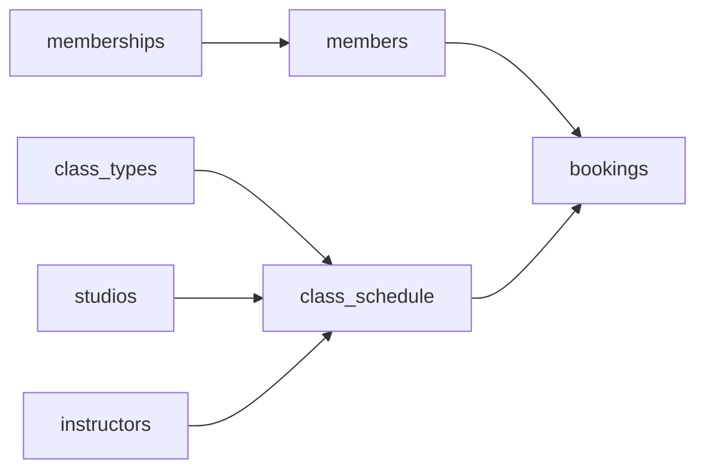

# The No-Show
_Every reserved seat ends one of five ways. Build the model that can tell them apart._

- **Domain:** data_modeling
- **Difficulty:** Easy
- **Est. time:** ? min
- **URL:** https://datadriven.io/problems/the_no_show

## Problem

We run a chain of fitness studios where members sign up under a pricing tier that fixes their monthly fee and how many classes it includes. Each session on the calendar is a single dated occurrence of a class type, held at one studio at a specific date and time with one instructor, and members reserve a spot in the session they want. When a popular session fills, a shut-out member joins the waitlist and is promoted when someone cancels; members who get in are scanned at the door, so a confirmed reservation that was never checked in stands apart as a no-show. Design the tables to run memberships, the session calendar, and the full reservation lifecycle, where a booking is waitlisted, confirmed, cancelled, or a no-show, and a confirmed spot only counts as attended once it is scanned at the door.

**Concepts tested:** `dmAttributes`, `dmConstraints`, `dmDataTypes`, `dmDimensionTables`, `dmEntities`, `dmFactTables`, `dmFirstNormalForm`, `dmForeignKeys`, `dmGrainDefinition`, `dmJunctionTables`, `dmManyToMany`, `dmOneToMany`, `dmPrimaryKeys`, `dmSecondNormalForm`, `dmStarSchema`, `dmSurrogateKeys`, `dmThirdNormalForm`

## Solution walkthrough


### Why this problem exists in real interviews

This is a template-vs-instance separation dressed up as a booking calendar. The skill being probed: can you model a repeating class type separately from its scheduled occurrences, so membership tiers, pricing, and instructor routing all land in the right table? Anyone merges `class_types` and `class_schedule` into one 'classes' table and it looks fine on day one. The trap is that the template rarely changes while the instances explode with volume, so a merged table duplicates name, duration, and instructor on every occurrence and leaves recurrence with nowhere to live. Get that wrong and renaming yoga becomes a bulk UPDATE across every historical row, weekly schedules become impossible to represent, and the no-show question has no clean answer because attendance is not tracked apart from the booking.

> **Trick to Solving**
>
> Any time a prompt says 'members book classes,' the trick is to notice two distinct time concepts: the class definition and the scheduled occurrence. Before drawing tables, a strong candidate asks: can the same class type repeat weekly, and do we need to track who showed up separately from who booked?
>
> 1. Separate `class_types` (the template) from `class_schedule` (the instance)
> 2. Bookings become the junction between members and `class_schedule`
> 3. Attendance (check-in) lives on bookings, not as a parallel table

---

### Break down the requirements

**Step 1: Split template from instance**

`class_types` holds 'yoga 60min,' `class_schedule` holds the Tuesday 7pm occurrence at a specific studio with a specific instructor. Conflating these makes the weekly schedule impossible to represent.

**Step 2: Model memberships as their own entity**

`memberships` describes tiers (price, class limit). `members` FK into it. This lets pricing evolve without touching member rows.

**Step 3: Bookings as a junction**

`bookings` links `members` to `class_schedule` with a status enum (confirmed, waitlisted, cancelled, `no_show`) and a nullable `check_in_time`. The status carries the reservation through its whole life; the timestamp is what promotes a confirmed booking to attended.

**Step 4: Track studios and instructors as dimensions**

`studios` and `instructors` are conformed dimensions, referenced from `class_schedule` so that utilization and instructor performance are one GROUP BY away.

---

### The solution

Below is one defensible model. The conceptual anchor is the separation of `class_types` from `class_schedule`, which cascades into how bookings and attendance behave.


**members**

| column | type | key |
|---|---|---|
| member_id | BIGINT | PK |
| membership_id | INT | FK |
| email | TEXT |  |
| joined_at | TIMESTAMP |  |

**memberships**

| column | type | key |
|---|---|---|
| membership_id | INT | PK |
| tier_name | TEXT |  |
| monthly_price | DECIMAL |  |
| class_limit | INT |  |

**studios**

| column | type | key |
|---|---|---|
| studio_id | INT | PK |
| name | TEXT |  |
| city | TEXT |  |
| capacity | INT |  |

**instructors**

| column | type | key |
|---|---|---|
| instructor_id | INT | PK |
| full_name | TEXT |  |
| speciality | TEXT |  |

**class_types**

| column | type | key |
|---|---|---|
| class_type_id | INT | PK |
| name | TEXT |  |
| duration_minutes | INT |  |

**class_schedule**

| column | type | key |
|---|---|---|
| class_schedule_id | BIGINT | PK |
| class_type_id | INT | FK |
| studio_id | INT | FK |
| instructor_id | INT | FK |
| scheduled_start | TIMESTAMP |  |
| max_seats | INT |  |

**bookings**

| column | type | key |
|---|---|---|
| booking_id | BIGINT | PK |
| member_id | BIGINT | FK |
| class_schedule_id | BIGINT | FK |
| status | TEXT |  |
| check_in_time | TIMESTAMP |  |


> **Why this works**
>
> Separating `class_types` from `class_schedule` is the trade-off that pays for itself. The template rarely changes; the instances explode with volume. Keeping them apart means template edits are O(1) and instance generation is a straightforward cron.

> **Interviewers watch for**
>
> The quiet trap is modeling attendance with `check_in_time` alone and skipping `status`. A null check-in cannot tell a no-show apart from a cancellation or a waitlisted member who never got a seat. The lifecycle states are distinct outcomes, so the status enum is what makes no-show rate computable; the timestamp is what marks a confirmed booking as attended.

> **Common pitfall**
>
> Collapsing `class_types` and `class_schedule` into a single 'classes' table. The weekly recurring pattern forces duplication of name, duration, and instructor on every row, and a rename turns into a bulk UPDATE across every historical instance.

---

### The analysis pattern

**No-show rate by instructor**

```sql
SELECT
    i.full_name,
    COUNT(*) FILTER (WHERE b.status = 'no_show') * 1.0 / COUNT(*) AS no_show_rate,
    COUNT(*) AS total_bookings
FROM bookings b
JOIN class_schedule cs ON cs.class_schedule_id = b.class_schedule_id
JOIN instructors i ON i.instructor_id = cs.instructor_id
WHERE cs.scheduled_start >= NOW() - INTERVAL '30 days'
  AND b.status IN ('confirmed', 'no_show')
GROUP BY i.full_name
ORDER BY no_show_rate DESC
```

---

### Trade-offs and alternatives

| Template + instance split | Single classes table |
|---|---|
| `class_types` is the template, `class_schedule` is the occurrence.

* Template edits touch one row
* Clean home for recurrence rules
* Two joins to answer 'which yoga class' questions | One classes table with name, time, studio, instructor inline.

* Simpler to read
* Renaming a class touches every historical row
* No natural place to express recurrence |

---

- **How would you express a class that repeats every Tuesday and Thursday for 8 weeks?**
  - _Tests whether the candidate adds a `recurrence_rule` on `class_types` or generates `class_schedule` rows via a job._
- **Members on the hot tier get unlimited classes, standard tier gets 10 per month. Where is that enforced?**
  - _Tests whether quotas live on the membership dimension and are checked at booking time._
- **A studio closes for maintenance and all bookings must be cancelled with credit. What changes?**
  - _Tests whether bookings.status supports the lifecycle and whether a credit ledger exists._
- **How would you handle waitlist promotion when a confirmed member cancels?**
  - _Tests whether waitlist ordering is an attribute on bookings or a separate queue table._
