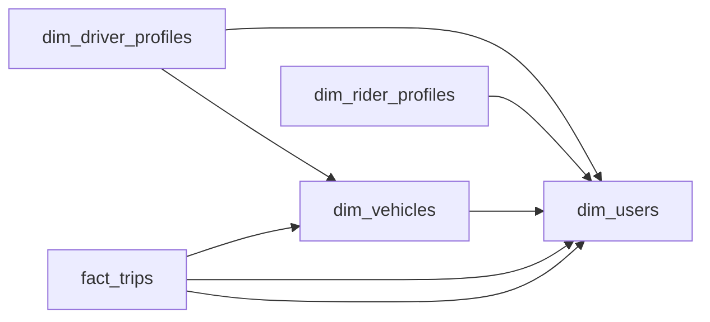

# The Other Seat

- **Domain:** data_modeling
- **Difficulty:** Hard
- **Est. time:** 25 min
- **URL:** https://datadriven.io/problems/the_other_seat

## Problem

We run a ride-hailing marketplace where the same person can sign up to drive and to ride, so the model has to capture both roles without splitting one human into two records. Design the entities for drivers, riders, vehicles, and the trips that connect them, knowing that every completed trip records the fare charged, the surge multiplier that was in effect, the specific vehicle used, and a separate rating in each direction. A driver may switch vehicles between trips, and each person's displayed rating is derived from the individual ratings captured on their trips, so the per-trip ratings stay the source of truth even if a current average is also cached on the profile for fast reads.

**Concepts tested:** `dmAttributes`, `dmConstraints`, `dmDataTypes`, `dmDimensionTables`, `dmEntities`, `dmFactTables`, `dmFirstNormalForm`, `dmForeignKeys`, `dmGrainDefinition`, `dmKeyGeneration`, `dmMetricAdditivity`, `dmOlapCubes`, `dmOneToMany`, `dmOneToOne`, `dmPrimaryKeys`, `dmSecondNormalForm`, `dmStarSchema`, `dmSurrogateKeys`, `dmThirdNormalForm`

## Solution walkthrough


### One human, two seats

This is an identity-unification problem dressed up as 'model drivers and riders'. Most candidates draw a drivers table and a riders table as two separate islands, and that fails in two places. First, the person who drives on Saturday and rides on Friday becomes two unrelated rows. Second, the trip that connects them needs a foreign key into a different table for each side. **The real skill is seeing one `dim_users` with role subtypes**, and a trip fact that points at that single identity from both sides. If you get it wrong, 'total spend and earnings per person' turns into a fuzzy-matching project on phone numbers.

> **Ask what the atomic person is before asking what a driver is**
>
> The atom is a user. Driver and rider are roles that user plays. Once identity is unified, `fact_trips` is a junction fact with two FKs into `dim_users`, and fare, surge, vehicle and ratings all sit at trip grain.

### Four decisions, in order

**Step 1: Unify identity in `dim_users`**

Put one row per human in `dim_users`, holding name, phone and signup. Driver-only fields (license, status, current vehicle) go in `dim_driver_profiles`, and rider-only fields go in `dim_rider_profiles`. Both subtypes use `user_id` as their PK. A dual-role person has one identity row and two profile rows.

**Step 2: Declare `fact_trips` at one row per completed trip**

The trip is the bridge. `driver_user_id` and `rider_user_id` are two distinct FKs, and each one says which seat that person occupied. That captures the many-to-many between drivers and riders with no separate bridge table.

**Step 3: Snapshot what drifts onto the trip**

`fare_amount`, `surge_multiplier` and `vehicle_id` are all written at trip time. `current_vehicle_id` on the driver profile answers a different question: what the driver drives today. A trip from last spring has to keep the car that was actually used.

**Step 4: Capture both ratings at trip grain**

Store `rating_of_driver` and `rating_of_rider` on `fact_trips`. The displayed rating is an aggregate over these values. You can cache an average on the profile for fast reads, as long as the per-trip values remain the source it is rebuilt from.


**dim_users**

| column | type | key |
|---|---|---|
| user_id | BIGINT | PK |
| full_name | TEXT |  |
| phone | TEXT |  |
| home_city | TEXT |  |
| signup_at | TIMESTAMP |  |

**dim_driver_profiles**

| column | type | key |
|---|---|---|
| user_id | BIGINT | PK |
| license_number | TEXT |  |
| current_vehicle_id | BIGINT | FK |
| status | TEXT |  |
| driver_since | DATE |  |

**dim_rider_profiles**

| column | type | key |
|---|---|---|
| user_id | BIGINT | PK |
| default_payment_id | BIGINT |  |
| rider_since | DATE |  |

**dim_vehicles**

| column | type | key |
|---|---|---|
| vehicle_id | BIGINT | PK |
| owner_user_id | BIGINT | FK |
| make | TEXT |  |
| model | TEXT |  |
| plate | TEXT |  |
| seat_capacity | INT |  |

**fact_trips**

| column | type | key |
|---|---|---|
| trip_id | BIGINT | PK |
| driver_user_id | BIGINT | FK |
| rider_user_id | BIGINT | FK |
| vehicle_id | BIGINT | FK |
| requested_at | TIMESTAMP |  |
| completed_at | TIMESTAMP |  |
| fare_amount | DECIMAL |  |
| surge_multiplier | DECIMAL |  |
| rating_of_driver | INT |  |
| rating_of_rider | INT |  |


**Reference schema DDL**

```sql
$1c
```

> **`current_vehicle_id` rewrites history**
>
> Candidates often leave `vehicle_id` off the trip and join old trips through `dim_driver_profiles.current_vehicle_id`. The first time a driver changes cars, every past trip gets reassigned to the new plate. The same thing happens to surge if you read it from a live pricing table instead of the value stored on the trip.

> **The first question is whether a driver can also ride**
>
> Strong candidates ask this within the first minute and unify identity before drawing any table. They also snapshot the vehicle onto the trip without being prompted. Weaker candidates build two parallel tables and get stuck when asked how the same person earns and spends.

| Unified users with role subtypes | Separate drivers and riders tables |
|---|---|
| One `dim_users` row per person. `driver_user_id` and `rider_user_id` both resolve to it, so dual-role activity rolls up under one key. The cost is one extra join to reach role-only fields. | `dim_drivers` and `dim_riders` each have their own key. That is quicker to sketch, but a dual-role person becomes two rows that never reconcile, and the trip's FKs point at different tables for each side. |

**Displayed driver rating, derived from trips**

```sql
SELECT
    t.driver_user_id,
    ROUND(AVG(t.rating_of_driver), 2) AS driver_rating,
    COUNT(t.rating_of_driver) AS rated_trips
FROM fact_trips t
GROUP BY t.driver_user_id
```

> **Partition the fact, broadcast the dimensions**
>
> At tens of millions of trips a day, `fact_trips` makes up nearly all the volume. Partition it by `completed_at` and cluster it by `driver_user_id` so rating rollups prune well. The four dimensions are small enough to broadcast in joins.

- **A driver is suspended and later reinstated. How does an analyst see the driver's `status` as of a trip's date?**
  - _Tests SCD Type 2 on `dim_driver_profiles` versus a status event log._
- **Product wants shared rides with several riders in one car. What happens to the grain of `fact_trips`?**
  - _Tests re-graining to one row per rider per trip versus adding a bridge table._
- **How do you keep a cached average rating on the profile consistent with `rating_of_driver` on trips?**
  - _Tests treating the cache as a projection that is rebuilt from the trip-grain source._
