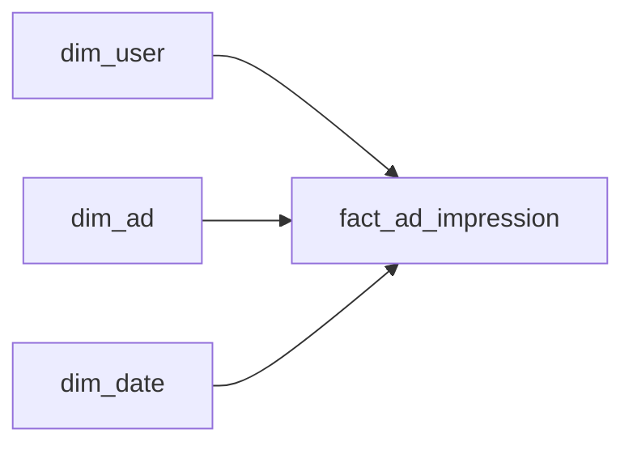

# The Person They Were Then

- **Domain:** data_modeling
- **Difficulty:** Easy
- **Est. time:** 20 min
- **URL:** https://datadriven.io/problems/the_person_they_were_then

## Problem

We run a messaging app where a user's subscription tier and country both drift over time, and the ad-revenue team needs every past impression to reflect the tier and country the user actually had the moment it fired. Design the schema that lets analysts slice historical ad revenue by the profile state as of each event.

**Concepts tested:** `dmDenormalization`, `dmDimensionTables`, `dmFactTables`, `dmForeignKeys`, `dmGrainDefinition`, `dmMetricAdditivity`, `dmOneToMany`, `dmPrimaryKeys`, `dmScdStrategy`, `dmScdType2`, `dmStarSchema`, `dmSurrogateKeys`

## Solution walkthrough


### Why this problem exists in real interviews

Beneath the profile-history costume this is a Type 2 slowly changing dimension with point-in-time attribution. The skill being probed: can you bind each ad impression to the version of the user that existed when it fired, not the version that exists today? Anyone can add a `valid_from` column. The trap is the join key. FK the fact to the natural `user_id` and every historical impression silently re-attributes to the user's current profile, so someone who upgraded to paid last week makes all of last year's free-tier impressions look like paid revenue.

> **Trick to Solving**
>
> Split the attributes by how they change before you draw a single table. Tier and country carry meaning through time and must be versioned; a display name is a cosmetic label that only ever needs its latest value.
>
> 1. Give `dim_user` a surrogate key plus `valid_from`/`valid_to`
> 2. Version tier and country; overwrite a cosmetic label like display name in place
> 3. Store the surrogate key on the fact, resolved at load time
> 4. Never join the fact on the natural `user_id`

---

### Break down the requirements

**Step 1: Separate attributes by change semantics**

Ask what each column means over time. A user's tier and country define who they were when an event happened, so they need history (Type 2). A cosmetic label like a display name is just the current tag on the account; nobody reports revenue by a name that has since changed, so it overwrites in place (Type 1). This is exactly the kind of scoping question a good candidate raises before drawing tables, because versioning everything bloats the dimension and hands you no analytical value.

**Step 2: Give the dimension a surrogate key and a validity span**

`user_id` is the natural key and repeats across versions, so it cannot be the primary key. Mint a surrogate `user_sk` per version and stamp `valid_from`/`valid_to` (plus an `is_current` flag for convenience). Exactly one open version exists per user at any instant, and spans are contiguous and non-overlapping so any timestamp resolves to one row.

**Step 3: Attribute the fact to the version, not the person**

At load time, resolve the impression's `user_id` and event timestamp to the `user_sk` whose validity span contains that timestamp, and store that `user_sk` on `fact_ad_impression`. Now the fact points at a frozen snapshot of tier and country. History cannot rewrite itself when the user changes tomorrow, because tomorrow gets a brand new `user_sk`.

**Step 4: Keep the fact additive and the dimensions conformed**

Revenue is additive at the impression grain. Conform `dim_ad` (advertiser, campaign, format) and `dim_date` so analysts can slice historical revenue by tier, country, campaign, and calendar without touching the natural key again.

---

### The reference model

`dim_user` is a Type 2 dimension keyed by `user_sk`; `fact_ad_impression` carries that surrogate so each impression is welded to the profile state in effect when it fired. A cosmetic label such as `display_name` can live on the dimension but is overwritten across versions, so it is not a basis for historical slicing.


**dim_user**

| column | type | key |
|---|---|---|
| user_sk | BIGINT | PK |
| user_id | BIGINT |  |
| subscription_tier | TEXT |  |
| country | TEXT |  |
| display_name | TEXT |  |
| valid_from | TIMESTAMP |  |
| valid_to | TIMESTAMP |  |
| is_current | BOOLEAN |  |

**dim_ad**

| column | type | key |
|---|---|---|
| ad_sk | INT | PK |
| advertiser | TEXT |  |
| campaign | TEXT |  |
| format | TEXT |  |

**dim_date**

| column | type | key |
|---|---|---|
| date_key | INT | PK |
| full_date | DATE |  |
| day_of_week | INT |  |
| month | INT |  |

**fact_ad_impression**

| column | type | key |
|---|---|---|
| impression_id | BIGINT | PK |
| user_sk | BIGINT | FK |
| ad_sk | INT | FK |
| date_key | INT | FK |
| event_at | TIMESTAMP |  |
| revenue_usd | DECIMAL |  |


> **How It Scales**
>
> At 300M users, versions are rare per user, so `dim_user` stays in the low billions of rows even after two years of changes, tiny next to the impression fact. Cluster or partition the fact by `date_key` and the versioning costs nothing at read time: the point-in-time work already happened at load, so historical rollups are plain surrogate-key joins with no range predicate on the dimension.

> **Interviewers Watch For**
>
> A strong candidate declares the grain of the dimension out loud (one row per user per version), names the surrogate key as the fact's join target, and asks which attributes actually need history before versioning anything. They say the words point-in-time and version, and they reject a design where the fact carries the natural `user_id`.

> **Common Pitfall**
>
> Storing `user_id` on the fact and joining to the current dimension row. It looks correct in a demo where nobody has changed tier yet, then quietly corrupts every historical report the first time a user upgrades. A second pitfall is versioning a cosmetic label like `display_name`, which multiplies dimension rows for a value that no report ever slices by.

---

### The analysis pattern

**Historical revenue by tier and country**

```sql
SELECT
    u.subscription_tier,
    u.country,
    d.month,
    SUM(f.revenue_usd) AS revenue
FROM fact_ad_impression f
JOIN dim_user u ON u.user_sk = f.user_sk
JOIN dim_date d ON d.date_key = f.date_key
WHERE d.full_date >= DATE '2025-01-01'
GROUP BY u.subscription_tier, u.country, d.month
ORDER BY revenue DESC
```

---

### Trade-offs and alternatives

| Surrogate key on the fact (Type 2) | Natural `user_id` on the fact |
|---|---|
| Impression stores `user_sk` resolved at load time.

* History is frozen and correct forever
* Reads are a plain equi-join, no range scan
* Load must resolve the version at ingest | Impression stores `user_id`, joins to current dim row.

* Simple to load
* Every tier change silently rewrites past revenue
* Point-in-time reporting is impossible without a separate history table |

---

- **A user's country change arrives a day late, after impressions that belong to the new country already landed. How do you fix the attribution?**
  - _Tests late-arriving dimension handling: closing the prior version at the true change time and re-resolving affected fact rows._
- **The product team now wants to slice churned users by the tier they held when they left. Does your model already support that?**
  - _Tests whether the candidate sees that Type 2 history answers this with no schema change._
- **How would you enforce that a user never has two overlapping open versions?**
  - _Tests validity-span integrity: contiguous, non-overlapping spans and a single `is_current` row per user._
- **If a cosmetic label like display name suddenly did need history for a compliance audit, how would you promote it without rebuilding the fact?**
  - _Tests promoting a Type 1 attribute to Type 2 and whether the fact's surrogate-key design absorbs it cleanly._
