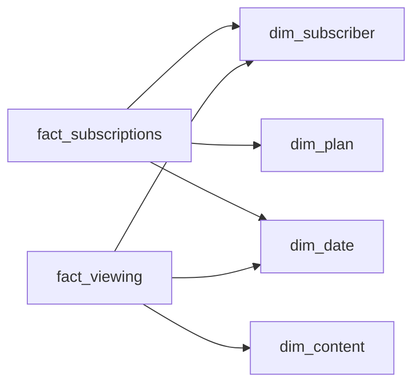

# The Plan That Changed Twice This Month
_Subscribers come, go, downgrade, and share. The schema has to keep up._

- **Domain:** data_modeling
- **Difficulty:** Medium
- **Est. time:** 30 min
- **URL:** https://datadriven.io/problems/the_plan_that_changed_twice_this_month

## Problem

A subscription streaming service is building a warehouse to measure churn and downgrade rates and content engagement, and it needs to reconstruct exactly which plan any subscriber was on at any past date even when someone starts, downgrades, and cancels all inside the same billing period, so each of those changes has to survive as its own timestamped record. Viewing has to be analyzed on its own, including ad-break exposure for the ad-supported tier, and churn and downgrades must be sliceable by the channel a subscriber was acquired through and the month they signed up. When a subscriber asks to be forgotten, their personal details must be removable while the historical viewing and subscription records stay intact under a stable, non-identifying key.

**Concepts tested:** `dmAttributes`, `dmConstraints`, `dmDataTypes`, `dmDenormalization`, `dmDimensionTables`, `dmEntities`, `dmEventSourcing`, `dmFactTables`, `dmForeignKeys`, `dmGrainDefinition`, `dmImmutableLogs`, `dmOneToMany`, `dmPrimaryKeys`, `dmScdType2`, `dmStarSchema`, `dmSurrogateKeys`

## Solution walkthrough


### What this really is

This is an event log dressed up as a subscriber table. The real question is grain: if one subscriber starts, downgrades and cancels inside the same billing month, how many rows exist? Anyone can draw a star. What separates candidates is where the plan change lives. The trap is SCD Type 2 on `dim_plan`, or a plan column on `dim_subscriber`. Either one holds a single plan state per period, so the second change in the month overwrites the first. Downgrade and churn counts undercount, and net MRR stops being an additive sum.

> **The customer moved, the plan did not**
>
> A price change is a change to the plan. A downgrade is a change to the customer's relationship with a plan. The first might earn Type 2 on `dim_plan`. The second is an **event**: a new row in `fact_subscriptions` pointing at a different `plan_sk`.

### Building it

**Step 1: Declare `fact_subscriptions` at event grain**

Use one row per lifecycle event, keyed by `subscription_event_id`, with `event_type` ('start', 'downgrade', 'cancel'), `event_ts` and `mrr_delta`. Three changes in one month become three rows. The plan held at any past instant is the `plan_sk` on the latest event at or before it, so nothing is stored twice.

**Step 2: Keep `dim_plan` flat**

`tier`, `has_ads` and `monthly_price` describe the product. Version it to track customer moves and every downgrade by any subscriber mints a new plan row: the dimension turns into a disguised fact table.

**Step 3: Give viewing its own fact**

`fact_viewing` stores one row per playback, with `watch_seconds` and `ad_break_count`. It has a different grain and orders of magnitude more volume. Fold it into the subscription fact and half the columns on every row are null.

**Step 4: Key both facts to `dim_date` with real date columns**

Add `event_date_key` and `view_date_key` as FKs to `dim_date.date_key`. A calendar edge has to start from a column that means a day; drawing it off `subscriber_sk` joins customers to dates by coincidence.

**Step 5: Separate identity from history for erasure**

The facts carry only the surrogate `subscriber_sk`. A forget request scrubs `subscriber_nk` and any personal fields on the `dim_subscriber` row, while the meaningless `subscriber_sk` keeps every event and playback joined. `acquisition_channel` and `signup_ts` stay for cohort slicing.


**dim_subscriber**

| column | type | key |
|---|---|---|
| subscriber_sk | BIGINT | PK |
| subscriber_nk | TEXT |  |
| country | TEXT |  |
| acquisition_channel | TEXT |  |
| signup_ts | TIMESTAMP |  |

**dim_plan**

| column | type | key |
|---|---|---|
| plan_sk | BIGINT | PK |
| plan_code | TEXT |  |
| tier | TEXT |  |
| has_ads | BOOLEAN |  |
| monthly_price | DECIMAL |  |

**dim_content**

| column | type | key |
|---|---|---|
| content_sk | BIGINT | PK |
| title | TEXT |  |
| content_type | TEXT |  |
| duration_sec | INT |  |

**dim_date**

| column | type | key |
|---|---|---|
| date_key | INT | PK |
| calendar_date | DATE |  |
| month | TEXT |  |
| is_month_end | BOOLEAN |  |

**fact_subscriptions**

| column | type | key |
|---|---|---|
| subscription_event_id | BIGINT | PK |
| subscriber_sk | BIGINT | FK |
| plan_sk | BIGINT | FK |
| event_date_key | INT | FK |
| event_ts | TIMESTAMP |  |
| event_type | TEXT |  |
| mrr_delta | DECIMAL |  |

**fact_viewing**

| column | type | key |
|---|---|---|
| view_id | BIGINT | PK |
| subscriber_sk | BIGINT | FK |
| content_sk | BIGINT | FK |
| view_date_key | INT | FK |
| view_ts | TIMESTAMP |  |
| watch_seconds | INT |  |
| ad_break_count | INT |  |


This is the payoff of event grain. The monthly report is a plain `GROUP BY`. Churn and downgrades are filtered counts on `event_type`, and net MRR is `SUM(mrr_delta)`. No window function, no reconciling snapshots.

**Monthly churn, downgrades and net MRR by tier**

```sql
SELECT
    d.month,
    p.tier,
    COUNT(*) FILTER (WHERE e.event_type = 'cancel') AS churns,
    COUNT(*) FILTER (WHERE e.event_type = 'downgrade') AS downgrades,
    SUM(e.mrr_delta) AS net_mrr
FROM fact_subscriptions e
JOIN dim_plan p ON p.plan_sk = e.plan_sk
JOIN dim_date d ON d.date_key = CAST(TO_CHAR(e.event_ts, 'YYYYMMDD') AS INT)
GROUP BY d.month, p.tier
```

| Plan column or SCD Type 2 | Event-grain fact |
|---|---|
| Stores one plan state per subscriber per period. A start, a downgrade and a cancel in one month collapse to 'cancelled', so the downgrade vanishes from the count. `mrr_delta` has nowhere to live. | Every change is a row with its own `event_ts` and `mrr_delta`. Counts are filters, MRR is a sum, and point-in-time plan is the latest event at or before the date. |

> **Deltas make MRR additive across any slice**
>
> Because each row carries a change, not a balance, `SUM(mrr_delta)` is correct for any month, tier, channel or cohort. An upgrade reversed a week later nets to zero without special handling.

> **Erasure is an update, not a delete**
>
> Deleting the `dim_subscriber` row orphans every fact keyed to its `subscriber_sk` or forces a cascade that wipes history. Null the personal fields and keep the row; the cohort attributes are not identifying on their own.

> **Say the grain before you draw a box**
>
> The tell is the first question asked: how many times can one subscription change inside one billing period? A candidate who hears 'changed twice this month' and answers 'then the fact is the event' has already passed the hard part.

- **How would you reconstruct each subscriber's plan on every day of a month with two plan changes?**
  - _As-of lookup over `fact_subscriptions` without SCD Type 2._
- **With `event_date_key` on the fact, how does the `dim_date` join change, and why does it matter at scale?**
  - _A stored key versus a key computed from `event_ts` on every row._
- **How would you materialize a daily active-subscriber snapshot from the event fact?**
  - _Deriving a periodic snapshot from transaction grain._
- **A subscriber invokes erasure. Which tables change, and what proves the history still reconciles?**
  - _PII isolated on `dim_subscriber`, with `subscriber_sk` kept stable._
