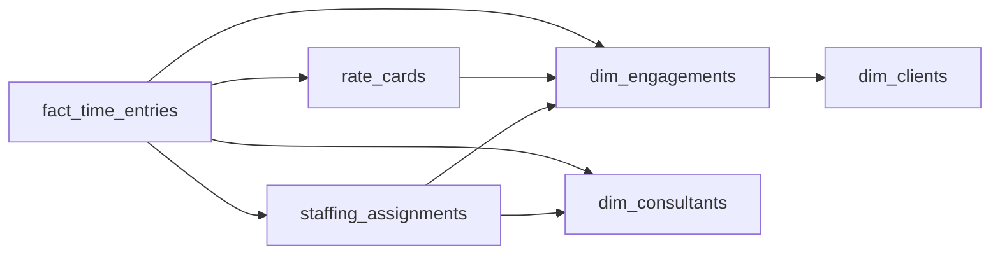

# The Rate That Was

- **Domain:** data_modeling
- **Difficulty:** Medium
- **Est. time:** 25 min
- **URL:** https://datadriven.io/problems/the_rate_that_was

## Problem

We run a professional services firm where consultants are staffed onto client engagements, often several at once, and log billable hours against each one. Rates change as consultants get promoted and as clients renegotiate terms, so any invoice we reissue for a past period has to bill at the rate that was in effect when the work was actually done. Design the schema that supports staffing, time logging, and invoice reconstruction.

**Concepts tested:** `dmAttributes`, `dmConstraints`, `dmDataTypes`, `dmDimensionTables`, `dmEntities`, `dmFactTables`, `dmForeignKeys`, `dmGrainDefinition`, `dmJunctionTables`, `dmManyToMany`, `dmOneToMany`, `dmPrimaryKeys`, `dmScdStrategy`, `dmScdType2`, `dmStarSchema`, `dmSurrogateKeys`

## Solution walkthrough

### What this problem really is

This is a slowly changing measure wearing a consulting costume. The rate is not a fact about a person. It moves when someone is promoted and when a client renegotiates, and the only question that matters is whether you can reissue last March's invoice to the cent. Anyone can draw consultants, engagements and time entries. The trap is **where the rate lives**. Hang a `current_rate` on `dim_consultants`, price hours with a join at query time, and the first promotion quietly reprices every invoice that person ever appeared on.

> **Ask about reissue before you draw a box**
>
> "Reissue a past invoice and it must match" means the money has to be frozen on the row where the work was logged. Versioned rates are where you look the rate up. A snapshot on the fact is where you keep it.

**Step 1: Bridge the many-to-many with `staffing_assignments`**

A consultant sits on several engagements in one week, and each engagement staffs many people. No foreign key on either dimension can hold that. The bridge gets its own surrogate `assignment_key` because the pair alone is not unique: the same person can be staffed twice under different roles.

**Step 2: Effective-date the role, never overwrite it**

`role_on_engagement` and `allocation_pct` belong to the assignment, not the person. A mid-engagement promotion closes the row with `assigned_to` and opens a new one. That is Type 2 on the bridge: the old role survives for the hours logged under it.

**Step 3: Version the rate card for renegotiations**

`rate_cards` holds one row per engagement, role and validity window. A renegotiated rate is a new row with a fresh `valid_from`, never an `UPDATE` to `hourly_rate`. This is the lookup source, not the billing source.

**Step 4: Snapshot `rate_applied` onto the fact**

The grain of `fact_time_entries` is one entry per assignment per `work_date`. At entry time, resolve the card in effect and write `rate_applied` and `billed_amount` onto the row, keeping `rate_card_key` for lineage. A reissue is then a plain `SUM(billed_amount)` with no temporal join to get wrong.

**dim_clients**

| column | type | key |
|---|---|---|
| client_key | INT | PK |
| client_name | TEXT |  |
| industry | TEXT |  |
| region | TEXT |  |

**dim_consultants**

| column | type | key |
|---|---|---|
| consultant_key | INT | PK |
| full_name | TEXT |  |
| home_office | TEXT |  |
| hire_date | DATE |  |

**dim_engagements**

| column | type | key |
|---|---|---|
| engagement_key | INT | PK |
| client_key | INT | FK |
| engagement_name | TEXT |  |
| engagement_type | TEXT |  |
| start_date | DATE |  |
| end_date | DATE |  |

**staffing_assignments**

| column | type | key |
|---|---|---|
| assignment_key | BIGINT | PK |
| engagement_key | INT | FK |
| consultant_key | INT | FK |
| role_on_engagement | TEXT |  |
| allocation_pct | DECIMAL |  |
| assigned_from | DATE |  |
| assigned_to | DATE |  |

**rate_cards**

| column | type | key |
|---|---|---|
| rate_card_key | BIGINT | PK |
| engagement_key | INT | FK |
| role_on_engagement | TEXT |  |
| hourly_rate | DECIMAL |  |
| currency | TEXT |  |
| valid_from | DATE |  |
| valid_to | DATE |  |
| is_current | BOOLEAN |  |

**fact_time_entries**

| column | type | key |
|---|---|---|
| time_entry_key | BIGINT | PK |
| assignment_key | BIGINT | FK |
| consultant_key | INT | FK |
| engagement_key | INT | FK |
| rate_card_key | BIGINT | FK |
| work_date | DATE |  |
| hours | DECIMAL |  |
| is_billable | BOOLEAN |  |
| rate_applied | DECIMAL |  |
| billed_amount | DECIMAL |  |
| currency | TEXT |  |

> **A join at billing time is a rewrite of history**
>
> Computing `hours * hourly_rate` at query time looks normalized and clean. One `valid_to` boundary off by a day, or one card edited in place, and a reissued invoice no longer matches the one the client already paid. Finance finds it, not you.

| Snapshot on the fact | Price through the versioned card |
|---|---|
| `rate_applied` and `billed_amount` written once at entry. Reissue is a `SUM`. History is immutable by construction, at the cost of a few bytes per row. | `rate_cards` joined on `work_date BETWEEN valid_from AND valid_to` in every billing query. One source of truth, but every invoice is a range join that can drift. |

> **Two kinds of change, two homes**
>
> The senior tell is separating them out loud: promotions are a new `staffing_assignments` row, renegotiations are a new `rate_cards` row, and neither ever touches a fact row already logged.

- **A client wins a 10 percent discount retroactive to the start of the quarter. How do you apply it without touching issued invoices?**
  - _Adjustment rows or a credit fact versus an `UPDATE` to snapshotted `billed_amount`._
- **What stops two `rate_cards` rows for the same engagement and role from overlapping in time?**
  - _Constraint thinking on Type 2 windows: non-overlapping `valid_from` and `valid_to`._
- **At tens of millions of entries a year, how do you lay out `fact_time_entries` for monthly invoice runs?**
  - _Partitioning on `work_date` so period-scoped billing prunes._
