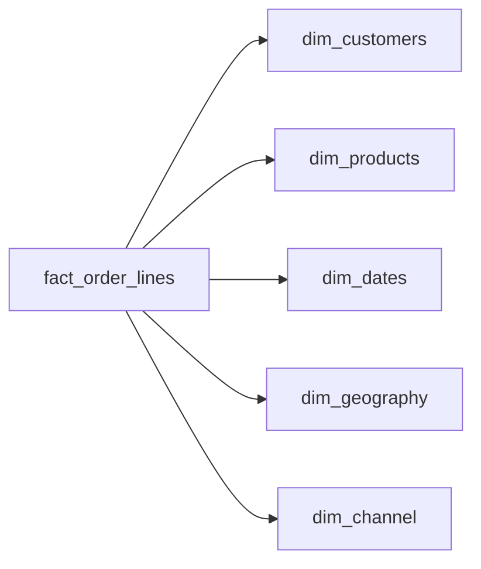

# The Retail Blueprint
_One business. A thousand transactions. Only one layout survives the analytics layer._

- **Domain:** data_modeling
- **Difficulty:** Medium
- **Est. time:** 25 min
- **URL:** https://datadriven.io/problems/the_retail_blueprint

## Problem

We're a mid-size online retailer selling about 50,000 SKUs. The BI team needs self-service dashboards to analyze sales by product category, customer segment, geography, sales channel, and time period. Design the dimensional model.

**Concepts tested:** `dmDenormalization`, `dmDimensionTables`, `dmFactTables`, `dmForeignKeys`, `dmGrainDefinition`, `dmMetricAdditivity`, `dmOneToMany`, `dmPrimaryKeys`, `dmStarSchema`, `dmSurrogateKeys`

## Solution walkthrough


### Strip the costume: this is a grain declaration

"Analyze sales by category, segment, geography, channel, and time" is a dimensional model wearing a BI-requirements costume. The real skill being probed is whether you declare the fact grain as atomic, additive order-line events and push every descriptor into surrogate-keyed conformed dimensions. Anyone can list six tables. What separates candidates is refusing to stamp `category`, `brand`, or `loyalty_tier` onto the fact. Do that and you're fine until the product team relabels a category: now every historical `fact_order_lines` row is wrong, and dashboards drift silently with no error to catch it. A coarser order-level grain would lose product-level slicing entirely, and a single flat table can't absorb catalog or segment changes without rewriting the fact.

> **The grain sentence decides every other column**
>
> Before drawing anything, answer one question: what is one row in the fact? Here it's **one product within one order**. Once that's fixed, additive measures (`quantity`, `net_amount`) stay on `fact_order_lines` and everything descriptive is forced out into a dimension. The grain isn't step one of the design; it IS the design.

### Building it

**Step 1: Pin the grain at the order line**

One row per product per order in `fact_order_lines`. This atomic grain supports basket analysis, per-line discounting, and category roll-ups without any pre-aggregation. An order-level grain would collapse the products in a basket and you could never slice by `category` again.

**Step 2: Force every descriptor into a dimension**

`category` and `brand` live in `dim_products`; `loyalty_tier` lives in `dim_customers`; `region` and `country` live in `dim_geography`. Keeping these OFF the fact is exactly what lets an analyst add a new attribute later without touching a single fact row.

**Step 3: Key dimensions with surrogates, not source IDs**

`product_sk` and `customer_sk` decouple the warehouse from operational keys. When a SKU is relaunched or a product changes category mid-year, the surrogate absorbs the new version as a new dimension row while old fact rows keep pointing at the old `product_sk`. That's how point-in-time history survives.

**Step 4: Stamp channel and geography per line too**

Channel is captured per order, but you stamp `channel_sk` on every order line so revenue slices by channel without joining back to an order table. `dim_channel` and `dim_geography` keep name strings off the fact, exactly like every other descriptor.


**dim_customers**

| column | type | key |
|---|---|---|
| customer_sk | BIGINT | PK |
| customer_id | TEXT |  |
| email | TEXT |  |
| signup_date | DATE |  |
| loyalty_tier | TEXT |  |

**dim_products**

| column | type | key |
|---|---|---|
| product_sk | BIGINT | PK |
| sku | TEXT |  |
| category | TEXT |  |
| brand | TEXT |  |
| list_price | DECIMAL |  |

**dim_dates**

| column | type | key |
|---|---|---|
| date_sk | INT | PK |
| calendar_date | DATE |  |
| fiscal_week | INT |  |
| is_holiday | BOOLEAN |  |

**dim_geography**

| column | type | key |
|---|---|---|
| geography_sk | BIGINT | PK |
| country | TEXT |  |
| region | TEXT |  |
| postal_code | TEXT |  |

**dim_channel**

| column | type | key |
|---|---|---|
| channel_sk | BIGINT | PK |
| channel_name | TEXT |  |
| channel_type | TEXT |  |

**fact_order_lines**

| column | type | key |
|---|---|---|
| order_line_id | BIGINT | PK |
| order_id | BIGINT |  |
| customer_sk | BIGINT | FK |
| product_sk | BIGINT | FK |
| date_sk | INT | FK |
| geography_sk | BIGINT | FK |
| channel_sk | BIGINT | FK |
| quantity | INT |  |
| net_amount | DECIMAL |  |


**Weekly revenue sliced across every conformed dimension**

```sql
SELECT
    d.fiscal_week,
    p.category,
    c.loyalty_tier AS segment,
    g.region,
    ch.channel_name,
    SUM(f.net_amount) AS revenue,
    SUM(f.quantity) AS units,
    COUNT(DISTINCT f.order_id) AS orders
FROM fact_order_lines f
JOIN dim_products p ON p.product_sk = f.product_sk
JOIN dim_dates d ON d.date_sk = f.date_sk
JOIN dim_customers c ON c.customer_sk = f.customer_sk
JOIN dim_geography g ON g.geography_sk = f.geography_sk
JOIN dim_channel ch ON ch.channel_sk = f.channel_sk
WHERE d.calendar_date >= '2025-01-01'
GROUP BY d.fiscal_week, p.category, c.loyalty_tier, g.region, ch.channel_name
ORDER BY d.fiscal_week, revenue DESC
```

> **The 60-second grain sentence is the tell**
>
> A strong candidate says "one row per product per order" out loud in the first minute, then keeps the monetary measure fully additive, whether they store a line-level `net_amount` or a per-unit price paired with `quantity`. Either works as long as line revenue is derivable and the amount reflects the price paid at order time. That single sentence signals more seniority than any number of correctly-named tables.

> **A descriptor on the fact turns a relabel into a backfill**
>
> The tempting mistake is storing `category` and `brand` on `fact_order_lines` "to avoid a join." Now every category rename requires rewriting billions of fact rows, and until you do, dashboards report a mix of old and new labels with no error to flag it. Conformed dimensions exist precisely so an attribute change is a one-row `UPDATE`, not a fact backfill.

| Classic Kimball star | One Big Table |
|---|---|
| Conformed dimensions, surrogate-key evolvability, additive facts. An attribute relabel is a single dimension row. Cost: joins at query time and per-dimension `SCD` handling, both cheap on columnar engines. | Flat denormalized single-table reads. Fast to scan, but every attribute change forces a full fact rewrite, there's no conformity across facts, and storage balloons as descriptors repeat on every row. |

- **How would you keep history when a product moves to a new `category` mid-year?**
  - _Tests SCD Type 2 awareness and surrogate-key versioning on `dim_products`._
- **Finance wants gross, discount, and net on the fact. Which are additive, semi-additive, or non-additive?**
  - _Tests whether the candidate can classify measures rather than blindly `SUM()` them._
- **Volume jumps from 10M to 500M order lines a month. What changes?**
  - _Tests partitioning by `date_sk` and clustering by `product_sk` on a columnar warehouse._
- **Marketing wants to attribute each order line to a touchpoint. Where does that live?**
  - _Tests adding a conformed dimension or bridge rather than widening `fact_order_lines`._
