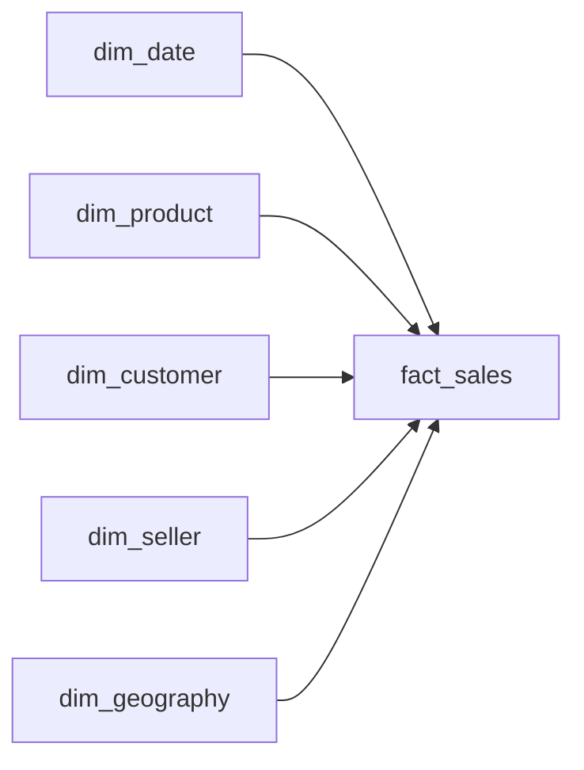

# The Sales Architecture
_Numbers are easy. Making them queryable at scale is the real job._

- **Domain:** data_modeling
- **Difficulty:** Medium
- **Est. time:** 30 min
- **URL:** https://datadriven.io/problems/the_sales_architecture

## Problem

We sell physical products through an online marketplace, and our normalized transactional database is too slow to power the BI dashboards analysts depend on. They need to break down revenue by product, seller, customer, geography, and time. Design a schema that makes those slices fast to query at scale.

**Concepts tested:** `dmDenormalization`, `dmDimensionTables`, `dmFactTables`, `dmForeignKeys`, `dmGrainDefinition`, `dmMetricAdditivity`, `dmOneToMany`, `dmPrimaryKeys`, `dmStarSchema`, `dmSurrogateKeys`

## Solution walkthrough


### Why this problem exists in real interviews

This probes whether a candidate can execute a textbook star schema without cutting corners: one atomic fact, five conformed dimensions, surrogate keys, additive measures. The interviewer is testing discipline, not creativity. The signal is how quickly the candidate locks grain and resists ad-hoc attributes on the fact.

> **Trick to Solving**
>
> The tell is the phrase "sales analytics" without further specialization. Before drawing any tables, a strong candidate asks: who are the stakeholders and what slices do they care about? If the answer covers product, customer, seller, time, and place, the five-dimension star is the canonical shape.
>
> 1. Lock grain at the sales line
> 2. Pick conformed dimensions for each analysis slice
> 3. Surrogate keys on every dimension
> 4. Additive measures only on the fact

---

### Break down the requirements

**Step 1: Declare grain**

`fact_sales` is one row per product per transaction. Atomic grain is what makes the star answer roll-ups at any level.

**Step 2: Conformed dimensions per slice**

Each stakeholder asks for a different cut: product team wants category, sales team wants region, finance wants quarter. Five dimensions cover the common vocabulary.

**Step 3: Surrogate keys on dimensions**

Each dimension has a BIGINT surrogate. Source system keys change; surrogates do not. This is the main defense against upstream churn.

**Step 4: Keep measures fully additive**

`quantity` and `net_amount` sum cleanly across any dimension combination. Derived metrics (discount %, ASP) are computed at query time.

---

### The solution

Below is one conceptually sound star. Five conformed dimensions and one atomic fact is the canonical retail analytics shape; the discipline is in stopping there.


**dim_product**

| column | type | key |
|---|---|---|
| product_sk | BIGINT | PK |
| sku | TEXT |  |
| category | TEXT |  |
| list_price | DECIMAL |  |

**dim_customer**

| column | type | key |
|---|---|---|
| customer_sk | BIGINT | PK |
| customer_id | TEXT |  |
| segment | TEXT |  |
| signup_date | DATE |  |

**dim_seller**

| column | type | key |
|---|---|---|
| seller_sk | BIGINT | PK |
| seller_id | TEXT |  |
| region | TEXT |  |
| hire_date | DATE |  |

**dim_date**

| column | type | key |
|---|---|---|
| date_sk | INT | PK |
| calendar_date | DATE |  |
| fiscal_quarter | TEXT |  |

**dim_geography**

| column | type | key |
|---|---|---|
| geography_sk | BIGINT | PK |
| country | TEXT |  |
| region | TEXT |  |
| city | TEXT |  |

**fact_sales**

| column | type | key |
|---|---|---|
| sales_line_id | BIGINT | PK |
| date_sk | INT | FK |
| product_sk | BIGINT | FK |
| customer_sk | BIGINT | FK |
| seller_sk | BIGINT | FK |
| geography_sk | BIGINT | FK |
| quantity | INT |  |
| net_amount | DECIMAL |  |


> **Why This Design Works**
>
> The canonical star exchanges a small amount of query-time join work for maximum evolvability and conformity across the warehouse. Because dimensions are shared, every new fact table (returns, inventory) can reuse them and cross-fact reporting comes for free.

> **Interviewers Watch For**
>
> Strong candidates name the fact type (transaction fact) and explicitly call out additivity of each measure. They also note that `dim_geography` belongs on the fact, not embedded in the customer, because sales location and billing location can differ.

> **Common Pitfall**
>
> Snowflaking prematurely: putting `category` on a separate `dim_category` table for no benefit. Dimensions should be flat unless a hierarchy actually changes independently of the product.

---

### The analysis pattern

**Seller performance across product categories**

```sql
SELECT
    s.region,
    s.seller_id,
    p.category,
    SUM(f.net_amount) AS revenue,
    SUM(f.quantity) AS units,
    COUNT(DISTINCT f.customer_sk) AS unique_customers
FROM fact_sales f
JOIN dim_seller s ON s.seller_sk = f.seller_sk
JOIN dim_product p ON p.product_sk = f.product_sk
JOIN dim_date d ON d.date_sk = f.date_sk
WHERE d.fiscal_quarter = '2025-Q1'
GROUP BY s.region, s.seller_id, p.category
ORDER BY revenue DESC
```

---

### Trade-offs and alternatives

| Flat five-dimension star | Snowflake with nested hierarchies |
|---|---|
| Conformity, evolvability, fast BI on columnar warehouses. Cost: joins at query time and dimension-maintenance pipelines. | Smaller dimension storage, independent hierarchy updates. Cost: more joins per query, more ETL surface area, and most BI tools prefer flat dimensions. |

---

- **A seller is reassigned to a new region mid-year. Do you Type 1 or Type 2 `dim_seller`?**
  - _Tests SCD judgment and whether historical commissions should reflect old or new regions._
- **How would you add a returns fact without breaking existing sales dashboards?**
  - _Tests conformed dimension reuse and whether the candidate uses negative quantities or a separate fact._
- **Analysts want same-day conversion rate by geography. What is missing from the fact?**
  - _Tests whether the candidate recognizes the need for a pageviews or sessions fact rather than loading conversion into `dim_customer`._
- **The business moves to a columnar warehouse. Does the star still make sense?**
  - _Tests understanding of when to consider OBT versus preserving Kimball discipline._
