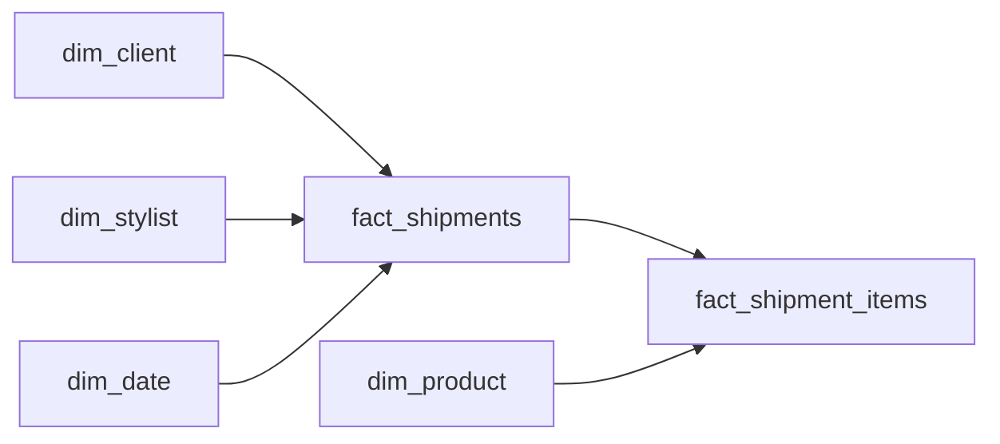

# The Schema That Could Not Answer Back
_Forty columns in. Zero useful answers out._

- **Domain:** data_modeling
- **Difficulty:** Hard
- **Est. time:** 35 min
- **URL:** https://datadriven.io/problems/the_schema_that_could_not_answer_back

## Problem

A personal styling service tracks shipments in a single wide denormalized table with one row per shipment, repeating item attributes across numbered columns. The business wants to add return reasons, calculate client lifetime value, and attribute revenue by brand. The current table cannot answer these questions without significant ETL changes. Redesign it.

**Concepts tested:** `dmAttributes`, `dmDenormalization`, `dmDimensionTables`, `dmEntities`, `dmFactTables`, `dmFirstNormalForm`, `dmForeignKeys`, `dmGrainDefinition`, `dmMetricAdditivity`, `dmOneToMany`, `dmPrimaryKeys`, `dmStarSchema`, `dmSurrogateKeys`

## Solution walkthrough


### Why this problem exists in real interviews

This probes whether you can detect repeating groups (`item_1` through `item_5`) and normalize them into a child fact at the correct grain. The signal is naming the item-grain fact and recognizing that a new business question like "return reason" becomes a column on that child fact instead of an ETL rewrite.

> **Trick to Solving**
>
> Before drawing any tables, a strong candidate asks: "how many items can a shipment have today, and can that limit change?" Any numbered column pattern is a repeating group in disguise. Unpivot it into a child fact at one row per item per shipment.
>
> 1. Spot numbered columns (`item_1_*` through `item_n_*`) as repeating groups
> 2. Unpivot to a child fact at item grain
> 3. Put shipment-level measures on the parent, item-level on the child
> 4. Treat future attributes (`return_reason`) as new columns on the child

---

### Break down the requirements

**Step 1: Declare the shipment grain on `fact_shipments`**

One row per shipment holds shipment-level measures like total and `item_count`. Shipment count questions stay cheap.

**Step 2: Unpivot item columns into `fact_shipment_items`**

Each numbered column pattern becomes one row per item per shipment. `was_kept` and `return_reason` live here because they are item-level decisions.

**Step 3: Conform client and stylist as dimensions**

`dim_client` and `dim_stylist` hold stable attributes. Client lifetime value is computed from shipments, not stored as a frozen column.

**Step 4: Put product as its own dimension for brand rollups**

Brand and category live on `dim_product`. Revenue-by-brand questions become a single join instead of a string-parse.

**Step 5: Isolate PII on `dim_client`**

Client name and email stay on `dim_client` so GDPR erasure does not touch financial facts.

---

### The solution

Below is one conceptually sound model. The grain split between shipment and shipment-item is the decision that pays for itself every time a new business question arrives.


**dim_client**

| column | type | key |
|---|---|---|
| client_sk | BIGINT | PK |
| client_nk | TEXT |  |
| state | TEXT |  |
| age_bucket | TEXT |  |
| signup_ts | TIMESTAMP |  |

**dim_stylist**

| column | type | key |
|---|---|---|
| stylist_sk | BIGINT | PK |
| stylist_nk | TEXT |  |
| specialty | TEXT |  |
| hired_ts | TIMESTAMP |  |

**dim_product**

| column | type | key |
|---|---|---|
| product_sk | BIGINT | PK |
| sku | TEXT |  |
| brand | TEXT |  |
| category | TEXT |  |
| list_price | DECIMAL |  |

**dim_date**

| column | type | key |
|---|---|---|
| date_key | INT | PK |
| calendar_date | DATE |  |
| fiscal_month | TEXT |  |

**fact_shipments**

| column | type | key |
|---|---|---|
| shipment_sk | BIGINT | PK |
| client_sk | BIGINT | FK |
| stylist_sk | BIGINT | FK |
| shipped_date_key | INT | FK |
| shipment_total | DECIMAL |  |
| item_count | INT |  |

**fact_shipment_items**

| column | type | key |
|---|---|---|
| shipment_item_sk | BIGINT | PK |
| shipment_sk | BIGINT | FK |
| product_sk | BIGINT | FK |
| price | DECIMAL |  |
| was_kept | BOOLEAN |  |
| return_reason | TEXT |  |


> **Why this design holds up**
>
> Normalizing the repeating group into a child fact makes future attributes additive: a new return reason codebook is a column on `fact_shipment_items`, not a table migration. Brand revenue becomes a single join path. Keep rate is a row-level boolean average.

> **What strong candidates do**
>
> They call out the repeating-group smell in the first read of the schema. They explicitly split shipment grain from item grain. They refuse to store LTV as a frozen column and derive it from the fact instead.

> **Red flags to avoid**
>
> Keeping the wide table and adding `item_6`, `item_7` as new columns guarantees another rewrite. Storing `client_lifetime_value` as a dimension attribute freezes a moving target. Mixing item-level and shipment-level measures on one fact forces nulls and double-counting.

---

### The analysis pattern

**Net revenue and keep rate by brand**

```sql
SELECT
    p.brand,
    SUM(si.price) AS gross_revenue,
    SUM(CASE WHEN si.was_kept THEN si.price ELSE 0 END) AS net_revenue,
    AVG(CASE WHEN si.was_kept THEN 1.0 ELSE 0.0 END) AS keep_rate
FROM fact_shipment_items si
JOIN fact_shipments s ON s.shipment_sk = si.shipment_sk
JOIN dim_product p ON p.product_sk = si.product_sk
JOIN dim_date d ON d.date_key = s.shipped_date_key
WHERE d.fiscal_month = '2025-03'
GROUP BY p.brand
```

---

### Trade-offs and alternatives

| Split shipment and item facts | Wide shipment fact with JSON items |
|---|---|
| Clean grain, easy brand rollups, additive item attributes. Requires a migration to unpivot the wide table into item rows. Writes touch two facts per shipment. | One row per shipment with `items` as a JSON array. Single insert per shipment. Brand questions require JSON parsing at query time and lose columnar pruning. |

---

- **How would you backfill `fact_shipment_items` from the existing wide table without downtime?**
  - _Tests migration strategy and dual-write cutover._
- **A client requests GDPR erasure. Which rows are modified and which are retained?**
  - _Tests PII isolation on `dim_client` and retention of financial facts._
- **How would you handle an item returned months after the shipment without breaking grain?**
  - _Tests late-arriving attribute updates versus an append-only returns fact._
- **How would the schema change if stylists can co-style a single shipment?**
  - _Tests whether `stylist_sk` becomes a bridge table._
- **How would you compute client lifetime value as of any historical date?**
  - _Tests derivation from `fact_shipment_items` instead of a frozen dimension attribute._
